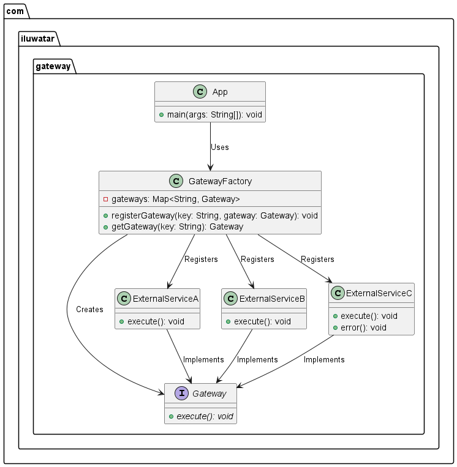

## Propósito

Proporcionar una interfaz de acceso a un conjunto de sistemas o funcionalidades externas. Gateway proporciona una vista simple y uniforme de
recursos externos a los internos de una aplicación.

## Explicación

Un ejemplo real

> Gateway actúa como una verdadera puerta de entrada de una ciudad determinada. Las personas dentro de la ciudad se llaman sistema interno, y las diferentes ciudades externas se llaman servicios externos. La puerta de enlace está aquí para proporcionar acceso al sistema interno a diferentes servicios externos.

En pocas palabras

> La pasarela puede proporcionar una interfaz que permita al sistema interno utilizar un servicio externo.

Wikipedia dice

> Un servidor que actúa como front-end de la API, recibe solicitudes de la API, aplica políticas de estrangulamiento y seguridad, pasa las solicitudes al servicio back-end y, a continuación, devuelve la respuesta al solicitante.

**Ejemplo programático**

La clase principal de nuestro ejemplo es el `ExternalService` que contiene elementos.

```java
class ExternalServiceA implements Gateway {
    @Override
    public void execute() throws Exception {
        LOGGER.info("Executing Service A");
        // Simulate a time-consuming task
        Thread.sleep(1000);
    }
}

/**
 * ExternalServiceB is one of external services.
 */
class ExternalServiceB implements Gateway {
    @Override
    public void execute() throws Exception {
        LOGGER.info("Executing Service B");
        // Simulate a time-consuming task
        Thread.sleep(1000);
    }
}

/**
 * ExternalServiceC is one of external services.
 */
class ExternalServiceC implements Gateway {
    @Override
    public void execute() throws Exception {
        LOGGER.info("Executing Service C");
        // Simulate a time-consuming task
        Thread.sleep(1000);
    }

    public void error() throws Exception {
        // Simulate an exception
        throw new RuntimeException("Service C encountered an error");
    }
}
```

Para operar estos servicios externos, aquí está la clase `App`:

```java
public class App {
    /**
     * Simulate an application calling external services.
     */
    public static void main(String[] args) throws Exception {
        GatewayFactory gatewayFactory = new GatewayFactory();

        // Register different gateways
        gatewayFactory.registerGateway("ServiceA", new ExternalServiceA());
        gatewayFactory.registerGateway("ServiceB", new ExternalServiceB());
        gatewayFactory.registerGateway("ServiceC", new ExternalServiceC());

        // Use an executor service for asynchronous execution
        Gateway serviceA = gatewayFactory.getGateway("ServiceA");
        Gateway serviceB = gatewayFactory.getGateway("ServiceB");
        Gateway serviceC = gatewayFactory.getGateway("ServiceC");

        // Execute external services
        try {
            serviceA.execute();
            serviceB.execute();
            serviceC.execute();
        } catch (ThreadDeath e) {
            LOGGER.info("Interrupted!" + e);
            throw e;
        }
    }
}
```

La interfaz `Gateway` es extremadamente sencilla.

```java
interface Gateway {
    void execute() throws Exception;
}
```

Salida del programa:

```java
        Executing Service A
        Executing Service B
        Executing Service C
```

## Diagrama de clases



## Aplicabilidad

Utilizar el patrón Gateway

* Para acceder al contenido de un objeto agregado sin exponer su representación interna.
* Para la integración con múltiples servicios externos o APIs.
* Para proporcionar una interfaz uniforme para recorrer diferentes estructuras de agregados.

## Tutoriales

* [Pattern: API Gateway / Backends for Frontends](https://microservices.io/patterns/apigateway.html)

## Usos conocidos

* [API Gateway](https://java-design-patterns.com/patterns/microservices-api-gateway/)
* [10 most common use cases of an API Gateway](https://apisix.apache.org/blog/2022/10/27/ten-use-cases-api-gateway/)

## Créditos

* [Gateway](https://martinfowler.com/articles/gateway-pattern.html)
* [What is the difference between Facade and Gateway design patterns?](https://stackoverflow.com/questions/4422211/what-is-the-difference-between-facade-and-gateway-design-patterns)
