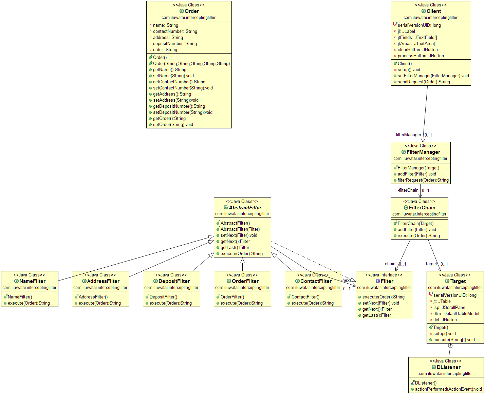

## Propósito
Un filtro de intercepción es un útil patrón de diseño Java que se utiliza cuando se desea preprocesar o postprocesar una petición en una aplicación. Estos filtros se crean y se aplican a la solicitud antes de que se le da a la aplicación de destino. Algunos ejemplos de uso incluyen la autenticación, que es necesario procesar antes de que la solicitud se entregue a la aplicación.

## Explicación
Ejemplo del mundo real
> Un ejemplo de uso del patrón de diseño Filtro Interceptor es relevante a la hora de realizar una plataforma de comercio electrónico. Es importante implementar varios filtros para la autenticación de la cuenta, la autenticación del pago, el registro y el almacenamiento en caché. Los tipos de filtros importantes en este ejemplo son los filtros de autenticación, registro, seguridad y almacenamiento en caché.

En palabras sencillas
> Un filtro de intercepción en Java es como una serie de puntos de control de seguridad para peticiones y respuestas en una aplicación de software. Comprueba y procesa los datos a medida que entran y salen, ayudando con tareas como la autenticación, el registro y la seguridad, mientras mantiene el núcleo de la aplicación seguro y limpio.

Wikipedia dice
> El filtro de intercepción es un patrón de Java que crea filtros conectables para procesar servicios comunes de una manera estándar sin necesidad de realizar cambios en el código de procesamiento de solicitudes.

## Ejemplo Programático
Como ejemplo, podemos crear una clase Filtro básica y definir un Filtro de Autenticación. Al filtro le falta lógica, pero

```java
// 1. Define a Filter interface
interface Filter {
    void runFilter(String request);
}
// 2. Create a Authentication filter
class AuthenticationFilter implements Filter {
    public void runFilter(String request) {
        // Authentication logic would be passed in here
        if (request.contains("authenticated=true")) {
            System.out.println("Authentication successful for request: " + request);
        } else {
            System.out.println("Authentication failed for request: " + request);
        }
    }
}
// 3. Create a Client to send requests and activate the filter
class Client {
    // create an instance of the filter in the Client class
    private Filter filter;

    // create constructor
    public Client(Filter filter) {
        this.filter = filter;
    }

    // send the String request to the filter, the request does not have to be a string
    // it can be anything
    public void sendRequest(String request) {
        filter.runFilter(request);
    }
}
// 4. Demonstrate the Authentication Filter
public class AuthenticationFilterExample {
    public static void main(String[] args) {
        Filter authenticationFilter = new AuthenticationFilter();
        Client client = new Client(authenticationFilter);

        // Simulate requests for false
        client.sendRequest("GET /public-page");
        // this request would come back as true as the link includes an argument
        // for successful authentication
        client.sendRequest("GET /private-page?authenticated=true");
    }
}
```
Este es un ejemplo básico de cómo implementar el esqueleto de un filtro. Falta la lógica de autenticación en AuthenticationFilterExample, pero se puede rellenar en los huecos.

Además, el cliente puede ser configurado para ejecutar múltiples filtros en su solicitud utilizando un bucle For poblado con filtros como se puede ver a continuación:

```java
// 1. Define a Filter interface
interface Filter {
    void runFilter(String request);
}

// 2. Create an Authentication filter
class AuthenticationFilter implements Filter {
    public void runFilter(String request) {
        // Authentication logic would be placed here
        if (request.contains("authenticated=true")) {
            System.out.println("Authentication successful for request: " + request);
        } else {
            System.out.println("Authentication failed for request: " + request);
        }
    }
}

// 3. Create a Client to send requests and activate multiple filters
class Client {
    // create a list of filters in the Client class
    private List<Filter> filters = new ArrayList<>();

    // add filters to the list
    public void addFilter(Filter filter) {
        filters.add(filter);
    }

    // send the request through all the filters
    public void sendRequest(String request) {
        for (Filter filter : filters) {
            filter.runFilter(request);
        }
    }
}

// 4. Demonstrate multiple filters
public class MultipleFiltersExample {
    public static void main(String[] args) {
        // Create a client
        Client client = new Client();

        // Add filters to the client
        Filter authenticationFilter = new AuthenticationFilter();
        client.addFilter(authenticationFilter);

        // Add more filters as needed
        // Filter anotherFilter = new AnotherFilter();
        // client.addFilter(anotherFilter);

        // Simulate requests
        client.sendRequest("GET /public-page");
        client.sendRequest("GET /private-page?authenticated=true");
    }
}
```
Este método permite manipular y comprobar los datos de forma rápida y sencilla antes de autenticar un inicio de sesión o finalizar otro tipo de acción.

## Diagrama de clases


## Aplicabilidad
Utilice el patrón Filtro interceptor cuando

* Un programa necesita preprocesar o postprocesar datos
* Un sistema necesita servicios de autorización/autenticación para acceder a datos sensibles
* Desea registrar/auditar peticiones o respuestas con fines de depuración o almacenamiento, como marcas de tiempo y acciones del usuario
* Desea transformar datos de un tipo a otro antes de entregarlos al proceso final.
* Desea implementar un manejo específico de excepciones

## Consecuencias
Consecuencias de la aplicación del filtro de interceptación

* Aumento de la complejidad del código, disminuyendo la facilidad de lectura
* Puede haber problemas en el orden en que se aplican los filtros si el orden es importante
* Aplicar múltiples filtros a una petición puede crear un retraso en el tiempo de respuesta
* Probar los efectos de múltiples filtros en una petición puede ser difícil.
* La compatibilidad y la gestión de versiones pueden ser difíciles si se tienen muchos filtros.

## Tutoriales

* [Introduction to Intercepting Filter Pattern in Java](https://www.baeldung.com/intercepting-filter-pattern-in-java)

## Ejemplos del mundo real

* [javax.servlet.FilterChain](https://tomcat.apache.org/tomcat-8.0-doc/servletapi/javax/servlet/FilterChain.html) and [javax.servlet.Filter](https://tomcat.apache.org/tomcat-8.0-doc/servletapi/javax/servlet/Filter.html)
* [Struts 2 - Interceptors](https://struts.apache.org/core-developers/interceptors.html)

## Créditos

* [TutorialsPoint - Intercepting Filter](http://www.tutorialspoint.com/design_pattern/intercepting_filter_pattern.htm)
