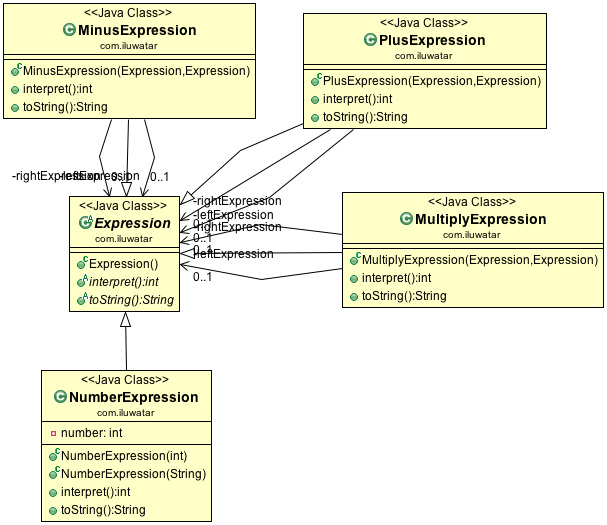

## Propósito

Dado un lenguaje, defina una representación para su gramática junto con un intérprete que utilice la
representación para interpretar las frases del lenguaje.

## Explicación

Ejemplo real

> Los niños enanos están aprendiendo matemáticas básicas en la escuela. Empiezan por lo más básico: "1 + 1", "4 - 2", "5 + 5", etcétera.

En palabras simples

> El patrón intérprete interpreta las frases en el idioma deseado.

Wikipedia dice

> En programación informática, el patrón intérprete es un patrón de diseño que especifica cómo evaluar sentencias en un lenguaje. La idea básica es tener una clase para cada símbolo (terminal o no terminal) en un lenguaje informático especializado. El árbol sintáctico de una sentencia en el lenguaje es una instancia del patrón compuesto y se utiliza para evaluar (interpretar) la sentencia para un cliente.

**Ejemplo programático**

Para poder interpretar matemáticas básicas, necesitamos una jerarquía de expresiones. La abstracción básica para ello es la clase `Expression`.

```java
public abstract class Expression {

  public abstract int interpret();

  @Override
  public abstract String toString();
}
```

La más sencilla de las expresiones es la `NumberExpression` que contiene un único número entero.

```java
public class NumberExpression extends Expression {

  private final int number;

  public NumberExpression(int number) {
    this.number = number;
  }

  public NumberExpression(String s) {
    this.number = Integer.parseInt(s);
  }

  @Override
  public int interpret() {
    return number;
  }

  @Override
  public String toString() {
    return "number";
  }
}
```

Las expresiones más complejas son operaciones como `PlusExpression`, `MinusExpression` y
`MultiplicarExpresión`. Aquí está la primera de ellas, las otras son similares.

```java
public class PlusExpression extends Expression {

  private final Expression leftExpression;
  private final Expression rightExpression;

  public PlusExpression(Expression leftExpression, Expression rightExpression) {
    this.leftExpression = leftExpression;
    this.rightExpression = rightExpression;
  }

  @Override
  public int interpret() {
    return leftExpression.interpret() + rightExpression.interpret();
  }

  @Override
  public String toString() {
    return "+";
  }
}
```

Ahora podemos mostrar el patrón del intérprete en acción analizando algunas matemáticas sencillas.

```java
    // the halfling kids are learning some basic math at school
    // define the math string we want to parse
    final var tokenString = "4 3 2 - 1 + *";

    // the stack holds the parsed expressions
    var stack = new Stack<Expression>();

    // tokenize the string and go through them one by one
    var tokenList = tokenString.split(" ");
    for (var s : tokenList) {
        if (isOperator(s)) {
            // when an operator is encountered we expect that the numbers can be popped from the top of
            // the stack
            var rightExpression = stack.pop();
            var leftExpression = stack.pop();
            LOGGER.info("popped from stack left: {} right: {}",
            leftExpression.interpret(), rightExpression.interpret());
            var operator = getOperatorInstance(s, leftExpression, rightExpression);
            LOGGER.info("operator: {}", operator);
            var result = operator.interpret();
            // the operation result is pushed on top of the stack
            var resultExpression = new NumberExpression(result);
            stack.push(resultExpression);
            LOGGER.info("push result to stack: {}", resultExpression.interpret());
        } else {
            // numbers are pushed on top of the stack
            var i = new NumberExpression(s);
            stack.push(i);
            LOGGER.info("push to stack: {}", i.interpret());
        }
    }
    // in the end, the final result lies on top of the stack
    LOGGER.info("result: {}", stack.pop().interpret());
```

La ejecución del programa produce la siguiente salida de consola.

```
popped from stack left: 1 right: 1
operator: +
push result to stack: 2
popped from stack left: 4 right: 2
operator: *
push result to stack: 8
result: 8
```

## Diagrama de clases



## Aplicabilidad

Utilice el patrón Intérprete cuando exista un lenguaje que interpretar, y pueda representar las sentencias
del lenguaje como árboles sintácticos abstractos. El patrón Intérprete funciona mejor cuando

* La gramática es simple. Para gramáticas complejas, la jerarquía de clases para la gramática se hace grande e inmanejable. Herramientas como los generadores de analizadores sintácticos son una mejor alternativa en estos casos. Pueden interpretar expresiones sin construir árboles sintácticos abstractos, lo que puede ahorrar espacio y posiblemente tiempo.
* La eficiencia no es una preocupación crítica. Por lo general, los intérpretes más eficientes no se implementan interpretando directamente los árboles de análisis sintáctico, sino traduciéndolos primero a otra forma. Por ejemplo, las expresiones regulares suelen transformarse en máquinas de estados. Pero incluso entonces, el traductor puede ser implementado por el patrón Intérprete, por lo que el patrón sigue siendo aplicable.

## Usos conocidos

* [java.util.Pattern](http://docs.oracle.com/javase/8/docs/api/java/util/regex/Pattern.html)
* [java.text.Normalizer](http://docs.oracle.com/javase/8/docs/api/java/text/Normalizer.html)
* Todas las subclases de [java.text.Format](http://docs.oracle.com/javase/8/docs/api/java/text/Format.html)
* [javax.el.ELResolver](http://docs.oracle.com/javaee/7/api/javax/el/ELResolver.html)


## Créditos

* [Design Patterns: Elements of Reusable Object-Oriented Software](https://www.amazon.com/gp/product/0201633612/ref=as_li_tl?ie=UTF8&camp=1789&creative=9325&creativeASIN=0201633612&linkCode=as2&tag=javadesignpat-20&linkId=675d49790ce11db99d90bde47f1aeb59)
* [Head First Design Patterns: A Brain-Friendly Guide](https://www.amazon.com/gp/product/0596007124/ref=as_li_tl?ie=UTF8&camp=1789&creative=9325&creativeASIN=0596007124&linkCode=as2&tag=javadesignpat-20&linkId=6b8b6eea86021af6c8e3cd3fc382cb5b)
* [Refactoring to Patterns](https://www.amazon.com/gp/product/0321213351/ref=as_li_tl?ie=UTF8&camp=1789&creative=9325&creativeASIN=0321213351&linkCode=as2&tag=javadesignpat-20&linkId=2a76fcb387234bc71b1c61150b3cc3a7)
