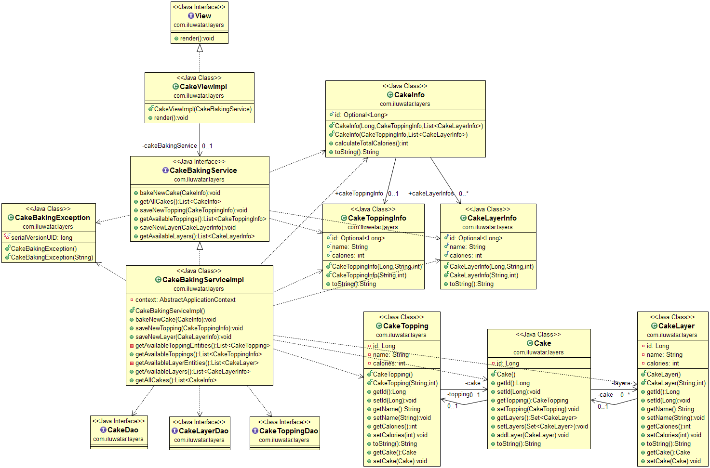

## Propósito

Capas (*Layers* en inglés) es un patrón arquitectónico donde las responsabilidades del software se dividen entre diferentes
capas de la aplicación.

## Explicación

Ejemplo del mundo real

> Considere un sitio web que muestra pasteles decorados para bodas y similares. En lugar de que la página web
> acceda directamente a la base de datos, depende de un servicio para entregar esta información. Luego, el
> servicio consulta la capa de datos para recopilar la información necesaria.

En otras palabras

> Con el patrón arquitectónico de Capas, diferentes responsabilidades residen en capas separadas. La capa de vista solo
> está interesada en la renderización, la capa de servicio ensambla los datos solicitados de varias fuentes, y
> la capa de datos obtiene la información del almacenamiento de datos.

Wikipedia dice

> En ingeniería de software, la arquitectura de varios niveles _multitier_ (a menudo referida como arquitectura n-tier) o
> arquitectura multicapa es una arquitectura cliente-servidor en la que las funciones de presentación, procesamiento de aplicaciones
> y gestión de datos están físicamente separadas.

**Ejemplo programático**

En la capa de datos, guardamos nuestros elementos básicos. `Cake` consta de capas (*layers*) y cobertura (*topping*).

```java
@Entity
public class Cake {
  @Id
  @GeneratedValue
  private Long id;
  @OneToOne(cascade = CascadeType.REMOVE)
  private CakeTopping topping;
  @OneToMany(cascade = CascadeType.REMOVE, fetch = FetchType.EAGER)
  private Set<CakeLayer> layers;
}
```

La capa de servicio ofrece `CakeBakingService` para un fácil acceso a diferentes aspectos de los pasteles.

```java
public interface CakeBakingService {
  void bakeNewCake(CakeInfo cakeInfo) throws CakeBakingException;
  List<CakeInfo> getAllCakes();
  void saveNewTopping(CakeToppingInfo toppingInfo);
  List<CakeToppingInfo> getAvailableToppings();
  void saveNewLayer(CakeLayerInfo layerInfo);
  List<CakeLayerInfo> getAvailableLayers();
}
```

En la parte superior tenemos nuestra `View`, responsable de renderizar los pasteles.

```java
public interface View {
  void render();
}
@Slf4j
public class CakeViewImpl implements View {
  private final CakeBakingService cakeBakingService;
  public CakeViewImpl(CakeBakingService cakeBakingService) {
    this.cakeBakingService = cakeBakingService;
  }
  public void render() {
    cakeBakingService.getAllCakes().forEach(cake -> LOGGER.info(cake.toString()));
  }
}
```

## Diagrama de clases



## Aplicabilidad

Utilice la arquitectura de Capas cuando:

* Quiera dividir claramente las responsabilidades del software en diferentes partes del programa.
* Quiera evitar que un cambio se propague a lo largo de la aplicación.
* Quiera hacer su aplicación más mantenible y testeable.

## Créditos

* [Pattern Oriented Software Architecture Volume 1: A System of Patterns](https://www.amazon.com/gp/product/0471958697/ref=as_li_tl?ie=UTF8&camp=1789&creative=9325&creativeASIN=0471958697&linkCode=as2&tag=javadesignpat-20&linkId=e3f42d7a2a4cc8c619bbc0136b20dadb)
