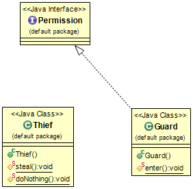

## Propósito
Utilización de interfaces vacías como marcadores para distinguir objetos con un tratamiento especial.

## Diagrama de clases

## Aplicabilidad
Utilice el patrón de interfaz de marcador cuando

* Desea identificar los objetos especiales de los objetos normales (para tratarlos de forma diferente)
* Desea indicar que un objeto está disponible para cierto tipo de operaciones.

## Ejemplos del mundo real

* [javase.8.docs.api.java.io.Serializable](https://docs.oracle.com/javase/8/docs/api/java/io/Serializable.html)
* [javase.8.docs.api.java.lang.Cloneable](https://docs.oracle.com/javase/8/docs/api/java/lang/Cloneable.html)

## Créditos

* [Effective Java](https://www.amazon.com/gp/product/0134685997/ref=as_li_tl?ie=UTF8&camp=1789&creative=9325&creativeASIN=0134685997&linkCode=as2&tag=javadesignpat-20&linkId=4e349f4b3ff8c50123f8147c828e53eb)
