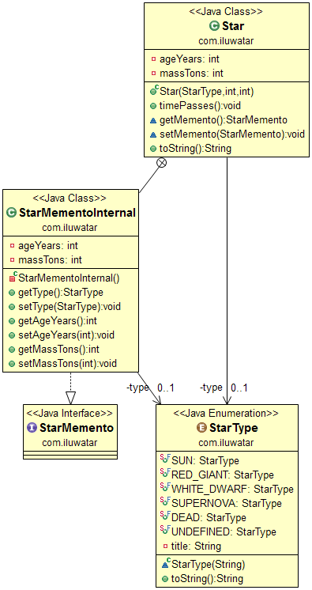

## También conocido como

Token

## Propósito

Sin violar la encapsulación, capturar y externalizar el estado interno de un objeto para que el objeto pueda ser restaurado a este estado más tarde.

## Explicación

Ejemplo del mundo real

> Estamos trabajando en una aplicación de astrología en la que necesitamos analizar las propiedades de las estrellas a lo largo del tiempo. Estamos creando instantáneas de los estados de las estrellas utilizando el patrón Memento.

En palabras sencillas

> El patrón Memento captura el estado interno de los objetos facilitando su almacenamiento y restauración en cualquier punto del tiempo.

Wikipedia dice

> El patrón memento es un patrón de diseño de software que proporciona la capacidad de restaurar un objeto a su estado anterior (deshacer vía rollback).

**Ejemplo programático**

Definamos primero los tipos de estrellas que somos capaces de manejar.

```java
public enum StarType {
  SUN("sun"),
  RED_GIANT("red giant"),
  WHITE_DWARF("white dwarf"),
  SUPERNOVA("supernova"),
  DEAD("dead star");
  ...
}
```

A continuación, vayamos directamente a lo esencial. Aquí está la clase `Star` junto con los mementos que necesitamos manipular. Presta especial atención a los métodos `getMemento` y `setMemento`.

```java
public interface StarMemento {
}

public class Star {

    private StarType type;
    private int ageYears;
    private int massTons;

    public Star(StarType startType, int startAge, int startMass) {
        this.type = startType;
        this.ageYears = startAge;
        this.massTons = startMass;
    }

    public void timePasses() {
        ageYears *= 2;
        massTons *= 8;
        switch (type) {
            case RED_GIANT -> type = StarType.WHITE_DWARF;
            case SUN -> type = StarType.RED_GIANT;
            case SUPERNOVA -> type = StarType.DEAD;
            case WHITE_DWARF -> type = StarType.SUPERNOVA;
            case DEAD -> {
                ageYears *= 2;
                massTons = 0;
            }
            default -> {
            }
        }
    }

    StarMemento getMemento() {
        var state = new StarMementoInternal();
        state.setAgeYears(ageYears);
        state.setMassTons(massTons);
        state.setType(type);
        return state;
    }

    void setMemento(StarMemento memento) {
        var state = (StarMementoInternal) memento;
        this.type = state.getType();
        this.ageYears = state.getAgeYears();
        this.massTons = state.getMassTons();
    }

    @Override
    public String toString() {
        return String.format("%s age: %d years mass: %d tons", type.toString(), ageYears, massTons);
    }

    private static class StarMementoInternal implements StarMemento {

        private StarType type;
        private int ageYears;
        private int massTons;

        // setters and getters ->
    ...
    }
}
```

Y, por último, así es como utilizamos los recuerdos para almacenar y restaurar estados estelares.

```java
    var states = new Stack<>();
    var star = new Star(StarType.SUN, 10000000, 500000);
    LOGGER.info(star.toString());
    states.add(star.getMemento());
    star.timePasses();
    LOGGER.info(star.toString());
    states.add(star.getMemento());
    star.timePasses();
    LOGGER.info(star.toString());
    states.add(star.getMemento());
    star.timePasses();
    LOGGER.info(star.toString());
    states.add(star.getMemento());
    star.timePasses();
    LOGGER.info(star.toString());
    while (states.size() > 0) {
      star.setMemento(states.pop());
      LOGGER.info(star.toString());
    }
```

Salida del programa:

```
sun age: 10000000 years mass: 500000 tons
red giant age: 20000000 years mass: 4000000 tons
white dwarf age: 40000000 years mass: 32000000 tons
supernova age: 80000000 years mass: 256000000 tons
dead star age: 160000000 years mass: 2048000000 tons
supernova age: 80000000 years mass: 256000000 tons
white dwarf age: 40000000 years mass: 32000000 tons
red giant age: 20000000 years mass: 4000000 tons
sun age: 10000000 years mass: 500000 tons
```

## Diagrama de clases



## Aplicabilidad

Utilice el patrón Memento cuando:

* Es necesario guardar una instantánea del estado de un objeto para poder restaurarlo más tarde, y
* Una interfaz directa para obtener el estado expondría detalles de implementación y rompería la encapsulación del objeto.

## Usos conocidos

* [java.util.Date](http://docs.oracle.com/javase/8/docs/api/java/util/Date.html)

## Créditos

* [Design Patterns: Elements of Reusable Object-Oriented Software](https://www.amazon.com/gp/product/0201633612/ref=as_li_tl?ie=UTF8&camp=1789&creative=9325&creativeASIN=0201633612&linkCode=as2&tag=javadesignpat-20&linkId=675d49790ce11db99d90bde47f1aeb59)
* [Head First Design Patterns: A Brain-Friendly Guide](https://www.amazon.com/gp/product/0596007124/ref=as_li_tl?ie=UTF8&camp=1789&creative=9325&creativeASIN=0596007124&linkCode=as2&tag=javadesignpat-20&linkId=6b8b6eea86021af6c8e3cd3fc382cb5b)
