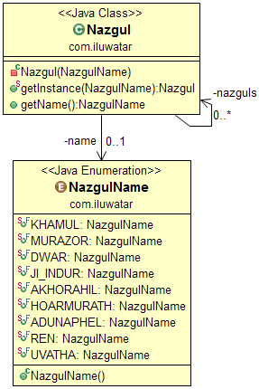

## También conocido como

Registry

## Propósito

Asegúrese de que una clase solo tiene un número limitado de instancias y proporcione un punto de acceso global a las
mismas.

## Explicación

Ejemplo del mundo real

> Los Nazgûl, también llamados espectros del anillo o los Nueve Jinetes, son los sirvientes más terribles de Sauron. Por
> definición, siempre hay nueve de ellos.

En palabras simples

> El patrón Multiton asegura que hay una cantidad predefinida de instancias disponibles globalmente.

Wikipedia dice

> En ingeniería de software, el patrón multiton es un patrón de diseño que generaliza el patrón singleton. Mientras que
> el singleton permite que solo se cree una instancia de una clase, el patrón multiton permite la creación controlada de
> múltiples instancias, las cuales gestiona mediante el uso de un mapa.

**Ejemplo Programático**

`Nazgul` es la clase multiton.

```java
public enum NazgulName {

  KHAMUL, MURAZOR, DWAR, JI_INDUR, AKHORAHIL, HOARMURATH, ADUNAPHEL, REN, UVATHA
}

public final class Nazgul {

  private static final Map<NazgulName, Nazgul> nazguls;

  private final NazgulName name;

  static {
    nazguls = new ConcurrentHashMap<>();
    nazguls.put(NazgulName.KHAMUL, new Nazgul(NazgulName.KHAMUL));
    nazguls.put(NazgulName.MURAZOR, new Nazgul(NazgulName.MURAZOR));
    nazguls.put(NazgulName.DWAR, new Nazgul(NazgulName.DWAR));
    nazguls.put(NazgulName.JI_INDUR, new Nazgul(NazgulName.JI_INDUR));
    nazguls.put(NazgulName.AKHORAHIL, new Nazgul(NazgulName.AKHORAHIL));
    nazguls.put(NazgulName.HOARMURATH, new Nazgul(NazgulName.HOARMURATH));
    nazguls.put(NazgulName.ADUNAPHEL, new Nazgul(NazgulName.ADUNAPHEL));
    nazguls.put(NazgulName.REN, new Nazgul(NazgulName.REN));
    nazguls.put(NazgulName.UVATHA, new Nazgul(NazgulName.UVATHA));
  }

  private Nazgul(NazgulName name) {
    this.name = name;
  }

  public static Nazgul getInstance(NazgulName name) {
    return nazguls.get(name);
  }

  public NazgulName getName() {
    return name;
  }
}
```

Y así es como accedemos a las instancias `Nazgul`.

```java
// eagerly initialized multiton
LOGGER.info("Printing out eagerly initialized multiton contents");
LOGGER.info("KHAMUL={}", Nazgul.getInstance(NazgulName.KHAMUL));
LOGGER.info("MURAZOR={}", Nazgul.getInstance(NazgulName.MURAZOR));
LOGGER.info("DWAR={}", Nazgul.getInstance(NazgulName.DWAR));
LOGGER.info("JI_INDUR={}", Nazgul.getInstance(NazgulName.JI_INDUR));
LOGGER.info("AKHORAHIL={}", Nazgul.getInstance(NazgulName.AKHORAHIL));
LOGGER.info("HOARMURATH={}", Nazgul.getInstance(NazgulName.HOARMURATH));
LOGGER.info("ADUNAPHEL={}", Nazgul.getInstance(NazgulName.ADUNAPHEL));
LOGGER.info("REN={}", Nazgul.getInstance(NazgulName.REN));
LOGGER.info("UVATHA={}", Nazgul.getInstance(NazgulName.UVATHA));

// enum multiton
LOGGER.info("Printing out enum-based multiton contents");
LOGGER.info("KHAMUL={}", NazgulEnum.KHAMUL);
LOGGER.info("MURAZOR={}", NazgulEnum.MURAZOR);
LOGGER.info("DWAR={}", NazgulEnum.DWAR);
LOGGER.info("JI_INDUR={}", NazgulEnum.JI_INDUR);
LOGGER.info("AKHORAHIL={}", NazgulEnum.AKHORAHIL);
LOGGER.info("HOARMURATH={}", NazgulEnum.HOARMURATH);
LOGGER.info("ADUNAPHEL={}", NazgulEnum.ADUNAPHEL);
LOGGER.info("REN={}", NazgulEnum.REN);
LOGGER.info("UVATHA={}", NazgulEnum.UVATHA);
```

Salida del programa:

```
20:35:07.413 [main] INFO com.iluwatar.multiton.App - Printing out eagerly initialized multiton contents
20:35:07.417 [main] INFO com.iluwatar.multiton.App - KHAMUL=com.iluwatar.multiton.Nazgul@48cf768c
20:35:07.419 [main] INFO com.iluwatar.multiton.App - MURAZOR=com.iluwatar.multiton.Nazgul@7960847b
20:35:07.419 [main] INFO com.iluwatar.multiton.App - DWAR=com.iluwatar.multiton.Nazgul@6a6824be
20:35:07.419 [main] INFO com.iluwatar.multiton.App - JI_INDUR=com.iluwatar.multiton.Nazgul@5c8da962
20:35:07.419 [main] INFO com.iluwatar.multiton.App - AKHORAHIL=com.iluwatar.multiton.Nazgul@512ddf17
20:35:07.419 [main] INFO com.iluwatar.multiton.App - HOARMURATH=com.iluwatar.multiton.Nazgul@2c13da15
20:35:07.419 [main] INFO com.iluwatar.multiton.App - ADUNAPHEL=com.iluwatar.multiton.Nazgul@77556fd
20:35:07.419 [main] INFO com.iluwatar.multiton.App - REN=com.iluwatar.multiton.Nazgul@368239c8
20:35:07.420 [main] INFO com.iluwatar.multiton.App - UVATHA=com.iluwatar.multiton.Nazgul@9e89d68
20:35:07.420 [main] INFO com.iluwatar.multiton.App - Printing out enum-based multiton contents
20:35:07.420 [main] INFO com.iluwatar.multiton.App - KHAMUL=KHAMUL
20:35:07.420 [main] INFO com.iluwatar.multiton.App - MURAZOR=MURAZOR
20:35:07.420 [main] INFO com.iluwatar.multiton.App - DWAR=DWAR
20:35:07.420 [main] INFO com.iluwatar.multiton.App - JI_INDUR=JI_INDUR
20:35:07.421 [main] INFO com.iluwatar.multiton.App - AKHORAHIL=AKHORAHIL
20:35:07.421 [main] INFO com.iluwatar.multiton.App - HOARMURATH=HOARMURATH
20:35:07.421 [main] INFO com.iluwatar.multiton.App - ADUNAPHEL=ADUNAPHEL
20:35:07.421 [main] INFO com.iluwatar.multiton.App - REN=REN
20:35:07.421 [main] INFO com.iluwatar.multiton.App - UVATHA=UVATHA
```

## Diagrama de Clases



## Aplicabilidad

Utilice el patrón Multiton cuando

* Debe haber un número determinado de instancias de una clase, y deben ser accesibles a los clientes desde un punto de
  acceso conocido.
