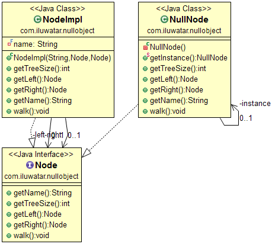

## Propósito

En la mayoría de los lenguajes orientados a objetos, como Java o C#, las referencias pueden ser nulas. Estas referencias deben comprobarse para asegurarse de que no son nulas antes de invocar cualquier método, porque normalmente los métodos no pueden invocarse sobre referencias nulas. En lugar de utilizar una referencia nula para indicar la ausencia de un objeto (por ejemplo, un cliente inexistente), se utiliza un objeto que implementa la interfaz esperada, pero cuyo cuerpo de método está vacío. La ventaja de este enfoque sobre una implementación por defecto es que un objeto nulo es muy predecible y no tiene efectos secundarios: no hace nada.

## Explicación

Ejemplo del mundo real

> Estamos construyendo un árbol binario a partir de nodos. Hay nodos normales y nodos "vacíos". Recorrer el árbol normalmente no debería causar errores, por lo que utilizamos el patrón de objetos nulos cuando es necesario.

En palabras sencillas

> El patrón de objetos nulos maneja los objetos "vacíos" con elegancia.

Wikipedia dice

> En programación informática orientada a objetos, un objeto nulo es un objeto sin valor referenciado o con un comportamiento neutro ("nulo") definido. El patrón de diseño de objetos nulos describe los usos de tales objetos y su comportamiento (o la falta del mismo).

**Ejemplo programático**

Esta es la definición de la interfaz `Node`.

```java
public interface Node {

  String getName();

  int getTreeSize();

  Node getLeft();

  Node getRight();

  void walk();
}
```

Tenemos dos implementaciones de `Node`. La implementación normal `NodeImpl` y `NullNode` para nodos vacíos.

```java
@Slf4j
public class NodeImpl implements Node {

  private final String name;
  private final Node left;
  private final Node right;

  /**
   * Constructor.
   */
  public NodeImpl(String name, Node left, Node right) {
    this.name = name;
    this.left = left;
    this.right = right;
  }

  @Override
  public int getTreeSize() {
    return 1 + left.getTreeSize() + right.getTreeSize();
  }

  @Override
  public Node getLeft() {
    return left;
  }

  @Override
  public Node getRight() {
    return right;
  }

  @Override
  public String getName() {
    return name;
  }

  @Override
  public void walk() {
    LOGGER.info(name);
    if (left.getTreeSize() > 0) {
      left.walk();
    }
    if (right.getTreeSize() > 0) {
      right.walk();
    }
  }
}

public final class NullNode implements Node {

  private static final NullNode instance = new NullNode();

  private NullNode() {
  }

  public static NullNode getInstance() {
    return instance;
  }

  @Override
  public int getTreeSize() {
    return 0;
  }

  @Override
  public Node getLeft() {
    return null;
  }

  @Override
  public Node getRight() {
    return null;
  }

  @Override
  public String getName() {
    return null;
  }

  @Override
  public void walk() {
    // Do nothing
  }
}
```

Entonces podemos construir y recorrer el árbol binario sin errores de la siguiente manera.

```java
    var root = new NodeImpl("1",
            new NodeImpl("11",
                new NodeImpl("111", NullNode.getInstance(), NullNode.getInstance()),
                NullNode.getInstance()
            ),
            new NodeImpl("12",
                NullNode.getInstance(),
                new NodeImpl("122", NullNode.getInstance(), NullNode.getInstance())
            )
        );
    root.walk();
```

Salida del programa:

```
1
11
111
12
122
```

## Diagrama de clases



## Aplicabilidad

Utilice el patrón Objeto nulo cuando

* Desea evitar la comprobación explícita de nulos y mantener el algoritmo elegante y fácil de leer.

## Créditos

* [Pattern Languages of Program Design 3](https://www.amazon.com/gp/product/0201310112/ref=as_li_tl?ie=UTF8&camp=1789&creative=9325&creativeASIN=0201310112&linkCode=as2&tag=javadesignpat-20&linkId=7372ffb8a4e39a3bb10f199b89aef921)
* [Refactoring to Patterns](https://www.amazon.com/gp/product/0321213351/ref=as_li_tl?ie=UTF8&camp=1789&creative=9325&creativeASIN=0321213351&linkCode=as2&tag=javadesignpat-20&linkId=2a76fcb387234bc71b1c61150b3cc3a7)
