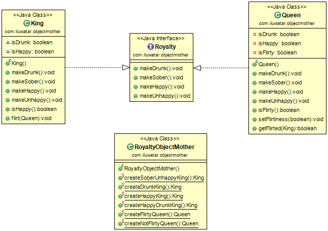

## Propósito

Se utiliza para definir una fábrica de contenido inmutable con interfaces de constructor y fábrica separadas.

## Diagrama de Clases



## Aplicabilidad

Utilice el patrón Object Mother cuando

* Quieres objetos consistentes a lo largo de varias pruebas
* Desea reducir el código para la creación de objetos en las pruebas.
* Cada prueba debe ejecutarse con datos nuevos

## Comprender el patrón madre objeto (Object Mother)

### Escenario real

Imagine que está desarrollando una aplicación Java para una agencia de viajes. En su sistema, hay diferentes tipos de
viajeros, como turistas, viajeros de negocios y agentes de viajes, cada uno con atributos y comportamientos específicos.
Para realizar pruebas exhaustivas, necesita crear y manipular estos objetos viajeros en varios contextos. El patrón
Object Mother puede ayudarle a generar objetos viajeros coherentes y predefinidos para las pruebas, garantizando que
estas se basen en datos conocidos y fiables.

### En palabras simples

El Patrón Objeto Madre (Object Mother) es un patrón de diseño utilizado en Java para simplificar la creación de objetos
con configuraciones específicas, especialmente para pruebas. En lugar de construir manualmente objetos con propiedades
variables para cada caso de prueba, se crea una clase o método "Objeto Madre" dedicado que produce estos objetos con
configuraciones predefinidas. De este modo se garantiza la coherencia y previsibilidad de los datos de las pruebas, lo
que las hace más fiables y fáciles de gestionar.

### Visión general desde el punto de vista de las pruebas

El patrón Objeto Madre (Object Mother) es un patrón de diseño relacionado con las pruebas que ayuda a mantener un
entorno de pruebas coherente y fiable. Permite definir y crear objetos con atributos específicos, lo que ayuda a
garantizar que las pruebas produzcan resultados coherentes y predecibles, lo que facilita la detección de problemas y el
mantenimiento del conjunto de pruebas.

### Uso práctico en pruebas

En las pruebas de software, sobre todo en las unitarias, el Patrón Objeto Madre tiene un valor incalculable. Ayuda a
asegurar que sus pruebas no están influenciadas por datos impredecibles, haciendo así sus pruebas más robustas y
repetibles. Al centralizar la creación de objetos de prueba en un Objeto Madre, puede adaptar fácilmente sus datos de
prueba a diferentes escenarios.

### Ejemplo en Java

He aquí un ejemplo ilustrativo en Java del Patrón Objeto Madre (Object Mother) en el contexto de una aplicación de
agencia de viajes:

```java
class Traveler {
    private String name;
    private int age;
    private boolean isBusinessTraveler;

    // Constructor and methods for the traveler
    // ...

    // Getter and setter methods
    // ...
}

class TravelerMother {
    public static Traveler createTourist(String name, int age) {
        Traveler traveler = new Traveler();
        traveler.setName(name);
        traveler.setAge(age);
        traveler.setBusinessTraveler(false);
        return traveler;
    }

    public static Traveler createBusinessTraveler(String name, int age) {
        Traveler traveler = new Traveler();
        traveler.setName(name);
        traveler.setAge(age);
        traveler.setBusinessTraveler(true);
        return traveler;
    }
}

public class TravelAgency {
    public static void main(String[] args) {
        // Using the Object Mother to create traveler objects for testing
        Traveler tourist = TravelerMother.createTourist("Alice", 28);
        Traveler businessTraveler = TravelerMother.createBusinessTraveler("Bob", 35);

        // Now you have consistent traveler objects for testing.
    }
}

```

En este ejemplo, TravelerMother es la clase Object Mother responsable de generar objetos Traveler predefinidos con
configuraciones específicas. Este enfoque garantiza que disponga de datos de prueba coherentes para diversos escenarios
en una aplicación de agencia de viajes, lo que mejora la fiabilidad y la eficacia de sus esfuerzos de prueba.

## Credits

* [Answer by David Brown](http://stackoverflow.com/questions/923319/what-is-an-objectmother) a la pregunta de
  stackoverflow: [What is an ObjectMother?](http://stackoverflow.com/questions/923319/what-is-an-objectmother)
* [c2wiki - Object Mother](http://c2.com/cgi/wiki?ObjectMother)
* [Nat Pryce - Test Data Builders: an alternative to the Object Mother pattern](http://www.natpryce.com/articles/000714.html)
