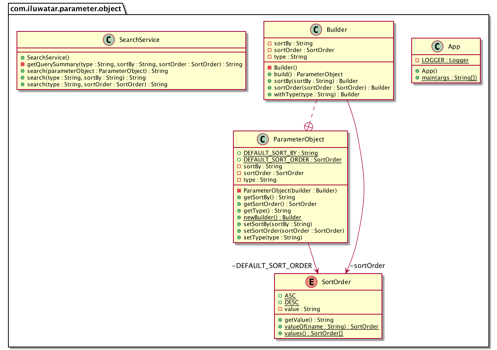

## Propósito

La sintaxis del lenguaje Java no permite declarar un método con un valor predefinido para un parámetro. Probablemente la mejor opción para conseguir parámetros de método predefinidos en Java es utilizar la sobrecarga de métodos. La sobrecarga de métodos permite declarar varios métodos con el mismo nombre pero con un número diferente de parámetros. Pero el principal problema con la sobrecarga de métodos como solución para los valores de los parámetros por defecto se revela cuando un método acepta múltiples parámetros. Crear un método sobrecargado para cada posible combinación de parámetros puede resultar engorroso. Para solucionar este problema, se utiliza el patrón Objeto Parámetro.

## Explicación

El Objeto Parámetro (Parameter Object) es simplemente un objeto envoltorio para todos los parámetros de un método. No es más que un POJO normal. La ventaja del Objeto Parámetro sobre una lista regular de parámetros de método es el hecho de que los campos de clase pueden tener valores por defecto. Una vez creada la clase envoltorio para la lista de parámetros del método, se crea también una clase constructora correspondiente. Normalmente es una clase estática interna. El paso final es utilizar el constructor para construir un nuevo objeto parámetro. Para aquellos parámetros que se omitan, se utilizarán sus valores por defecto.


**Ejemplo programático**

Aquí está la simple clase `SearchService` donde se utiliza la sobrecarga de métodos para los valores por defecto aquí. Para utilizar la sobrecarga de métodos, el número de argumentos o el tipo de argumento tiene que ser diferente.

```java
public class SearchService {
  //Method Overloading example. SortOrder is defaulted in this method
  public String search(String type, String sortBy) {
    return getQuerySummary(type, sortBy, SortOrder.DESC);
  }

  /* Method Overloading example. SortBy is defaulted in this method. Note that the type has to be 
  different here to overload the method */
  public String search(String type, SortOrder sortOrder) {
    return getQuerySummary(type, "price", sortOrder);
  }

  private String getQuerySummary(String type, String sortBy, SortOrder sortOrder) {
    return "Requesting shoes of type \"" + type + "\" sorted by \"" + sortBy + "\" in \""
        + sortOrder.getValue() + "ending\" order...";
  }
}

```

A continuación presentamos el `SearchService` con `ParameterObject` creado con el patrón Builder.

```java
public class SearchService {

  /* Parameter Object example. Default values are abstracted into the Parameter Object 
  at the time of Object creation */
  public String search(ParameterObject parameterObject) {
    return getQuerySummary(parameterObject.getType(), parameterObject.getSortBy(),
        parameterObject.getSortOrder());
  }
  
  private String getQuerySummary(String type, String sortBy, SortOrder sortOrder) {
    return "Requesting shoes of type \"" + type + "\" sorted by \"" + sortBy + "\" in \""
        + sortOrder.getValue() + "ending\" order...";
  }
}

public class ParameterObject {
  public static final String DEFAULT_SORT_BY = "price";
  public static final SortOrder DEFAULT_SORT_ORDER = SortOrder.ASC;

  private String type;
  private String sortBy = DEFAULT_SORT_BY;
  private SortOrder sortOrder = DEFAULT_SORT_ORDER;

  private ParameterObject(Builder builder) {
    type = builder.type;
    sortBy = builder.sortBy != null && !builder.sortBy.isBlank() ? builder.sortBy : sortBy;
    sortOrder = builder.sortOrder != null ? builder.sortOrder : sortOrder;
  }

  public static Builder newBuilder() {
    return new Builder();
  }

  //Getters and Setters...

  public static final class Builder {

    private String type;
    private String sortBy;
    private SortOrder sortOrder;

    private Builder() {
    }

    public Builder withType(String type) {
      this.type = type;
      return this;
    }

    public Builder sortBy(String sortBy) {
      this.sortBy = sortBy;
      return this;
    }

    public Builder sortOrder(SortOrder sortOrder) {
      this.sortOrder = sortOrder;
      return this;
    }

    public ParameterObject build() {
      return new ParameterObject(this);
    }
  }
}


```

## Diagrama de clases



## Aplicabilidad

Este patrón nos muestra la forma de tener parámetros por defecto para un método en Java ya que el lenguaje no tiene la característica de parámetros por defecto fuera de la caja.

## Créditos

- [Does Java have default parameters?](http://dolszewski.com/java/java-default-parameters)
