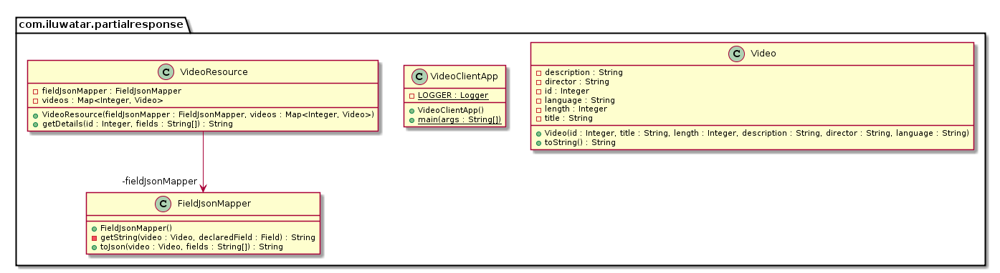

## Propósito
Enviar una respuesta parcial del servidor al cliente en función de sus necesidades. El cliente especificará los campos que necesita al servidor, en lugar de servir todos los detalles del recurso.

## Diagrama de clases

## Aplicabilidad
Utilice el patrón de respuesta parcial cuando

* El cliente sólo necesita un subconjunto de datos del recurso.
* Para evitar demasiada transferencia de datos por cable

## Créditos

* [Common Design Patterns](https://cloud.google.com/apis/design/design_patterns)
