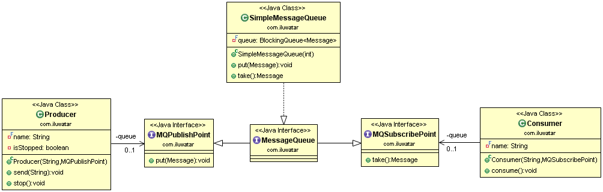

## Propósito

La píldora venenosa es un elemento de datos predefinido conocido que permite proporcionar un cierre graceful para un proceso de consumo distribuido independiente.

## Explicación

Ejemplo del mundo real

> Pensemos en una cola de mensajes con un productor y un consumidor. El productor sigue introduciendo nuevos mensajes en la cola y el consumidor sigue leyéndolos. Finalmente, cuando llega el momento de cerrar la cola, el productor envía el mensaje de píldora venenosa.

En pocas palabras

> Poison Pill es una estructura de mensaje conocida que pone fin al intercambio de mensajes.

**Ejemplo programático**

Definamos primero la estructura del mensaje. Hay una interfaz `Message` y una implementación `SimpleMessage`.

```java
public interface Message {

  ...

  enum Headers {
    DATE, SENDER
  }

  void addHeader(Headers header, String value);

  String getHeader(Headers header);

  Map<Headers, String> getHeaders();

  void setBody(String body);

  String getBody();
}

public class SimpleMessage implements Message {

  private final Map<Headers, String> headers = new HashMap<>();
  private String body;

  @Override
  public void addHeader(Headers header, String value) {
    headers.put(header, value);
  }

  @Override
  public String getHeader(Headers header) {
    return headers.get(header);
  }

  @Override
  public Map<Headers, String> getHeaders() {
    return Collections.unmodifiableMap(headers);
  }

  @Override
  public void setBody(String body) {
    this.body = body;
  }

  @Override
  public String getBody() {
    return body;
  }
}
```

Para pasar mensajes utilizamos colas de mensajes. Aquí definimos los tipos relacionados con la cola de mensajes: `MqPublishPoint`, `MqSubscribePoint` y `MessageQueue`. `SimpleMessageQueue` implementa todas estas interfaces.

```java
public interface MqPublishPoint {

  void put(Message msg) throws InterruptedException;
}

public interface MqSubscribePoint {

  Message take() throws InterruptedException;
}

public interface MessageQueue extends MqPublishPoint, MqSubscribePoint {
}

public class SimpleMessageQueue implements MessageQueue {

  private final BlockingQueue<Message> queue;

  public SimpleMessageQueue(int bound) {
    queue = new ArrayBlockingQueue<>(bound);
  }

  @Override
  public void put(Message msg) throws InterruptedException {
    queue.put(msg);
  }

  @Override
  public Message take() throws InterruptedException {
    return queue.take();
  }
}
```

A continuación necesitamos los mensajes `Producer` y `Consumer`. Internamente utilizan las colas de mensajes de arriba. Es importante notar que cuando `Producer` se detiene, envía la píldora venenosa para informar a `Consumer` que la mensajería ha terminado.

```java
public class Producer {
  
  ... 

  public void send(String body) {
    if (isStopped) {
      throw new IllegalStateException(String.format(
          "Producer %s was stopped and fail to deliver requested message [%s].", body, name));
    }
    var msg = new SimpleMessage();
    msg.addHeader(Headers.DATE, new Date().toString());
    msg.addHeader(Headers.SENDER, name);
    msg.setBody(body);

    try {
      queue.put(msg);
    } catch (InterruptedException e) {
      // allow thread to exit
      LOGGER.error("Exception caught.", e);
    }
  }

  public void stop() {
    isStopped = true;
    try {
      queue.put(Message.POISON_PILL);
    } catch (InterruptedException e) {
      // allow thread to exit
      LOGGER.error("Exception caught.", e);
    }
  }
}

public class Consumer {

  ...

  public void consume() {
    while (true) {
      try {
        var msg = queue.take();
        if (Message.POISON_PILL.equals(msg)) {
          LOGGER.info("Consumer {} receive request to terminate.", name);
          break;
        }
        var sender = msg.getHeader(Headers.SENDER);
        var body = msg.getBody();
        LOGGER.info("Message [{}] from [{}] received by [{}]", body, sender, name);
      } catch (InterruptedException e) {
        // allow thread to exit
        LOGGER.error("Exception caught.", e);
        return;
      }
    }
  }
}
```

Por último, estamos listos para presentar todo el ejemplo en acción.

```java
    var queue = new SimpleMessageQueue(10000);

    final var producer = new Producer("PRODUCER_1", queue);
    final var consumer = new Consumer("CONSUMER_1", queue);

    new Thread(consumer::consume).start();

    new Thread(() -> {
      producer.send("hand shake");
      producer.send("some very important information");
      producer.send("bye!");
      producer.stop();
    }).start();
```

Salida del programa:

```
Message [hand shake] from [PRODUCER_1] received by [CONSUMER_1]
Message [some very important information] from [PRODUCER_1] received by [CONSUMER_1]
Message [bye!] from [PRODUCER_1] received by [CONSUMER_1]
Consumer CONSUMER_1 receive request to terminate.
```

## Diagrama de clases



## Aplicabilidad

Utiliza la expresión "píldora envenenada" (Poison pill) cuando:

* Hay una necesidad de enviar una señal de un hilo/proceso a otro para terminar.

## Ejemplos del mundo real

* [akka.actor.PoisonPill](http://doc.akka.io/docs/akka/2.1.4/java/untyped-actors.html)
