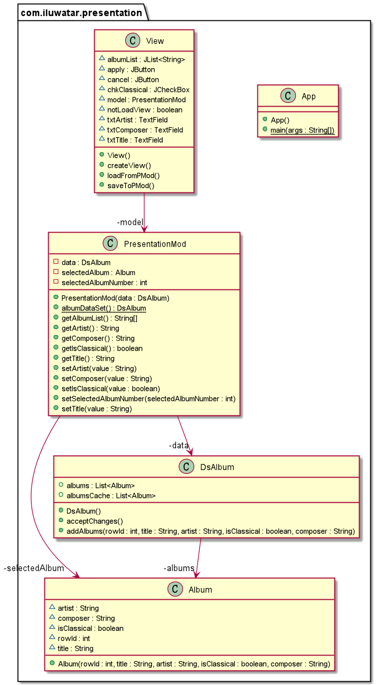

## También conocido como
Application Model

## Propósito
El modelo de presentación extrae el estado y el comportamiento de la vista a una clase modelo que forma parte de la presentación.

## Explicación

Ejemplo del mundo real

> Cuando necesitamos escribir un programa con GUI, no es necesario que pongamos todo el comportamiento de la presentación en la clase view. Porque será más difícil de probar. Así que podemos utilizar Presentation Model Pattern para separar el comportamiento y la vista. La vista solo necesita cargar los datos y estados de otra clase y mostrar estos datos en la pantalla de acuerdo a los estados.

En palabras simples

> un patrón que divide la presentación y el control.

Ejemplo de código

La clase `view` es la GUI de los álbumes. Los métodos `saveToPMod` y `loadFromPMod` se utilizan para lograr la sincronización.

```java
public class View {
  /**
   * the model that controls this view.
   */
  private final PresentationModel model;

  private TextField txtTitle;
  private TextField txtArtist;
  private JCheckBox chkClassical;
  private TextField txtComposer;
  private JList<String> albumList;
  private JButton apply;
  private JButton cancel;

  public View() {
    model = new PresentationModel(PresentationModel.albumDataSet());
  }

  /**
   * save the data to PresentationModel.
   */
  public void saveToPMod() {
    LOGGER.info("Save data to PresentationModel");
    model.setArtist(txtArtist.getText());
    model.setTitle(txtTitle.getText());
    model.setIsClassical(chkClassical.isSelected());
    model.setComposer(txtComposer.getText());
  }

  /**
   * load the data from PresentationModel.
   */
  public void loadFromPMod() {
    LOGGER.info("Load data from PresentationModel");
    txtArtist.setText(model.getArtist());
    txtTitle.setText(model.getTitle());
    chkClassical.setSelected(model.getIsClassical());
    txtComposer.setEditable(model.getIsClassical());
    txtComposer.setText(model.getComposer());
  }

  public void createView() {
    // the detail of GUI information like size, listenser and so on.
  }
}
```

La clase `Album` sirve para almacenar información de un álbum.

```java
public class Album {
    
  private String title;
  private String artist;
  private boolean isClassical;
  /**
   * only when the album is classical,
   * composer can have content.
   */
  private String composer;
}

```

La clase `DisplatedAlbums` almacena la información de todos los álbumes que se mostrarán en la GUI.

```java
public class DisplayedAlbums {
  private final List<Album> albums;

  public DisplayedAlbums() {
    this.albums = new ArrayList<>();
  }

  public void addAlbums(final String title,
                        final String artist, final boolean isClassical,
                        final String composer) {
    if (isClassical) {
      this.albums.add(new Album(title, artist, true, composer));
    } else {
      this.albums.add(new Album(title, artist, false, ""));
    }
  }
}
```

Clase `PresentationMod` se utiliza para controlar toda la acción de GUI.

```java
public class PresentationModel {
  private final DisplayedAlbums data;
  
  private int selectedAlbumNumber;
  private Album selectedAlbum;

  public PresentationModel(final DisplayedAlbums dataOfAlbums) {
    this.data = dataOfAlbums;
    this.selectedAlbumNumber = 1;
    this.selectedAlbum = this.data.getAlbums().get(0);
  }

  /**
   * Changes the value of selectedAlbumNumber.
   *
   * @param albumNumber the number of album which is shown on the view.
   */
  public void setSelectedAlbumNumber(final int albumNumber) {
    LOGGER.info("Change select number from {} to {}",
            this.selectedAlbumNumber, albumNumber);
    this.selectedAlbumNumber = albumNumber;
    this.selectedAlbum = data.getAlbums().get(this.selectedAlbumNumber - 1);
  }

  public String getTitle() {
    return selectedAlbum.getTitle();
  }
  // other get methods are like this, which are used to get information of selected album.

  public void setTitle(final String value) {
    LOGGER.info("Change album title from {} to {}",
            selectedAlbum.getTitle(), value);
    selectedAlbum.setTitle(value);
  }
  // other set methods are like this, which are used to get information of selected album.

  /**
   * Gets a list of albums.
   *
   * @return the names of all the albums.
   */
  public String[] getAlbumList() {
    var result = new String[data.getAlbums().size()];
    for (var i = 0; i < result.length; i++) {
      result[i] = data.getAlbums().get(i).getTitle();
    }
    return result;
  }
}
```

Podemos ejecutar la clase `App` para iniciar esta demo. la casilla de verificación es el álbum clásico; el primer campo de texto es el nombre del artista del álbum; el segundo es el nombre del título del álbum; el último es el nombre del compositor:


## Diagrama de clases


## Aplicabilidad
Utilice el patrón de modelo de presentación cuando

* Probar una presentación a través de una ventana GUI es a menudo incómodo, y en algunos casos imposible.
* No determine qué GUI se utilizará.

## Patrones relacionados

- [Supervising Controller](https://martinfowler.com/eaaDev/SupervisingPresenter.html) 
- [Passive View](https://martinfowler.com/eaaDev/PassiveScreen.html)

## Créditos

* [Presentation Model Patterns](https://martinfowler.com/eaaDev/PresentationModel.html)

