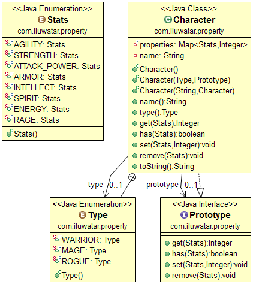

## Propósito

Crear jerarquía de objetos y nuevos objetos utilizando objetos existentes como padres.

## Explicación

Ejemplo del mundo real

> En la mística tierra de _"Elandria"_, los aventureros pueden aprovechar el poder de las reliquias antiguas para
> personalizar sus habilidades. Cada reliquia representa una propiedad o habilidad única. A medida que los aventureros
> exploran, descubren e integran nuevas reliquias, mejorando dinámicamente sus habilidades en función de las reliquias
> que
> poseen.

> Considera un software moderno utilizado en el diseño y personalización de teléfonos inteligentes. Los diseñadores
> pueden elegir entre una variedad de componentes como el tipo de procesador, las especificaciones de la cámara, la
> capacidad de la batería y más. Cada componente representa una propiedad del teléfono inteligente. A medida que la
> tecnología evoluciona y se disponen de nuevos componentes, los diseñadores pueden agregar o reemplazar propiedades sin
> problemas para crear una configuración de teléfono inteligente única sin redefinir la estructura de diseño central.

En palabras simples

> Define y gestiona un conjunto dinámico de propiedades para un objeto, permitiendo la personalización sin alterar su
> estructura.

**Ejemplo Programático**

```java
import java.util.HashMap;
import java.util.Map;

// Enumeration for possible properties or statistics a character can have
enum Stats {
    AGILITY, ATTACK_POWER, ARMOR, INTELLECT, SPIRIT, FURY, RAGE;
}

// Enumeration for different types or classes of characters
enum Type {
    WARRIOR, MAGE, ROGUE;
}

// Interface defining prototype operations on a character
interface Prototype {
    Integer get(Stats stat);
    boolean has(Stats stat);
    void set(Stats stat, Integer value);
    void remove(Stats stat);
}

// Implementation of the Character class
class Character implements Prototype {
    private String name;
    private Type type;
    private Map<Stats, Integer> properties = new HashMap<>();

    public Character() {}

    public Character(Type type, Prototype prototype) {
        this.type = type;
        for (Stats stat : Stats.values()) {
            if (prototype.has(stat)) {
                this.set(stat, prototype.get(stat));
            }
        }
    }

    public Character(String name, Type type) {
        this.name = name;
        this.type = type;
    }

    @Override
    public Integer get(Stats stat) {
        return properties.get(stat);
    }

    @Override
    public boolean has(Stats stat) {
        return properties.containsKey(stat);
    }

    @Override
    public void set(Stats stat, Integer value) {
        properties.put(stat, value);
    }

    @Override
    public void remove(Stats stat) {
        properties.remove(stat);
    }

    @Override
    public String toString() {
        return "Character{name='" + name + "', type=" + type + ", properties=" + properties + '}';
    }
}

// Main class to demonstrate the pattern
public class PropertyPatternDemo {
    public static void main(String[] args) {
        // Create a prototype character
        Character prototypeWarrior = new Character("Proto Warrior", Type.WARRIOR);
        prototypeWarrior.set(Stats.ATTACK_POWER, 10);
        prototypeWarrior.set(Stats.ARMOR, 15);

        // Create a new character using the prototype
        Character newWarrior = new Character(Type.WARRIOR, prototypeWarrior);
        newWarrior.set(Stats.AGILITY, 5);

        System.out.println(prototypeWarrior);
        System.out.println(newWarrior);
    }
}
```

Salida del programa:

```
Character{name='Proto Warrior', type=WARRIOR, properties={ARMOR=15, ATTACK_POWER=10}}
Character{name='null', type=WARRIOR, properties={ARMOR=15, AGILITY=5, ATTACK_POWER=10}}
```

## Diagrama de Clases



## Aplicabilidad

Utilice el patrón Property cuando

* Cuando desee tener objetos con un conjunto dinámico de campos y herencia de prototipos

## Ejemplo del mundo real

* [JavaScript](https://developer.mozilla.org/en-US/docs/Web/JavaScript/Inheritance_and_the_prototype_chain) prototipo
  herencia
