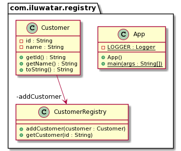

## Propósito

Almacena los objetos de una única clase y proporciona un punto de acceso global a los mismos.
Similar al patrón Multiton, la única diferencia es que en un registro no hay restricción en el número de objetos.

## Explicación

En pocas palabras

> El registro es un objeto bien conocido que otros objetos pueden utilizar para encontrar objetos y servicios comunes.

**Ejemplo Programático**
A continuación se muestra una clase `Cliente

```java
public class Customer {

  private final String id;
  private final String name;

  public Customer(String id, String name) {
    this.id = id;
    this.name = name;
  }

  public String getId() {
    return id;
  }

  public String getName() {
    return name;
  }

}
```

Este registro de los objetos `Customer` es `CustomerRegistry`.

```java
public final class CustomerRegistry {

  private static final CustomerRegistry instance = new CustomerRegistry();

  public static CustomerRegistry getInstance() {
    return instance;
  }

  private final Map<String, Customer> customerMap;

  private CustomerRegistry() {
    customerMap = new ConcurrentHashMap<>();
  }

  public Customer addCustomer(Customer customer) {
    return customerMap.put(customer.getId(), customer);
  }

  public Customer getCustomer(String id) {
    return customerMap.get(id);
  }

}
```

## Diagrama de Clases



## Aplicabilidad

Usar el patrón Registry cuando

* El cliente quiere una referencia de algún objeto, por lo que el cliente puede buscar ese objeto en el registro del
  objeto.

## Consecuencias

Un gran número de objetos voluminosos añadidos al registro daría lugar a un gran consumo de memoria, ya que los objetos
del registro no se recogen de la basura.

## Créditos

* https://www.martinfowler.com/eaaCatalog/registry.html
* https://wiki.c2.com/?RegistryPattern
