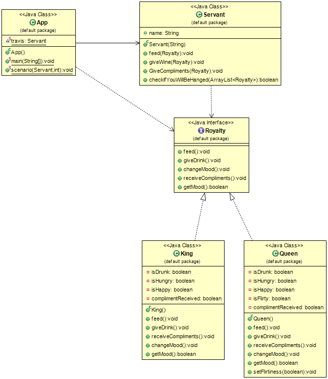

## Propósito
Servant se utiliza para proporcionar algún comportamiento a un grupo de clases.
En lugar de definir ese comportamiento en cada clase - o cuando no podemos factorizar
este comportamiento en la clase padre común - se define una vez en el Servant.

## Explicación

Ejemplo del mundo real

> El Rey, la Reina y otros miembros reales de palacio necesitan sirvientes que les den de comer,
> organizar bebidas, etc.

En otras palabras

> Garantiza que un objeto servidor preste determinados servicios a un grupo de clases atendidas.

Wikipedia dice

> En ingeniería de software, el patrón Servant define un objeto utilizado para ofrecer alguna funcionalidad
> a un grupo de clases sin definir esa funcionalidad en cada una de ellas. Un Servant es una clase
> cuya instancia (o incluso sólo clase) proporciona métodos que se encargan de un servicio deseado, mientras que
> los objetos para los que (o con los que) el Servant hace algo, se toman como parámetros.

**Ejemplo programático**

La clase Servant puede prestar servicios a otros miembros reales de palacio.

```java
/**
 * Servant.
 */
public class Servant {

  public String name;

  /**
   * Constructor.
   */
  public Servant(String name) {
    this.name = name;
  }

  public void feed(Royalty r) {
    r.getFed();
  }

  public void giveWine(Royalty r) {
    r.getDrink();
  }

  public void giveCompliments(Royalty r) {
    r.receiveCompliments();
  }

  /**
   * Check if we will be hanged.
   */
  public boolean checkIfYouWillBeHanged(List<Royalty> tableGuests) {
    return tableGuests.stream().allMatch(Royalty::getMood);
  }
}
```

Royalty es una interfaz. Es implementada por las clases King, y Queen para obtener servicios de servant.

```java
interface Royalty {

    void getFed();

    void getDrink();

    void changeMood();

    void receiveCompliments();

    boolean getMood();
}
```
La clase King implementa la interfaz Royalty.
```java
public class King implements Royalty {

    private boolean isDrunk;
    private boolean isHungry = true;
    private boolean isHappy;
    private boolean complimentReceived;

    @Override
    public void getFed() {
        isHungry = false;
    }

    @Override
    public void getDrink() {
        isDrunk = true;
    }

    public void receiveCompliments() {
        complimentReceived = true;
    }

    @Override
    public void changeMood() {
        if (!isHungry && isDrunk) {
            isHappy = true;
        }
        if (complimentReceived) {
            isHappy = false;
        }
    }

    @Override
    public boolean getMood() {
        return isHappy;
    }
}
```
La clase Queen implementa la interfaz Royalty.
```java
public class Queen implements Royalty {

    private boolean isDrunk = true;
    private boolean isHungry;
    private boolean isHappy;
    private boolean isFlirty = true;
    private boolean complimentReceived;

    @Override
    public void getFed() {
        isHungry = false;
    }

    @Override
    public void getDrink() {
        isDrunk = true;
    }

    public void receiveCompliments() {
        complimentReceived = true;
    }

    @Override
    public void changeMood() {
        if (complimentReceived && isFlirty && isDrunk && !isHungry) {
            isHappy = true;
        }
    }

    @Override
    public boolean getMood() {
        return isHappy;
    }

    public void setFlirtiness(boolean f) {
        this.isFlirty = f;
    }

}
```

Luego:

```java
public class App {

    private static final Servant jenkins = new Servant("Jenkins");
    private static final Servant travis = new Servant("Travis");

    /**
     * Program entry point.
     */
    public static void main(String[] args) {
        scenario(jenkins, 1);
        scenario(travis, 0);
    }

    /**
     * Can add a List with enum Actions for variable scenarios.
     */
    public static void scenario(Servant servant, int compliment) {
        var k = new King();
        var q = new Queen();

        var guests = List.of(k, q);

        // feed
        servant.feed(k);
        servant.feed(q);
        // serve drinks
        servant.giveWine(k);
        servant.giveWine(q);
        // compliment
        servant.giveCompliments(guests.get(compliment));

        // outcome of the night
        guests.forEach(Royalty::changeMood);

        // check your luck
        if (servant.checkIfYouWillBeHanged(guests)) {
            LOGGER.info("{} will live another day", servant.name);
        } else {
            LOGGER.info("Poor {}. His days are numbered", servant.name);
        }
    }
}
```

La salida de la consola

```
Jenkins will live another day
Poor Travis. His days are numbered
```


## Diagrama de clases


## Aplicabilidad
Utiliza el patrón Servant cuando

* Cuando queremos que algunos objetos realicen una acción común y no queremos definir esta acción como un método en cada clase.

## Créditos

* [Let's Modify the Objects-First Approach into Design-Patterns-First](http://edu.pecinovsky.cz/papers/2006_ITiCSE_Design_Patterns_First.pdf)
