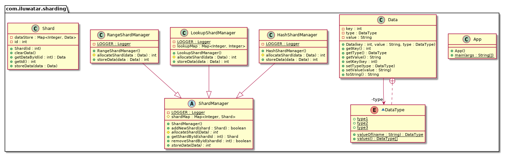

---
title: Sharding 
shortTitle: Sharding 
category: Behavioral
language: es
tag:  
 - Performance
 - Cloud distributed
---  
  
## Propósito
El patrón sharding significa dividir el almacén de datos en particiones horizontales o shards. Cada fragmento tiene el mismo esquema, pero contiene su propio subconjunto de datos.
Un fragmento es un almacén de datos en sí mismo (puede contener los datos de muchas entidades de diferentes tipos), que se ejecuta en un servidor que actúa como nodo de almacenamiento.

## Diagrama de clases

## Aplicabilidad
Este patrón ofrece las siguientes ventajas:

- Se puede ampliar el sistema añadiendo más fragmentos que se ejecuten en nodos de almacenamiento adicionales.
- El sistema puede utilizar hardware comercial en lugar de ordenadores especializados (y caros) para cada nodo de almacenamiento.
- Se puede reducir la contención y mejorar el rendimiento equilibrando la carga de trabajo entre los shards.
- En la nube, los shards pueden ubicarse físicamente cerca de los usuarios que accederán a los datos.

## Créditos
  
* [Sharding pattern](https://docs.microsoft.com/en-us/azure/architecture/patterns/sharding)