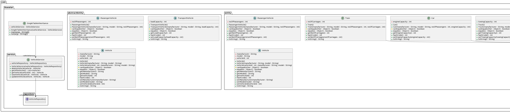

## Single Table Inheritance(STI)

## Propósito

Representa una jerarquía hereditaria de clases como una única tabla que tiene columnas para todos los campos de las distintas clases.

## Explicación

Un ejemplo real

> Puede haber muchos tipos diferentes de vehículos en este mundo pero todos ellos se engloban bajo el único paraguas de Vehículo

En palabras sencillas

> Mapea cada instancia de clase de un árbol de herencia en una única tabla.

Wikipedia dice

> La herencia de tabla única es una forma de emular la herencia orientada a objetos en una base de datos relacional. Al mapear desde una tabla de la base de datos a un objeto en un lenguaje orientado a objetos, un campo de la base de datos identifica a qué clase de la jerarquía pertenece el objeto. Todos los campos de todas las clases se almacenan en la misma tabla, de ahí el nombre de "herencia de tabla única".

**Ejemplo programático**

Baeldung - Herencia de Hibernate

> Podemos definir la estrategia que queremos utilizar añadiendo la anotación @Inheritance a la superclase:

```java
@Entity
@Inheritance(strategy = InheritanceType.SINGLE_TABLE)
public class MyProduct {
  @Id
  private long productId;
  private String name;

  // constructor, getters, setters
}
```

El identificador de las entidades también se define en la superclase.

A continuación, podemos añadir las entidades de la subclase:

```java
@Entity
public class Book extends MyProduct {
  private String author;
}
```

```java
@Entity
public class Pen extends MyProduct {
  private String color;
}
```
Valores del discriminador

- Dado que los registros de todas las entidades estarán en la misma tabla, Hibernate necesita una forma de diferenciarlos.

- Por defecto, esto se hace a través de una columna discriminadora llamada DTYPE que tiene como valor el nombre de la entidad.

- Para personalizar la columna discriminadora, podemos utilizar la anotación @DiscriminatorColumn:

```java
@Entity(name="products")
@Inheritance(strategy = InheritanceType.SINGLE_TABLE)
@DiscriminatorColumn(name="product_type",
        discriminatorType = DiscriminatorType.INTEGER)
public class MyProduct {
  // ...
}
```
- Aquí hemos optado por diferenciar las entidades de la subclase MyProduct mediante una columna entera llamada product_type.

- A continuación, tenemos que indicar a Hibernate qué valor tendrá cada registro de subclase para la columna product_type:

```java
@Entity
@DiscriminatorValue("1")
public class Book extends MyProduct {
  // ...
}
```
```java
@Entity
@DiscriminatorValue("2")
public class Pen extends MyProduct {
  // ...
}
```

- Hibernate añade otros dos valores predefinidos que puede tomar la anotación: null y not null:

  - @DiscriminatorValue("null") significa que cualquier fila sin valor discriminador se asignará a la clase de entidad con esta anotación; esto puede aplicarse a la clase raíz de la jerarquía.
  - @DiscriminatorValue("not null"): cualquier fila con un valor discriminador que no coincida con ninguno de los asociados a las definiciones de entidad se asignará a la clase con esta anotación.

## Diagrama de clases



## Aplicabilidad

Utilice el patrón Singleton cuando

## Use STI Cuando Las Subclases Tienen Los Mismos Campos/Columnas Pero Diferente Comportamiento
- Una buena indicación de que STI es correcto es cuando las diferentes subclases tienen los mismos campos/columnas pero diferentes métodos. En el ejemplo de cuentas anterior, esperamos que todas las columnas de la base de datos sean utilizadas por cada subclase. De lo contrario, habrá muchas columnas nulas en la base de datos.
  <br><br>
* Utilizar STI cuando esperamos realizar consultas en todas las subclases
  - Otra buena indicación de que STI es correcto es si esperamos realizar consultas a través de todas las clases. Por ejemplo, si queremos encontrar las 10 cuentas con los saldos más altos en todas las clases, STI nos permite utilizar sólo una consulta, mientras que MTI requerirá manipulación en memoria.

### Tutoriales

- <a href ="https://www.youtube.com/watch?v=M5YrLtAHtOo" >Cerebros de Java - Herencia de tabla única</a>

## Consecuencias

* Los campos a veces son relevantes y a veces no, lo que puede confundir a la gente que usa las tablas directamente.
* Las columnas utilizadas sólo por algunas subclases hacen que se desperdicie espacio en la base de datos.
  Hasta qué punto esto es realmente un problema depende de las características
  específicas de los datos y de lo bien que la base de datos comprima las columnas vacías.
  Oracle, por ejemplo, es muy eficiente en el recorte de espacio desperdiciado, particularmente columnas opcionales a la derecha de la tabla de la base de datos.
  Cada base de datos tiene sus propios trucos para esto.
* La tabla única puede acabar siendo demasiado grande, con muchos índices y frecuentes, lo que puede perjudicar el rendimiento. Puede evitar esto teniendo
  tablas de índices separadas que o bien enumeran claves de filas que tienen una determinada propiedad o que copien un subconjunto de campos relevantes para un índice.
* Sólo se dispone de un único espacio de nombres para los campos, por lo que hay que asegurarse de que
  de no utilizar el mismo nombre para diferentes campos. Los nombres compuestos con el nombre de la clase como prefijo o sufijo.

## Patrones relacionados

* MappedSuperclass
* Single Table
* Joined Table
* Table per Class

## Créditos

* [Single Table Inheritance - martinFowler.com](https://www.martinfowler.com/eaaCatalog/singleTableInheritance.html)
* [Patterns of Enterprise Application Architecture](https://books.google.co.in/books?id=vqTfNFDzzdIC&pg=PA278&redir_esc=y#v=onepage&q&f=false)
