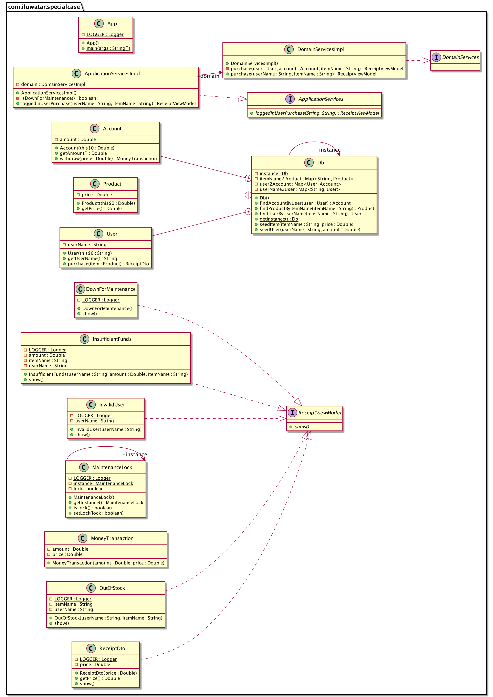

## Propósito

Define algunos casos especiales, y los encapsula en subclases que proporcionan diferentes comportamientos especiales.

## Explicación

Ejemplo del mundo real

> En un sistema de comercio electrónico, la capa de presentación espera que la capa de aplicación produzca cierto modelo de vista.
> Tenemos un escenario de éxito, en el que el modelo de vista de recibo contiene datos reales de la compra,
> y un par de escenarios de fracaso.

En otras palabras

> El patrón Special Case permite devolver objetos reales no nulos que realizan comportamientos especiales.

En [Patterns of Enterprise Application Architecture](https://martinfowler.com/books/eaa.html) se dice
la diferencia con el Patrón de Objeto Nulo

> Si me perdonas el juego de palabras irresistible, yo veo el Objeto Nulo como un caso especial de Caso Especial.

**Ejemplo programático**

Para centrarnos en el patrón en sí, implementamos la BD y el bloqueo de mantenimiento del sistema de comercio electrónico mediante la instancia singleton.

```java
public class Db {
  private static Db instance;
  private Map<String, User> userName2User;
  private Map<User, Account> user2Account;
  private Map<String, Product> itemName2Product;

  public static Db getInstance() {
    if (instance == null) {
      synchronized (Db.class) {
        if (instance == null) {
          instance = new Db();
          instance.userName2User = new HashMap<>();
          instance.user2Account = new HashMap<>();
          instance.itemName2Product = new HashMap<>();
        }
      }
    }
    return instance;
  }

  public void seedUser(String userName, Double amount) {
    User user = new User(userName);
    instance.userName2User.put(userName, user);
    Account account = new Account(amount);
    instance.user2Account.put(user, account);
  }

  public void seedItem(String itemName, Double price) {
    Product item = new Product(price);
    itemName2Product.put(itemName, item);
  }

  public User findUserByUserName(String userName) {
    if (!userName2User.containsKey(userName)) {
      return null;
    }
    return userName2User.get(userName);
  }

  public Account findAccountByUser(User user) {
    if (!user2Account.containsKey(user)) {
      return null;
    }
    return user2Account.get(user);
  }

  public Product findProductByItemName(String itemName) {
    if (!itemName2Product.containsKey(itemName)) {
      return null;
    }
    return itemName2Product.get(itemName);
  }

  public class User {
    private String userName;

    public User(String userName) {
      this.userName = userName;
    }

    public String getUserName() {
      return userName;
    }

    public ReceiptDto purchase(Product item) {
      return new ReceiptDto(item.getPrice());
    }
  }

  public class Account {
    private Double amount;

    public Account(Double amount) {
      this.amount = amount;
    }

    public MoneyTransaction withdraw(Double price) {
      if (price > amount) {
        return null;
      }
      return new MoneyTransaction(amount, price);
    }

    public Double getAmount() {
      return amount;
    }
  }

  public class Product {
    private Double price;

    public Product(Double price) {
      this.price = price;
    }

    public Double getPrice() {
      return price;
    }
  }
}

public class MaintenanceLock {
  private static final Logger LOGGER = LoggerFactory.getLogger(MaintenanceLock.class);

  private static MaintenanceLock instance;
  private boolean lock = true;

  public static MaintenanceLock getInstance() {
    if (instance == null) {
      synchronized (MaintenanceLock.class) {
        if (instance == null) {
          instance = new MaintenanceLock();
        }
      }
    }
    return instance;
  }

  public boolean isLock() {
    return lock;
  }

  public void setLock(boolean lock) {
    this.lock = lock;
    LOGGER.info("Maintenance lock is set to: " + lock);
  }
}
```

Primero presentaremos la capa de presentación, la interfaz del modelo de vista de recibo y su implementación de un escenario exitoso.

```java
public interface ReceiptViewModel {
  void show();
}

public class ReceiptDto implements ReceiptViewModel {

  private static final Logger LOGGER = LoggerFactory.getLogger(ReceiptDto.class);

  private Double price;

  public ReceiptDto(Double price) {
    this.price = price;
  }

  public Double getPrice() {
    return price;
  }

  @Override
  public void show() {
    LOGGER.info("Receipt: " + price + " paid");
  }
}
```

Y aquí están las implementaciones de los escenarios de fracaso, que son los casos especiales.

```java
public class DownForMaintenance implements ReceiptViewModel {
  private static final Logger LOGGER = LoggerFactory.getLogger(DownForMaintenance.class);

  @Override
  public void show() {
    LOGGER.info("Down for maintenance");
  }
}

public class InvalidUser implements ReceiptViewModel {
  private static final Logger LOGGER = LoggerFactory.getLogger(InvalidUser.class);

  private final String userName;

  public InvalidUser(String userName) {
    this.userName = userName;
  }

  @Override
  public void show() {
    LOGGER.info("Invalid user: " + userName);
  }
}

public class OutOfStock implements ReceiptViewModel {

  private static final Logger LOGGER = LoggerFactory.getLogger(OutOfStock.class);

  private String userName;
  private String itemName;

  public OutOfStock(String userName, String itemName) {
    this.userName = userName;
    this.itemName = itemName;
  }

  @Override
  public void show() {
    LOGGER.info("Out of stock: " + itemName + " for user = " + userName + " to buy");
  }
}

public class InsufficientFunds implements ReceiptViewModel {
  private static final Logger LOGGER = LoggerFactory.getLogger(InsufficientFunds.class);

  private String userName;
  private Double amount;
  private String itemName;

  public InsufficientFunds(String userName, Double amount, String itemName) {
    this.userName = userName;
    this.amount = amount;
    this.itemName = itemName;
  }

  @Override
  public void show() {
    LOGGER.info("Insufficient funds: " + amount + " of user: " + userName
        + " for buying item: " + itemName);
  }
}
```

En segundo lugar, está la capa de aplicación, la implementación de los servicios de aplicación y la implementación de los servicios de dominio.

```java
public class ApplicationServicesImpl implements ApplicationServices {
  private DomainServicesImpl domain = new DomainServicesImpl();

  @Override
  public ReceiptViewModel loggedInUserPurchase(String userName, String itemName) {
    if (isDownForMaintenance()) {
      return new DownForMaintenance();
    }
    return this.domain.purchase(userName, itemName);
  }

  private boolean isDownForMaintenance() {
    return MaintenanceLock.getInstance().isLock();
  }
}

public class DomainServicesImpl implements DomainServices {
  public ReceiptViewModel purchase(String userName, String itemName) {
    Db.User user = Db.getInstance().findUserByUserName(userName);
    if (user == null) {
      return new InvalidUser(userName);
    }

    Db.Account account = Db.getInstance().findAccountByUser(user);
    return purchase(user, account, itemName);
  }

  private ReceiptViewModel purchase(Db.User user, Db.Account account, String itemName) {
    Db.Product item = Db.getInstance().findProductByItemName(itemName);
    if (item == null) {
      return new OutOfStock(user.getUserName(), itemName);
    }

    ReceiptDto receipt = user.purchase(item);
    MoneyTransaction transaction = account.withdraw(receipt.getPrice());
    if (transaction == null) {
      return new InsufficientFunds(user.getUserName(), account.getAmount(), itemName);
    }

    return receipt;
  }
}
```

Por último, el cliente envía solicitudes a los servicios de la aplicación para obtener la vista de la presentación.

```java
    // DB seeding
    LOGGER.info("Db seeding: " + "1 user: {\"ignite1771\", amount = 1000.0}, "
        + "2 products: {\"computer\": price = 800.0, \"car\": price = 20000.0}");
    Db.getInstance().seedUser("ignite1771", 1000.0);
    Db.getInstance().seedItem("computer", 800.0);
    Db.getInstance().seedItem("car", 20000.0);

    var applicationServices = new ApplicationServicesImpl();
    ReceiptViewModel receipt;

    LOGGER.info("[REQUEST] User: " + "abc123" + " buy product: " + "tv");
    receipt = applicationServices.loggedInUserPurchase("abc123", "tv");
    receipt.show();
    MaintenanceLock.getInstance().setLock(false);
    LOGGER.info("[REQUEST] User: " + "abc123" + " buy product: " + "tv");
    receipt = applicationServices.loggedInUserPurchase("abc123", "tv");
    receipt.show();
    LOGGER.info("[REQUEST] User: " + "ignite1771" + " buy product: " + "tv");
    receipt = applicationServices.loggedInUserPurchase("ignite1771", "tv");
    receipt.show();
    LOGGER.info("[REQUEST] User: " + "ignite1771" + " buy product: " + "car");
    receipt = applicationServices.loggedInUserPurchase("ignite1771", "car");
    receipt.show();
    LOGGER.info("[REQUEST] User: " + "ignite1771" + " buy product: " + "computer");
    receipt = applicationServices.loggedInUserPurchase("ignite1771", "computer");
    receipt.show();
```

Salida del programa de cada solicitud:

```
    Down for maintenance
    Invalid user: abc123
    Out of stock: tv for user = ignite1771 to buy
    Insufficient funds: 1000.0 of user: ignite1771 for buying item: car
    Receipt: 800.0 paid    
```

## Diagrama de clases



## Aplicabilidad

Utilice el patrón Special Case cuando:

* Tienes varios lugares en el sistema que tienen el mismo comportamiento después de una comprobación condicional
  para una instancia de clase en particular, o el mismo comportamiento después de una comprobación nula.
* Devuelve un objeto real que realiza el comportamiento real, en lugar de un objeto nulo que no realiza nada.

## Tutorial 

* [Special Case Tutorial](https://www.codinghelmet.com/articles/reduce-cyclomatic-complexity-special-case)

## Créditos

* [How to Reduce Cyclomatic Complexity Part 2: Special Case Pattern](https://www.codinghelmet.com/articles/reduce-cyclomatic-complexity-special-case)
* [Patterns of Enterprise Application Architecture](https://martinfowler.com/books/eaa.html)
* [Special Case](https://www.martinfowler.com/eaaCatalog/specialCase.html)