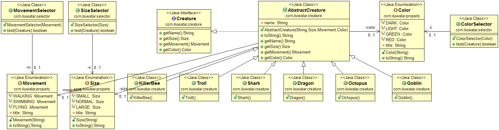

## También conocido como

Filter, Criteria

## Propósito

El patrón de Specification separa la declaración de cómo emparejar un candidato, del objeto candidato
con el que se compara. Además de su utilidad en la selección, también es valioso para la
validación y para la construcción por encargo.

## Explicación

Ejemplo del mundo real

> Hay un conjunto de criaturas diferentes y a menudo necesitamos seleccionar algún subconjunto de ellas. Podemos
> escribir nuestra especificación de búsqueda como "criaturas que puedan volar", "criaturas de más de 500
> kilogramos", o como una combinación de otras especificaciones de búsqueda.
> que realizará el filtrado.

En palabras sencillas

> El patrón de especificación nos permite separar los criterios de búsqueda del objeto que realiza la
> búsqueda.

Wikipedia dice

> En programación informática, el patrón de especificación es un patrón particular de diseño de software,
> por el cual las reglas de negocio pueden ser recombinadas encadenando las reglas de negocio usando lógica booleana
> lógica booleana.

**Ejemplo programático**

Si nos fijamos en nuestro ejemplo anterior, tenemos un conjunto de criaturas con ciertas propiedades.
propiedades. Esas propiedades pueden formar parte de un conjunto predefinido y limitado (representado aquí por los
enums Tamaño, Movimiento y Color); pero también pueden ser valores continuos (por ejemplo, la masa de una
criatura). En este caso, es más apropiado utilizar lo que llamamos "especificación parametrizada",
en la que el valor de la propiedad puede darse como argumento al instanciar la criatura, lo que permite
mayor flexibilidad. Una tercera opción es combinar propiedades predefinidas y/o parametrizadas utilizando
lógica booleana, lo que permite posibilidades de selección casi ilimitadas (esto se denomina "especificación compuesta", véase más adelante).
especificación compuesta", véase más adelante). Los pros y los contras de cada enfoque se detallan en la tabla al final de este documento.
de este documento.

```java
public interface Creature {
  String getName();
  Size getSize();
  Movement getMovement();
  Color getColor();
  Mass getMass();
}
```

Y la implementación de `Dragon` tiene este aspecto.

```java
public class Dragon extends AbstractCreature {

  public Dragon() {
    super("Dragon", Size.LARGE, Movement.FLYING, Color.RED, new Mass(39300.0));
  }
}
```

Ahora que queremos seleccionar algún subconjunto de ellos, utilizamos selectores. Para seleccionar criaturas que vuelan
debemos usar `MovementSelector`.

```java
public class MovementSelector extends AbstractSelector<Creature> {

  private final Movement movement;

  public MovementSelector(Movement m) {
    this.movement = m;
  }

  @Override
  public boolean test(Creature t) {
    return t.getMovement().equals(movement);
  }
}
```

Por otro lado, cuando seleccionamos criaturas más pesadas que una cantidad elegida, usamos
`MassGreaterThanSelector`.

```java
public class MassGreaterThanSelector extends AbstractSelector<Creature> {

  private final Mass mass;

  public MassGreaterThanSelector(double mass) {
    this.mass = new Mass(mass);
  }

  @Override
  public boolean test(Creature t) {
    return t.getMass().greaterThan(mass);
  }
}
```

Con estos elementos en su lugar, podemos realizar una búsqueda de criaturas rojas de la siguiente manera:

```java
    var redCreatures = creatures.stream().filter(new ColorSelector(Color.RED))
      .collect(Collectors.toList());
```

Pero también podríamos usar nuestro selector parametrizado así:

```java
    var heavyCreatures = creatures.stream().filter(new MassGreaterThanSelector(500.0)
      .collect(Collectors.toList());
```

Nuestra tercera opción es combinar varios selectores. La búsqueda de criaturas especiales
(definidas como rojas, voladoras y no pequeñas) podría hacerse de la siguiente manera:

```java
    var specialCreaturesSelector = 
      new ColorSelector(Color.RED).and(new MovementSelector(Movement.FLYING)).and(new SizeSelector(Size.SMALL).not());

    var specialCreatures = creatures.stream().filter(specialCreaturesSelector)
      .collect(Collectors.toList());
```

**Más información sobre las especificaciones de los compuestos**

En Composite Specification, crearemos instancias personalizadas de `AbstractSelector` combinando
otros selectores (llamados "hojas") utilizando los tres operadores lógicos básicos. Éstos se implementan en
ConjunctionSelector`, `DisjunctionSelector` y `NegationSelector`.

```java
public abstract class AbstractSelector<T> implements Predicate<T> {

  public AbstractSelector<T> and(AbstractSelector<T> other) {
    return new ConjunctionSelector<>(this, other);
  }

  public AbstractSelector<T> or(AbstractSelector<T> other) {
    return new DisjunctionSelector<>(this, other);
  }

  public AbstractSelector<T> not() {
    return new NegationSelector<>(this);
  }
}
```

```java
public class ConjunctionSelector<T> extends AbstractSelector<T> {

  private final List<AbstractSelector<T>> leafComponents;

  @SafeVarargs
  ConjunctionSelector(AbstractSelector<T>... selectors) {
    this.leafComponents = List.of(selectors);
  }

  /**
   * Tests if *all* selectors pass the test.
   */
  @Override
  public boolean test(T t) {
    return leafComponents.stream().allMatch(comp -> (comp.test(t)));
  }
}
```

Todo lo que queda por hacer ahora es crear selectores de hoja (ya sean de código duro o parametrizados) que
sean lo más genéricos posible, y podremos instanciar la clase ``AbstractSelector`` combinando
cualquier cantidad de selectores, como se ejemplificó anteriormente. Debemos tener cuidado, sin embargo, ya que es fácil
cometer un error al combinar muchos operadores lógicos; en particular, debemos prestar atención a la prioridad de las operaciones.
la prioridad de las operaciones. En general, la especificación compuesta es una gran manera de escribir más
código reutilizable, ya que no es necesario crear una clase Selector para cada operación de filtrado. En su lugar
simplemente creamos una instancia de ``AbstractSelector`` "sobre la marcha", utilizando selectores genéricos de "hoja" y algunos selectores booleanos básicos.
y alguna lógica booleana básica.

**Comparación de los distintos enfoques**

| Patrón | Uso | Pros | Contras |
|---|---|---|---|
| Especificación Codificada | Los criterios de selección son pocos y se conocen de antemano | + Fácil de implementar | - Inflexible |
| | | + Expresivo |
| Especificación Parametrizada | Los criterios de selección abarcan un amplio rango de valores (por ejemplo, masa, velocidad,...) | + Alguna flexibilidad | - Aún requiere clases de propósito especial |
| Especificación Compuesta | Hay muchos criterios de selección que se pueden combinar de múltiples maneras, por lo tanto, no es factible crear una clase para cada selector | + Muy flexible, sin requerir muchas clases especializadas | - Algo más difícil de comprender |
| | | + Admite operaciones lógicas | - Todavía necesitas crear las clases base utilizadas como hojas |
## Class diagram



## Diagrama de clases

Utilice el patrón Specification cuando

* Necesitas seleccionar un subconjunto de objetos basándote en algún criterio, y refrescar la selección en varios momentos.
* Necesita comprobar que sólo se utilizan objetos adecuados para una determinada función (validación).

## Patrones relacionados

* Repository

## Créditos

* [Martin Fowler - Specifications](http://martinfowler.com/apsupp/spec.pdf)
