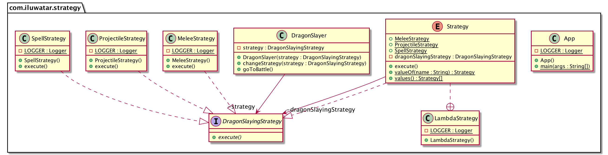

## También conocido como

Policy

## Propósito

Definir una familia de algoritmos, encapsular cada uno de ellos y hacerlos intercambiables. La estrategia permite
que el algoritmo varíe independientemente de los clientes que lo utilicen.

## Explicación

Ejemplo del mundo real

> Matar dragones es un trabajo peligroso. Con la experiencia, se hace más fácil. Los veteranos de
> Los matadragones han desarrollado diferentes estrategias de lucha contra distintos tipos de dragones.

En palabras sencillas

> El patrón de estrategia permite elegir el algoritmo más adecuado en tiempo de ejecución.

Wikipedia dice

> En programación informática, el patrón de estrategia (también conocido como patrón de política) es un patrón de > diseño de software de comportamiento que permite seleccionar un algoritmo en tiempo de ejecución.
> patrón de diseño de software que permite seleccionar un algoritmo en tiempo de ejecución.

**Ejemplo programático**

Presentemos primero la interfaz de la estrategia para matar dragones y sus implementaciones.

```java
@FunctionalInterface
public interface DragonSlayingStrategy {

  void execute();
}

@Slf4j
public class MeleeStrategy implements DragonSlayingStrategy {

  @Override
  public void execute() {
    LOGGER.info("With your Excalibur you sever the dragon's head!");
  }
}

@Slf4j
public class ProjectileStrategy implements DragonSlayingStrategy {

  @Override
  public void execute() {
    LOGGER.info("You shoot the dragon with the magical crossbow and it falls dead on the ground!");
  }
}

@Slf4j
public class SpellStrategy implements DragonSlayingStrategy {

  @Override
  public void execute() {
    LOGGER.info("You cast the spell of disintegration and the dragon vaporizes in a pile of dust!");
  }
}
```

Y aquí está el poderoso cazador de dragones, que puede elegir su estrategia de lucha en función del
oponente.

```java
public class DragonSlayer {

  private DragonSlayingStrategy strategy;

  public DragonSlayer(DragonSlayingStrategy strategy) {
    this.strategy = strategy;
  }

  public void changeStrategy(DragonSlayingStrategy strategy) {
    this.strategy = strategy;
  }

  public void goToBattle() {
    strategy.execute();
  }
}
```

Por último, aquí está el cazador de dragones en acción.

```java
    LOGGER.info("Green dragon spotted ahead!");
    var dragonSlayer = new DragonSlayer(new MeleeStrategy());
    dragonSlayer.goToBattle();
    LOGGER.info("Red dragon emerges.");
    dragonSlayer.changeStrategy(new ProjectileStrategy());
    dragonSlayer.goToBattle();
    LOGGER.info("Black dragon lands before you.");
    dragonSlayer.changeStrategy(new SpellStrategy());
    dragonSlayer.goToBattle();
```

Salida del programa:

```
    Green dragon spotted ahead!
    With your Excalibur you sever the dragon's head!
    Red dragon emerges.
    You shoot the dragon with the magical crossbow and it falls dead on the ground!
    Black dragon lands before you.
    You cast the spell of disintegration and the dragon vaporizes in a pile of dust!    
```

Además, las expresiones lambda de Java 8 proporcionan otro enfoque para la implementación:

```java
public class LambdaStrategy {

  private static final Logger LOGGER = LoggerFactory.getLogger(LambdaStrategy.class);

  public enum Strategy implements DragonSlayingStrategy {
    MeleeStrategy(() -> LOGGER.info(
        "With your Excalibur you severe the dragon's head!")),
    ProjectileStrategy(() -> LOGGER.info(
        "You shoot the dragon with the magical crossbow and it falls dead on the ground!")),
    SpellStrategy(() -> LOGGER.info(
        "You cast the spell of disintegration and the dragon vaporizes in a pile of dust!"));

    private final DragonSlayingStrategy dragonSlayingStrategy;

    Strategy(DragonSlayingStrategy dragonSlayingStrategy) {
      this.dragonSlayingStrategy = dragonSlayingStrategy;
    }

    @Override
    public void execute() {
      dragonSlayingStrategy.execute();
    }
  }
}
```

Y aquí está el cazador de dragones en acción.

```java
    LOGGER.info("Green dragon spotted ahead!");
    dragonSlayer.changeStrategy(LambdaStrategy.Strategy.MeleeStrategy);
    dragonSlayer.goToBattle();
    LOGGER.info("Red dragon emerges.");
    dragonSlayer.changeStrategy(LambdaStrategy.Strategy.ProjectileStrategy);
    dragonSlayer.goToBattle();
    LOGGER.info("Black dragon lands before you.");
    dragonSlayer.changeStrategy(LambdaStrategy.Strategy.SpellStrategy);
    dragonSlayer.goToBattle();
```

La salida del programa es la misma que la anterior.

## Diagrama de clases



## Aplicabilidad

Utilice el patrón Strategy cuando

* Muchas clases relacionadas sólo difieren en su comportamiento. Las estrategias proporcionan una forma de configurar una clase con uno de varios comportamientos
* Necesita diferentes variantes de un algoritmo. Por ejemplo, puede definir algoritmos que reflejen diferentes compensaciones espacio/tiempo. Las estrategias pueden utilizarse cuando estas variantes se implementan como una jerarquía de clases de algoritmos
* Un algoritmo utiliza datos que los clientes no deberían conocer. Utilice el patrón Strategy para evitar exponer estructuras de datos complejas específicas del algoritmo.
* Una clase define muchos comportamientos, y éstos aparecen como múltiples sentencias condicionales en sus operaciones. En lugar de muchas condicionales, mueva las ramas condicionales relacionadas a su propia clase Strategy.

## Tutorial 

* [Strategy Pattern Tutorial](https://www.journaldev.com/1754/strategy-design-pattern-in-java-example-tutorial)

## Créditos

* [Design Patterns: Elements of Reusable Object-Oriented Software](https://www.amazon.com/gp/product/0201633612/ref=as_li_tl?ie=UTF8&camp=1789&creative=9325&creativeASIN=0201633612&linkCode=as2&tag=javadesignpat-20&linkId=675d49790ce11db99d90bde47f1aeb59)
* [Functional Programming in Java: Harnessing the Power of Java 8 Lambda Expressions](https://www.amazon.com/gp/product/1937785467/ref=as_li_tl?ie=UTF8&camp=1789&creative=9325&creativeASIN=1937785467&linkCode=as2&tag=javadesignpat-20&linkId=7e4e2fb7a141631491534255252fd08b)
* [Head First Design Patterns: A Brain-Friendly Guide](https://www.amazon.com/gp/product/0596007124/ref=as_li_tl?ie=UTF8&camp=1789&creative=9325&creativeASIN=0596007124&linkCode=as2&tag=javadesignpat-20&linkId=6b8b6eea86021af6c8e3cd3fc382cb5b)
* [Refactoring to Patterns](https://www.amazon.com/gp/product/0321213351/ref=as_li_tl?ie=UTF8&camp=1789&creative=9325&creativeASIN=0321213351&linkCode=as2&tag=javadesignpat-20&linkId=2a76fcb387234bc71b1c61150b3cc3a7)
