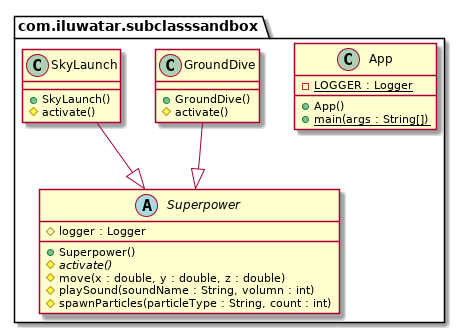

---  
title: Subclass Sandbox 
shortTitle: Subclass Sandbox 
category: Behavioral
language: es
tag:  
 - Game programming
---  

## Propósito 
El patrón Subclass Sandbox describe una idea básica, aunque no tiene una mecánica muy detallada. Necesitarás el patrón cuando tengas varias subclases similares. Si tienes que hacer un pequeño cambio, entonces cambia la clase base, mientras que todas las subclases no deberían tener que ser tocadas. Así que la clase base tiene que ser capaz de proporcionar todas las operaciones que una clase derivada necesita realizar.

## Explicación
Ejemplo del mundo real
> Consideremos que queremos crear algunos superpoderes en el juego, y necesitan moverse acompañados de un efecto de sonido y desovar partículas. ¿Crear muchas clases que contengan métodos similares o necesitar una clase base para derivarlos? El patrón subclase-base te permite tratar este problema de la segunda manera.

En palabras sencillas
> El subclass-sandbox consiste en trasladar los métodos solapados en las subclases a una clase base que reduzca la tasa de redundancia en las clases.

Wikipedia dice
> A base class defines an abstract sandbox method and several provided operations. Marking them protected makes it clear that they are for use by derived classes. Each derived sandboxed subclass implements the sandbox method using the provided operations.

**Ejemplo programático**  
Comenzamos con la clase base `Superpower`. Contiene un método abstracto sandbox `active()` y algunas operaciones proporcionadas.

```
public abstract class Superpower {

  protected Logger logger;

  protected abstract void activate();

  protected void move(double x, double y, double z) {
    logger.info("Move to ( " + x + ", " + y + ", " + z + " )");
  }

  protected void playSound(String soundName, int volume) {
    logger.info("Play " + soundName + " with volume " + volume);
  }

  protected void spawnParticles(String particleType, int count) {
    logger.info("Spawn " + count + " particle with type " + particleType);
  }
}
```
A continuación podemos crear una subclase derivada sandboxed que implemente el método sandbox usando las operaciones proporcionadas. Aquí está la primera Superpower:
```
public class SkyLaunch extends Superpower {

  public SkyLaunch() {
    super();
    logger = LoggerFactory.getLogger(SkyLaunch.class);
  }

  @Override
  protected void activate() {
    move(0, 0, 20);
    playSound("SKYLAUNCH_SOUND", 1);
    spawnParticles("SKYLAUNCH_PARTICLE", 100);
  }
}
```
Aquí está la segunda Superpower.
```
public class GroundDive extends Superpower {

  public GroundDive() {
    super();
    logger = LoggerFactory.getLogger(GroundDive.class);
  }

  @Override
  protected void activate() {
    move(0, 0, -20);
    playSound("GROUNDDIVE_SOUND", 5);
    spawnParticles("GROUNDDIVE_PARTICLE", 20);
  }
}
```
Por último, aquí están los superpower en activo.
```
    LOGGER.info("Use superpower: sky launch");
    var skyLaunch = new SkyLaunch();
    skyLaunch.activate();
    LOGGER.info("Use superpower: ground dive");
    var groundDive = new GroundDive();
    groundDive.activate();
```
Salida del programa:
```
// Use superpower: sky launch
// Move to ( 0.0, 0.0, 20.0 )
// Play SKYLAUNCH_SOUND with volume 1
// Spawn 100 particle with type SKYLAUNCH_PARTICLE
// Use superpower: ground dive
// Move to ( 0.0, 0.0, -20.0 )
// Play GROUNDDIVE_SOUND with volume 5
// Spawn 20 particle with type GROUNDDIVE_PARTICLE
```
## Diagrama de clases

  
## Aplicabilidad
El patrón Subclass Sandbox es un patrón muy simple y común que se encuentra en muchas bases de código, incluso fuera de los juegos. Si tienes un método protegido no virtual por ahí, probablemente ya estés usando algo como esto. Subclass Sandbox es un buen ajuste cuando:

- Usted tiene una clase base con un número de clases derivadas.
- La clase base es capaz de proporcionar todas las operaciones que una clase derivada puede necesitar realizar.
- Hay solapamiento de comportamiento en las subclases y desea que sea más fácil compartir código entre ellas.
- Usted quiere minimizar el acoplamiento entre las clases derivadas y el resto del programa
  
## Créditos 
  
* [Game Programming Patterns - Subclass Sandbox](https://gameprogrammingpatterns.com/subclass-sandbox.html)
