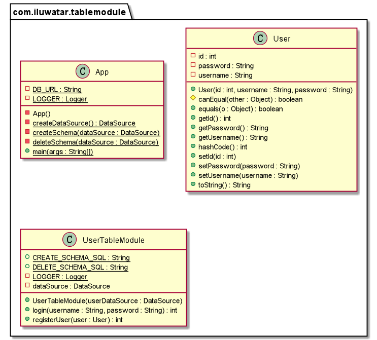

## Propósito
El módulo de tablas organiza la lógica del dominio con una clase por tabla de la base de datos, y una única instancia de una clase contiene los distintos procedimientos que actuarán sobre los datos.

## Explicación

Ejemplo del mundo real

> Cuando tratamos con un sistema de usuarios, necesitamos algunas operaciones sobre la tabla de usuarios. Podemos utilizar el patrón de módulo de tabla en este escenario. Podemos crear una clase llamada UserTableModule e inicializar una instancia de esa clase para manejar la lógica de negocio para todas las filas de la tabla de usuarios.

En palabras simples

> Una única instancia que maneja la lógica de negocio para todas las filas de una tabla o vista de la base de datos.

**Ejemplo programático**

En el ejemplo del sistema de usuarios, necesitamos manejar la lógica de dominio del login y registro de usuarios. Podemos utilizar el patrón de módulo de tabla y crear una instancia de la clase `UserTableModule` para manejar la lógica de negocio de todas las filas de la tabla de usuarios.

Aquí está la entidad básica `User`.

```java
@Setter
@Getter
@ToString
@EqualsAndHashCode
@AllArgsConstructor
public class User {
  private int id;
  private String username;
  private String password;
}
```

Aquí está la clase `UserTableModule`.

```java
public class UserTableModule {
  private final DataSource dataSource;
  private Connection connection = null;
  private ResultSet resultSet = null;
  private PreparedStatement preparedStatement = null;

  public UserTableModule(final DataSource userDataSource) {
    this.dataSource = userDataSource;
  }
  
  /**
   * Login using username and password.
   *
   * @param username the username of a user
   * @param password the password of a user
   * @return the execution result of the method
   * @throws SQLException if any error
   */
  public int login(final String username, final String password) throws SQLException {
  		// Method implementation.

  }

  /**
   * Register a new user.
   *
   * @param user a user instance
   * @return the execution result of the method
   * @throws SQLException if any error
   */
  public int registerUser(final User user) throws SQLException {
  		// Method implementation.
  }
}
```

En la clase `App`, usamos una instancia del `UserTableModule` para manejar el login y registro de usuarios.

```java
// Create data source and create the user table.
final var dataSource = createDataSource();
createSchema(dataSource);
userTableModule = new UserTableModule(dataSource);

//Initialize two users.
var user1 = new User(1, "123456", "123456");
var user2 = new User(2, "test", "password");

//Login and register using the instance of userTableModule.
userTableModule.registerUser(user1);
userTableModule.login(user1.getUsername(), user1.getPassword());
userTableModule.login(user2.getUsername(), user2.getPassword());
userTableModule.registerUser(user2);
userTableModule.login(user2.getUsername(), user2.getPassword());

deleteSchema(dataSource);
```

La salida del programa:

```java
12:22:13.095 [main] INFO com.iluwatar.tablemodule.UserTableModule - Register successfully!
12:22:13.117 [main] INFO com.iluwatar.tablemodule.UserTableModule - Login successfully!
12:22:13.128 [main] INFO com.iluwatar.tablemodule.UserTableModule - Fail to login!
12:22:13.136 [main] INFO com.iluwatar.tablemodule.UserTableModule - Register successfully!
12:22:13.144 [main] INFO com.iluwatar.tablemodule.UserTableModule - Login successfully!
```

## Diagrama de clases



## Aplicabilidad

Utilice el patrón de módulo de tabla cuando

- La lógica del dominio es simple y los datos están en forma tabular.
- La aplicación sólo utiliza unas pocas estructuras de datos comunes compartidas orientadas a tablas.

## Patrones relacionados

- [Transaction Script](https://java-design-patterns.com/patterns/transaction-script/)

- [Domain Model](https://java-design-patterns.com/patterns/domain-model/)

## Créditos

* [Table Module Pattern](http://wiki3.cosc.canterbury.ac.nz/index.php/Table_module_pattern)
* [Patterns of Enterprise Application Architecture](https://www.amazon.com/gp/product/0321127420/ref=as_li_qf_asin_il_tl?ie=UTF8&tag=javadesignpat-20&creative=9325&linkCode=as2&creativeASIN=0321127420&linkId=18acc13ba60d66690009505577c45c04)
* [Architecture patterns: domain model and friends](https://inviqa.com/blog/architecture-patterns-domain-model-and-friends)