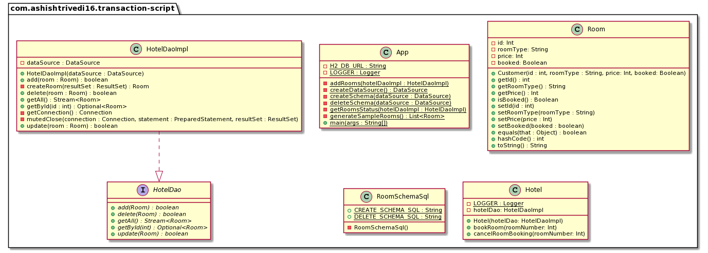

## Propósito

Transaction Script organiza la lógica de negocio por procedimientos donde cada procedimiento maneja una única
solicitud de la presentación.

## Explicación

Ejemplo del mundo real

> Necesitas crear un sistema de reservas de habitaciones de hotel. Dado que los requisitos son bastante simples
> utilizar el patrón Transaction Script.

En palabras sencillas

> Transaction Script organiza la lógica de negocio en transacciones que el sistema necesita llevar a cabo.

Ejemplo programático

La clase `Hotel` se encarga de reservar y cancelar las reservas de habitaciones.

```java
@Slf4j
public class Hotel {

  private final HotelDaoImpl hotelDao;

  public Hotel(HotelDaoImpl hotelDao) {
    this.hotelDao = hotelDao;
  }

  public void bookRoom(int roomNumber) throws Exception {

    Optional<Room> room = hotelDao.getById(roomNumber);

    if (room.isEmpty()) {
      throw new Exception("Room number: " + roomNumber + " does not exist");
    } else {
      if (room.get().isBooked()) {
        throw new Exception("Room already booked!");
      } else {
        Room updateRoomBooking = room.get();
        updateRoomBooking.setBooked(true);
        hotelDao.update(updateRoomBooking);
      }
    }
  }

  public void cancelRoomBooking(int roomNumber) throws Exception {

    Optional<Room> room = hotelDao.getById(roomNumber);

    if (room.isEmpty()) {
      throw new Exception("Room number: " + roomNumber + " does not exist");
    } else {
      if (room.get().isBooked()) {
        Room updateRoomBooking = room.get();
        updateRoomBooking.setBooked(false);
        int refundAmount = updateRoomBooking.getPrice();
        hotelDao.update(updateRoomBooking);

        LOGGER.info("Booking cancelled for room number: " + roomNumber);
        LOGGER.info(refundAmount + " is refunded");
      } else {
        throw new Exception("No booking for the room exists");
      }
    }
  }
}
```

La clase `Hotel` tiene dos métodos, uno para reservar y otro para cancelar una habitación respectivamente. Cada uno de ellos
transacción en el sistema, haciendo que `Hotel` implemente el patrón Transaction Script
Transaction Script.

El método `bookRoom` consolida todos los pasos necesarios como comprobar si la habitación ya está reservada
o no, si no está reservada entonces reserva la habitación y actualiza la base de datos utilizando el DAO.

El método `cancelRoom` consolida pasos como comprobar si la habitación está reservada o no,
si está reservada, calcula el importe del reembolso y actualiza la base de datos utilizando el DAO.

## Diagrama de clases



## Aplicabilidad

Utilice el patrón Transaction Script cuando la aplicación tenga sólo una pequeña cantidad de lógica y esa
lógica no será extendida en el futuro.

## Consecuencias

* A medida que la lógica de negocio se complica,
  se hace progresivamente más difícil mantener el script de transacción
  en un estado bien diseñado.
* Puede ocurrir duplicación de código entre scripts de transacciones.
* Normalmente no es fácil refactorizar el script de transacciones a otros patrones de lógica de dominio.
  del dominio.

## Patrones relacionados

* Domain Model
* Table Module
* Service Layer

## Créditos

* [Transaction Script Pattern](https://dzone.com/articles/transaction-script-pattern#:~:text=Transaction%20Script%20(TS)%20is%20the,need%20big%20architecture%20behind%20them.)
* [Transaction Script](https://www.informit.com/articles/article.aspx?p=1398617)
* [Patterns of Enterprise Application Architecture](https://www.amazon.com/gp/product/0321127420/ref=as_li_qf_asin_il_tl?ie=UTF8&tag=javadesignpat-20&creative=9325&linkCode=as2&creativeASIN=0321127420&linkId=18acc13ba60d66690009505577c45c04)
