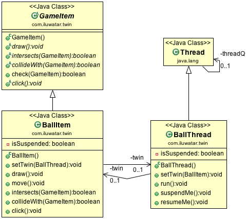

## Propósito
Twin pattern es un patrón de diseño que proporciona una solución estándar para simular herencia múltiple en java

## Explicación

Ejemplo real

> Consideremos un juego con una pelota que necesita características de dos tipos, Game Item, e hilos para funcionar sin problemas en el juego. Podemos utilizar dos objetos, con un objeto compatible con el primer tipo y el otro compatible con el segundo tipo. El par de objetos juntos pueden funcionar como una pelota en el juego.

En palabras sencillas

> Proporciona una forma de formar dos subclases estrechamente acopladas que pueden actuar como una clase gemela que tiene dos extremos.

Wikipedia dice

> En ingeniería de software, el patrón Gemelo es un patrón de diseño de software que permite a los desarrolladores modelar herencia múltiple en lenguajes de programación que no soportan herencia múltiple. Este patrón evita muchos de los problemas de la herencia múltiple.

**Ejemplo programático**

Tomemos nuestro ejemplo anterior de la bola de juego. Consideremos que tenemos un juego en el que la pelota necesita ser tanto un `GameItem` como un `Thread`.
En primer lugar, tenemos la clase `GameItem` dada a continuación y la clase `Thread`.


```java

@Slf4j
public abstract class GameItem {

  public void draw() {
    LOGGER.info("draw");
    doDraw();
  }

  public abstract void doDraw();


  public abstract void click();
}

```

A continuación, tenemos las subclases `BallItem` y `BallThread` que las heredan, respectivamente.

```java

@Slf4j
public class BallItem extends GameItem {

  private boolean isSuspended;

  @Setter
  private BallThread twin;

  @Override
  public void doDraw() {

    LOGGER.info("doDraw");
  }

  public void move() {
    LOGGER.info("move");
  }

  @Override
  public void click() {

    isSuspended = !isSuspended;

    if (isSuspended) {
      twin.suspendMe();
    } else {
      twin.resumeMe();
    }
  }
}


@Slf4j
public class BallThread extends Thread {

  @Setter
  private BallItem twin;

  private volatile boolean isSuspended;

  private volatile boolean isRunning = true;

  /**
   * Run the thread.
   */
  public void run() {

    while (isRunning) {
      if (!isSuspended) {
        twin.draw();
        twin.move();
      }
      try {
        Thread.sleep(250);
      } catch (InterruptedException e) {
        throw new RuntimeException(e);
      }
    }
  }

  public void suspendMe() {
    isSuspended = true;
    LOGGER.info("Begin to suspend BallThread");
  }

  public void resumeMe() {
    isSuspended = false;
    LOGGER.info("Begin to resume BallThread");
  }

  public void stopMe() {
    this.isRunning = false;
    this.isSuspended = true;
  }
}

``` 

Ahora, cuando necesitemos la pelota, podemos instanciar objetos tanto del `BallThread` como del `BallItem` como un par y pasarlos a su objeto par para que puedan actuar juntos según convenga.

```java

var ballItem = new BallItem();
var ballThread = new BallThread();

ballItem.setTwin(ballThread);
ballThread.setTwin(ballItem);

```


## Diagrama de clases


## Aplicabilidad
Utilice el lenguaje Twin

* Para simular herencia múltiple en un lenguaje que no soporta esta característica.
* Para evitar ciertos problemas de la herencia múltiple como los choques de nombres.

## Créditos

* [Twin – A Design Pattern for Modeling Multiple Inheritance](http://www.ssw.uni-linz.ac.at/Research/Papers/Moe99/Paper.pdf)
