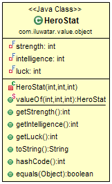

## Propósito

Proporcionar objetos que siguen la semántica de valor en lugar de la semántica de referencia. Esto significa que la
igualdad de los objetos de valor no se basa en la identidad. Dos objetos de valor son iguales cuando tienen el mismo
valor, no necesariamente siendo el mismo objeto.

## Explicación

Ejemplo del mundo real

> Existe una clase para las estadísticas de héroes en un juego de rol. Las estadísticas contienen atributos como fuerza,
> inteligencia y suerte. Las estadísticas de diferentes héroes deben ser iguales cuando todos los atributos son iguales.

En palabras simples

> Los objetos de valor son iguales cuando sus atributos tienen el mismo valor.

Wikipedia dice

> En informática, un objeto de valor es un objeto pequeño que representa una entidad simple cuya igualdad no se basa en
> la identidad: es decir, dos objetos de valor son iguales cuando tienen el mismo valor, no necesariamente siendo el mismo
> objeto.

**Ejemplo Programático**

Aquí está la clase `HeroStat` que es el objeto valor. Fíjate en el uso de la
anotación [Lombok's `@Value`](https://projectlombok.org/features/Value).

```java
@Value(staticConstructor = "valueOf")
class HeroStat {

    int strength;
    int intelligence;
    int luck;
}
```

El ejemplo crea tres `HeroStat` diferentes y compara su igualdad.

```java
var statA = HeroStat.valueOf(10, 5, 0);
var statB = HeroStat.valueOf(10, 5, 0);
var statC = HeroStat.valueOf(5, 1, 8);

LOGGER.info(statA.toString());
LOGGER.info(statB.toString());
LOGGER.info(statC.toString());

LOGGER.info("Is statA and statB equal : {}", statA.equals(statB));
LOGGER.info("Is statA and statC equal : {}", statA.equals(statC));
```

Aquí está la salida de la consola.

```
20:11:12.199 [main] INFO com.iluwatar.value.object.App - HeroStat(strength=10, intelligence=5, luck=0)
20:11:12.202 [main] INFO com.iluwatar.value.object.App - HeroStat(strength=10, intelligence=5, luck=0)
20:11:12.202 [main] INFO com.iluwatar.value.object.App - HeroStat(strength=5, intelligence=1, luck=8)
20:11:12.202 [main] INFO com.iluwatar.value.object.App - Is statA and statB equal : true
20:11:12.203 [main] INFO com.iluwatar.value.object.App - Is statA and statC equal : false
```

## Diagrama de Clases



## Aplicabilidad

Utilice el objeto Valor cuando

* La igualdad del objeto debe basarse en su valor.

## Usos conocidos

* [java.util.Optional](https://docs.oracle.com/javase/8/docs/api/java/util/Optional.html)
* [java.time.LocalDate](https://docs.oracle.com/javase/8/docs/api/java/time/LocalDate.html)
* [joda-time, money, beans](http://www.joda.org/)

## Créditos

* [Patterns of Enterprise Application Architecture](http://www.martinfowler.com/books/eaa.html)
* [ValueObject](https://martinfowler.com/bliki/ValueObject.html)
* [VALJOs - Value Java Objects : Stephen Colebourne's blog](http://blog.joda.org/2014/03/valjos-value-java-objects.html)
* [Value Object : Wikipedia](https://en.wikipedia.org/wiki/Value_object)
* [J2EE Design Patterns](https://www.amazon.com/gp/product/0596004273/ref=as_li_tl?ie=UTF8&camp=1789&creative=9325&creativeASIN=0596004273&linkCode=as2&tag=javadesignpat-20&linkId=f27d2644fbe5026ea448791a8ad09c94)
