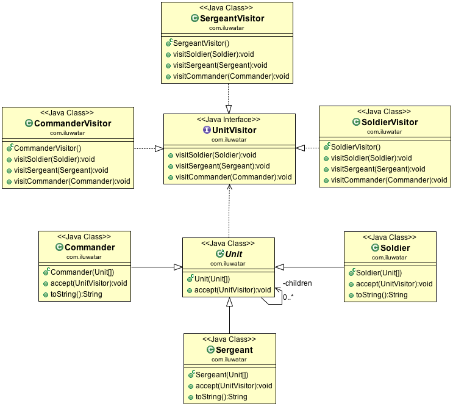

## Propósito

Representar una operación a realizar sobre los elementos de una estructura de objetos. Visitante permite
definir una nueva operación sin cambiar las clases de los elementos sobre los que opera.

## Explicación

Ejemplo del mundo real

> Considere una estructura de árbol con unidades del ejército. El comandante tiene dos sargentos bajo él y cada sargento
> tiene tres soldados bajo él. Dado que la jerarquía implementa el patrón visitante, podemos
> crear fácilmente nuevos objetos que interactúen con el comandante, los sargentos, los soldados, o todos ellos. 


Ejemplo del mundo real

> El patrón Visitante define las operaciones que se pueden realizar en los nodos de la estructura de datos.

Wikipedia dice

> En programación orientada a objetos e ingeniería de software, el patrón de diseño visitante es una forma de
> separar un algoritmo de una estructura de objetos sobre la que opera. Un resultado práctico de esta
> separación es la capacidad de añadir nuevas operaciones a estructuras de objetos existentes sin modificarlas.
> las estructuras.

**Ejemplo programático**

Dado el ejemplo anterior de la unidad del ejército, primero tenemos los tipos básicos Unit y UnitVisitor.

```java
public abstract class Unit {

  private final Unit[] children;

  public Unit(Unit... children) {
    this.children = children;
  }

  public void accept(UnitVisitor visitor) {
    Arrays.stream(children).forEach(child -> child.accept(visitor));
  }
}

public interface UnitVisitor {

  void visit(Soldier soldier);

  void visit(Sergeant sergeant);

  void visit(Commander commander);
}
```

Luego tenemos las unidades de hormigón.

```java
public class Commander extends Unit {

  public Commander(Unit... children) {
    super(children);
  }

  @Override
  public void accept(UnitVisitor visitor) {
    visitor.visit(this);
    super.accept(visitor);
  }

  @Override
  public String toString() {
    return "commander";
  }
}

public class Sergeant extends Unit {

  public Sergeant(Unit... children) {
    super(children);
  }

  @Override
  public void accept(UnitVisitor visitor) {
    visitor.visit(this);
    super.accept(visitor);
  }

  @Override
  public String toString() {
    return "sergeant";
  }
}

public class Soldier extends Unit {

  public Soldier(Unit... children) {
    super(children);
  }

  @Override
  public void accept(UnitVisitor visitor) {
    visitor.visit(this);
    super.accept(visitor);
  }

  @Override
  public String toString() {
    return "soldier";
  }
}
```

He aquí, pues, algunos visitantes concretos.

```java
@Slf4j
public class CommanderVisitor implements UnitVisitor {

  @Override
  public void visit(Soldier soldier) {
    // Do nothing
  }

  @Override
  public void visit(Sergeant sergeant) {
    // Do nothing
  }

  @Override
  public void visit(Commander commander) {
    LOGGER.info("Good to see you {}", commander);
  }
}

@Slf4j
public class SergeantVisitor implements UnitVisitor {

  @Override
  public void visit(Soldier soldier) {
    // Do nothing
  }

  @Override
  public void visit(Sergeant sergeant) {
    LOGGER.info("Hello {}", sergeant);
  }

  @Override
  public void visit(Commander commander) {
    // Do nothing
  }
}

@Slf4j
public class SoldierVisitor implements UnitVisitor {

  @Override
  public void visit(Soldier soldier) {
    LOGGER.info("Greetings {}", soldier);
  }

  @Override
  public void visit(Sergeant sergeant) {
    // Do nothing
  }

  @Override
  public void visit(Commander commander) {
    // Do nothing
  }
}
```

Por último, podemos mostrar el poder de los visitantes en acción.

```java
commander.accept(new SoldierVisitor());
commander.accept(new SergeantVisitor());
commander.accept(new CommanderVisitor());
```

Salida del programa:

```
Greetings soldier
Greetings soldier
Greetings soldier
Greetings soldier
Greetings soldier
Greetings soldier
Hello sergeant
Hello sergeant
Good to see you commander
```

## Diagrama de clases



## Aplicabilidad

Utilice el patrón Visitor cuando

* Una estructura de objetos contiene muchas clases de objetos con diferentes interfaces, y desea realizar operaciones en estos objetos que dependen de sus clases concretas.
* Es necesario realizar muchas operaciones distintas y no relacionadas en los objetos de una estructura de objetos, y se desea evitar "contaminar" sus clases con estas operaciones. Visitor permite mantener juntas las operaciones relacionadas definiéndolas en una clase. Cuando la estructura de objetos es compartida por muchas aplicaciones, utilice Visitor para poner las operaciones sólo en aquellas aplicaciones que las necesiten.
* Las clases que definen la estructura del objeto raramente cambian, pero a menudo se quieren definir nuevas operaciones sobre la estructura. Cambiar las clases de la estructura del objeto requiere redefinir la interfaz para todos los visitantes, lo que es potencialmente costoso. Si las clases de la estructura del objeto cambian a menudo, probablemente sea mejor definir las operaciones en esas clases.

## Tutoriales

* [Refactoring Guru](https://refactoring.guru/design-patterns/visitor)
* [Dzone](https://dzone.com/articles/design-patterns-visitor)
* [Sourcemaking](https://sourcemaking.com/design_patterns/visitor)

## Usos conocidos

* [Apache Wicket](https://github.com/apache/wicket) component tree, Mire [MarkupContainer](https://github.com/apache/wicket/blob/b60ec64d0b50a611a9549809c9ab216f0ffa3ae3/wicket-core/src/main/java/org/apache/wicket/MarkupContainer.java)
* [javax.lang.model.element.AnnotationValue](http://docs.oracle.com/javase/8/docs/api/javax/lang/model/element/AnnotationValue.html) y [AnnotationValueVisitor](http://docs.oracle.com/javase/8/docs/api/javax/lang/model/element/AnnotationValueVisitor.html)
* [javax.lang.model.element.Element](http://docs.oracle.com/javase/8/docs/api/javax/lang/model/element/Element.html) y [Element Visitor](http://docs.oracle.com/javase/8/docs/api/javax/lang/model/element/ElementVisitor.html)
* [java.nio.file.FileVisitor](http://docs.oracle.com/javase/8/docs/api/java/nio/file/FileVisitor.html)

## Créditos

* [Design Patterns: Elements of Reusable Object-Oriented Software](https://www.amazon.com/gp/product/0201633612/ref=as_li_tl?ie=UTF8&camp=1789&creative=9325&creativeASIN=0201633612&linkCode=as2&tag=javadesignpat-20&linkId=675d49790ce11db99d90bde47f1aeb59)
* [Head First Design Patterns: A Brain-Friendly Guide](https://www.amazon.com/gp/product/0596007124/ref=as_li_tl?ie=UTF8&camp=1789&creative=9325&creativeASIN=0596007124&linkCode=as2&tag=javadesignpat-20&linkId=6b8b6eea86021af6c8e3cd3fc382cb5b)
* [Refactoring to Patterns](https://www.amazon.com/gp/product/0321213351/ref=as_li_tl?ie=UTF8&camp=1789&creative=9325&creativeASIN=0321213351&linkCode=as2&tag=javadesignpat-20&linkId=2a76fcb387234bc71b1c61150b3cc3a7)
