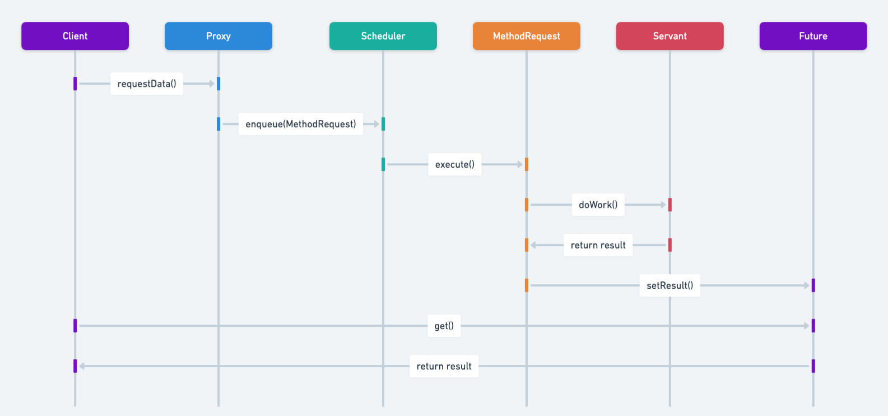

## هدف الگوی طراحی Active Object

الگوی Active Object روشی مطمئن برای پردازش ناهمگام در جاوا فراهم می‌کند که به پاسخ‌گو بودن برنامه‌ها و مدیریت مؤثر threadها کمک می‌کند. این الگو با محصور کردن وظایف در شیءهایی که هر کدام thread و صف پیام مخصوص خود را دارند، به این هدف می‌رسد. این جداسازی باعث می‌شود thread اصلی پاسخ‌گو باقی بماند و مشکلاتی مانند دست‌کاری مستقیم threadها یا دسترسی به وضعیت مشترک (shared state) به وجود نیاید.

## توضیح کامل الگوی Active Object با مثال‌های دنیای واقعی

مثال دنیای واقعی

> تصور کنید در یک رستوران شلوغ، مشتریان سفارش خود را به گارسون‌ها می‌سپارند. به‌جای آنکه گارسون‌ها خودشان به آشپزخانه بروند و غذا را آماده کنند، سفارش‌ها را روی کاغذهایی می‌نویسند و به یک هماهنگ‌کننده می‌دهند. این هماهنگ‌کننده گروهی از سرآشپزها را مدیریت می‌کند که غذاها را به صورت ناهمگام آماده می‌کنند. هرگاه آشپزی آزاد شود، سفارش بعدی را از صف برمی‌دارد، غذا را آماده می‌کند و پس از آن گارسون را برای سرو غذا مطلع می‌سازد.
>
> در این قیاس، گارسون‌ها نماینده threadهای کلاینت هستند، هماهنگ‌کننده نقش زمان‌بند (scheduler) را ایفا می‌کند، و آشپزها نمایان‌گر اجرای متدها در threadهای جداگانه هستند. این ساختار باعث می‌شود گارسون‌ها بتوانند بدون مسدود شدن توسط فرایند آماده‌سازی غذا، سفارش‌های بیشتری دریافت کنند—درست مانند اینکه الگوی Active Object، فراخوانی متد را از اجرای آن جدا می‌کند تا هم‌زمانی (concurrency) را افزایش دهد.

به زبان ساده

> الگوی Active Object، اجرای متد را از فراخوانی آن جدا می‌کند تا در برنامه‌های چندریسمانی (multithreaded)، هم‌زمانی و پاسخ‌گویی بهتری فراهم شود.

طبق تعریف ویکی‌پدیا

> الگوی طراحی Active Object اجرای متد را از فراخوانی آن جدا می‌کند، برای شیءهایی که هرکدام thread کنترل مخصوص به خود را دارند. هدف، معرفی هم‌زمانی با استفاده از فراخوانی متد به‌صورت ناهمگام و یک زمان‌بند برای مدیریت درخواست‌ها است.
>
> این الگو شامل شش جزء کلیدی است:
>
> * یک proxy، که رابطی برای کلاینت‌ها با متدهای عمومی فراهم می‌کند.
> * یک interface که درخواست متد برای شیء فعال (active object) را تعریف می‌کند.
> * فهرستی از درخواست‌های معلق از سوی کلاینت‌ها.
> * یک زمان‌بند (scheduler) که تصمیم می‌گیرد کدام درخواست بعدی اجرا شود.
> * پیاده‌سازی متد شیء فعال.
> * یک callback یا متغیر برای اینکه کلاینت نتیجه را دریافت کند.

نمودار توالی



## مثال برنامه‌نویسی از Active Object در جاوا

این بخش نحوه عملکرد الگوی Active Object در جاوا را توضیح می‌دهد و کاربرد آن در مدیریت وظایف ناهمگام و کنترل هم‌زمانی را نشان می‌دهد.

اورک‌ها به دلیل ذات وحشی و غیرقابل مهارشان شناخته می‌شوند. به‌نظر می‌رسد هرکدام thread کنترل مخصوص خود را دارند. برای پیاده‌سازی یک موجود که دارای سازوکار thread مستقل خود باشد و فقط API را در اختیار قرار دهد نه اجرای داخلی را، می‌توان از الگوی Active Object استفاده کرد.

```java
public abstract class ActiveCreature {
    private final Logger logger = LoggerFactory.getLogger(ActiveCreature.class.getName());

    private BlockingQueue<Runnable> requests;

    private String name;

    private Thread thread;

    public ActiveCreature(String name) {
        this.name = name;
        this.requests = new LinkedBlockingQueue<Runnable>();
        thread = new Thread(new Runnable() {
            @Override
            public void run() {
                while (true) {
                    try {
                        requests.take().run();
                    } catch (InterruptedException e) {
                        logger.error(e.getMessage());
                    }
                }
            }
        }
        );
        thread.start();
    }

    public void eat() throws InterruptedException {
        requests.put(new Runnable() {
                         @Override
                         public void run() {
                             logger.info("{} is eating!", name());
                             logger.info("{} has finished eating!", name());
                         }
                     }
        );
    }

    public void roam() throws InterruptedException {
        requests.put(new Runnable() {
                         @Override
                         public void run() {
                             logger.info("{} has started to roam the wastelands.", name());
                         }
                     }
        );
    }

    public String name() {
        return this.name;
    }
}
```

می‌توان دید هر کلاسی که از ActiveCreature ارث‌بری کند، دارای thread کنترل مختص به خود برای فراخوانی و اجرای متدها خواهد بود.

برای مثال، کلاس Orc:

```java
public class Orc extends ActiveCreature {

    public Orc(String name) {
        super(name);
    }
}

اکنون می‌توان چند موجود مانند orc ایجاد کرد، به آن‌ها دستور داد که بخورند و پرسه بزنند، و آن‌ها این دستورات را در thread مختص به خود اجرا می‌کنند:

```java
public class App implements Runnable {

    private static final Logger logger = LoggerFactory.getLogger(App.class.getName());

    private static final int NUM_CREATURES = 3;

    public static void main(String[] args) {
        var app = new App();
        app.run();
    }

    @Override
    public void run() {
        List<ActiveCreature> creatures = new ArrayList<>();
        try {
            for (int i = 0; i < NUM_CREATURES; i++) {
                creatures.add(new Orc(Orc.class.getSimpleName() + i));
                creatures.get(i).eat();
                creatures.get(i).roam();
            }
            Thread.sleep(1000);
        } catch (InterruptedException e) {
            logger.error(e.getMessage());
            Thread.currentThread().interrupt();
        } finally {
            for (int i = 0; i < NUM_CREATURES; i++) {
                creatures.get(i).kill(0);
            }
        }
    }
}
```

خروجی برنامه:

```
09:00:02.501 [Thread-0] INFO com.iluwatar.activeobject.ActiveCreature -- Orc0 is eating!
09:00:02.501 [Thread-2] INFO com.iluwatar.activeobject.ActiveCreature -- Orc2 is eating!
09:00:02.501 [Thread-1] INFO com.iluwatar.activeobject.ActiveCreature -- Orc1 is eating!
09:00:02.504 [Thread-0] INFO com.iluwatar.activeobject.ActiveCreature -- Orc0 has finished eating!
09:00:02.504 [Thread-1] INFO com.iluwatar.activeobject.ActiveCreature -- Orc1 has finished eating!
09:00:02.504 [Thread-0] INFO com.iluwatar.activeobject.ActiveCreature -- Orc0 has started to roam in the wastelands.
09:00:02.504 [Thread-2] INFO com.iluwatar.activeobject.ActiveCreature -- Orc2 has finished eating!
09:00:02.504 [Thread-1] INFO com.iluwatar.activeobject.ActiveCreature -- Orc1 has started to roam in the wastelands.
09:00:02.504 [Thread-2] INFO com.iluwatar.activeobject.ActiveCreature -- Orc2 has started to roam in the wastelands.
```

چه زمانی از الگوی Active Object در جاوا استفاده کنیم؟

از الگوی Active Object در جاوا استفاده کنید زمانی که:

* نیاز دارید وظایف ناهمگام را بدون مسدود کردن thread اصلی مدیریت کنید تا عملکرد و پاسخ‌گویی بهتری داشته باشید.

* نیاز به تعامل ناهمگام با منابع خارجی دارید.

* می‌خواهید پاسخ‌گویی برنامه را افزایش دهید.

* نیاز به مدیریت وظایف هم‌زمان به‌صورت ماژولار و قابل نگهداری دارید.

آموزش‌های Java برای الگوی Active Object

    [Android and Java Concurrency: The Active Object Pattern (Douglas Schmidt)]((https://www.youtube.com/watch?v=Cd8t2u5Qmvc))

کاربردهای دنیای واقعی الگوی Active Object در جاوا

    سیستم‌های معاملات بلادرنگ که درخواست‌ها به‌صورت ناهمگام پردازش می‌شوند.

    رابط‌های کاربری گرافیکی (GUI) که در آن وظایف طولانی در پس‌زمینه اجرا می‌شوند بدون آنکه رابط کاربری را متوقف کنند.

    برنامه‌نویسی بازی‌ها برای مدیریت به‌روزرسانی‌های هم‌زمان وضعیت بازی یا محاسبات هوش مصنوعی.

مزایا و ملاحظات الگوی Active Object

با مزایا و معایب استفاده از الگوی Active Object در جاوا آشنا شوید؛ از جمله بهبود ایمنی threadها و ملاحظات سربار احتمالی (overhead).

مزایا:

    پاسخ‌گویی بهتر thread اصلی.

    محصورسازی مسائل مربوط به هم‌زمانی درون شیءها.

    بهبود سازمان‌دهی کد و قابلیت نگهداری.

    فراهم‌سازی ایمنی در برابر شرایط بحرانی (thread safety) و جلوگیری از مشکلات وضعیت مشترک.

معایب:

    سربار اضافی به دلیل ارسال پیام و مدیریت threadها.

    برای تمام سناریوهای هم‌زمانی مناسب نیست.

الگوهای طراحی مرتبط در جاوا

    * [Command](https://java-design-patterns.com/patterns/command/): درخواست را به‌عنوان یک شیء کپسوله می‌کند، مشابه روشی که Active Object فراخوانی متد را کپسوله می‌کند.

    * [Promise](https://java-design-patterns.com/patterns/promise/): راهی برای دریافت نتیجه یک فراخوانی متد ناهمگام فراهم می‌کند؛ اغلب همراه با Active Object استفاده می‌شود.

    * [Proxy](https://java-design-patterns.com/patterns/proxy/): الگوی Active Object می‌تواند از proxy برای مدیریت فراخوانی‌های متد به‌صورت ناهمگام استفاده کند.

منابع و مراجع

    * [Design Patterns: Elements of Reusable Object Software](https://amzn.to/3HYqrBE)

    * [Concurrent Programming in Java: Design Principles and Patterns](https://amzn.to/498SRVq)

    * [Java Concurrency in Practice](https://amzn.to/4aRMruW)

    * [Learning Concurrent Programming in Scala](https://amzn.to/3UE07nV)

    * [Pattern Languages of Program Design 3](https://amzn.to/3OI1j61)

    * [Pattern-Oriented Software Architecture Volume 2: Patterns for Concurrent and Networked Objects](https://amzn.to/3UgC24V)

