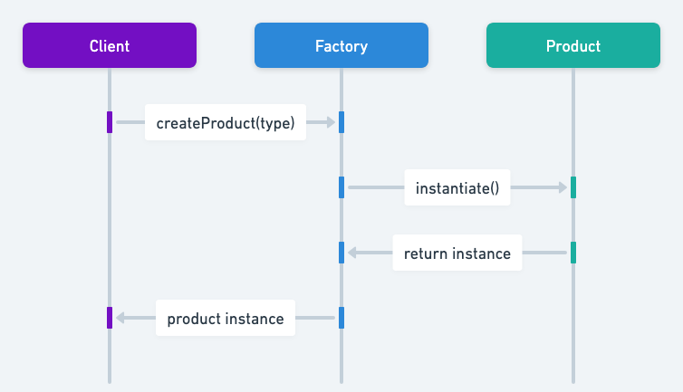

---
---
title: "الگوی factory در جاوا: ساده‌سازی ایجاد اشیاء"
shortTitle: factory
description: "الگوی طراحی factory در جاوا را با مثال‌ها و توضیحات دقیق بیاموزید. یاد بگیرید چگونه با استفاده از الگوی factory کدی انعطاف‌پذیر و مقیاس‌پذیر ایجاد کنید. مناسب برای توسعه‌دهندگانی که به دنبال بهبود مهارت‌های طراحی شیءگرا هستند."
category: structural
language: fa
tag:
    - انتزاع
    - کپسوله‌سازی
    - گروه چهار نفره
    - نمونه‌سازی
    - چندریختی
---

## هدف از الگوی طراحی factory

الگوی طراحی factory در جاوا یک الگوی ساختاری است که یک رابط برای ایجاد یک شیء تعریف می‌کند اما به زیرکلاس‌ها اجازه می‌دهد نوع اشیائی را که ایجاد خواهند شد تغییر دهند. این الگو انعطاف‌پذیری و مقیاس‌پذیری را در کد شما ترویج می‌دهد.

## توضیح دقیق الگوی factory با مثال‌های دنیای واقعی

### مثال دنیای واقعی

> تصور کنید در یک نانوایی انواع مختلف کیک‌ها با استفاده از الگوی طراحی factory ساخته می‌شوند. `CakeFactory` فرآیند ایجاد را مدیریت می‌کند و امکان افزودن آسان انواع جدید کیک‌ها را بدون تغییر در فرآیند اصلی فراهم می‌کند. `CakeFactory` می‌تواند انواع مختلفی از کیک‌ها مانند کیک شکلاتی، کیک وانیلی و کیک توت‌فرنگی تولید کند. به جای اینکه کارکنان نانوایی به صورت دستی مواد اولیه را انتخاب کنند و دستورالعمل‌های خاصی را برای هر نوع کیک دنبال کنند، از `CakeFactory` برای مدیریت فرآیند استفاده می‌کنند. مشتری فقط نوع کیک را درخواست می‌کند و `CakeFactory` مواد اولیه و دستورالعمل مناسب را تعیین کرده و نوع خاصی از کیک را ایجاد می‌کند. این تنظیم به نانوایی اجازه می‌دهد تا انواع جدید کیک‌ها را به راحتی اضافه کند بدون اینکه فرآیند اصلی تغییر کند، که این امر انعطاف‌پذیری و مقیاس‌پذیری را ترویج می‌دهد.

### تعریف ویکی‌پدیا

> الگوی factory یک شیء برای ایجاد اشیاء دیگر است – به طور رسمی، factory یک تابع یا متدی است که اشیاء با نمونه‌ها یا کلاس‌های مختلف را بازمی‌گرداند.

### نمودار توالی



## مثال برنامه‌نویسی از الگوی factory در جاوا

تصور کنید یک کیمیاگر قصد دارد سکه‌هایی تولید کند. کیمیاگر باید بتواند هم سکه‌های طلا و هم سکه‌های مسی ایجاد کند و تغییر بین آن‌ها باید بدون تغییر در کد موجود امکان‌پذیر باشد. الگوی factory این امکان را فراهم می‌کند با ارائه یک متد ایجاد استاتیک که می‌توان آن را با پارامترهای مرتبط فراخوانی کرد.

در جاوا، می‌توانید الگوی factory را با تعریف یک رابط `Coin` و پیاده‌سازی‌های آن `GoldCoin` و `CopperCoin` پیاده‌سازی کنید. کلاس `CoinFactory` یک متد استاتیک `getCoin` ارائه می‌دهد تا اشیاء سکه را بر اساس نوع ایجاد کند.

```java
public interface Coin {
    String getDescription();
}
```

```java
public class GoldCoin implements Coin {

    static final String DESCRIPTION = "This is a gold coin.";

    @Override
    public String getDescription() {
        return DESCRIPTION;
    }
}
```

```java
public class CopperCoin implements Coin {
     
    static final String DESCRIPTION = "This is a copper coin.";

    @Override
    public String getDescription() {
        return DESCRIPTION;
    }
}
```

کد زیر انواع سکه‌هایی که پشتیبانی می‌شوند (`GoldCoin` و `CopperCoin`) را نشان می‌دهد.

```java
@RequiredArgsConstructor
@Getter
public enum CoinType {

    COPPER(CopperCoin::new),
    GOLD(GoldCoin::new);

    private final Supplier<Coin> constructor;
}
```

سپس متد استاتیک `getCoin` برای ایجاد اشیاء سکه در کلاس factory `CoinFactory` کپسوله شده است.

```java
public class CoinFactory {

    public static Coin getCoin(CoinType type) {
        return type.getConstructor().get();
    }
}
```

اکنون، در کد کلاینت، می‌توانیم انواع مختلفی از سکه‌ها را با استفاده از کلاس factory تولید کنیم.

```java
public static void main(String[] args) {
        LOGGER.info("The alchemist begins his work.");
        var coin1 = CoinFactory.getCoin(CoinType.COPPER);
        var coin2 = CoinFactory.getCoin(CoinType.GOLD);
        LOGGER.info(coin1.getDescription());
        LOGGER.info(coin2.getDescription());
}
```

خروجی برنامه:

```
06:19:53.530 [main] INFO com.iluwatar.factory.App -- The alchemist begins his work.
06:19:53.533 [main] INFO com.iluwatar.factory.App -- This is a copper coin.
06:19:53.533 [main] INFO com.iluwatar.factory.App -- This is a gold coin.
```

## زمان استفاده از الگوی factory در جاوا

* از الگوی طراحی factory در جاوا زمانی استفاده کنید که کلاس از قبل نوع دقیق و وابستگی‌های اشیائی که نیاز به ایجاد آن دارد را نمی‌داند.
* زمانی که یک متد یکی از چندین کلاس ممکن که یک کلاس والد مشترک دارند را بازمی‌گرداند و می‌خواهد منطق انتخاب شیء را کپسوله کند.
* این الگو معمولاً هنگام طراحی فریم‌ورک‌ها یا کتابخانه‌ها برای ارائه بهترین انعطاف‌پذیری و جداسازی از انواع کلاس‌های خاص استفاده می‌شود.

## کاربردهای دنیای واقعی الگوی factory در جاوا

* [java.util.Calendar#getInstance()](https://docs.oracle.com/javase/8/docs/api/java/util/Calendar.html#getInstance--)
* [java.util.ResourceBundle#getBundle()](https://docs.oracle.com/javase/8/docs/api/java/util/ResourceBundle.html#getBundle-java.lang.String-)
* [java.text.NumberFormat#getInstance()](https://docs.oracle.com/javase/8/docs/api/java/text/NumberFormat.html#getInstance--)
* [java.nio.charset.Charset#forName()](https://docs.oracle.com/javase/8/docs/api/java/nio/charset/Charset.html#forName-java.lang.String-)
* [java.net.URLStreamHandlerFactory#createURLStreamHandler(String)](https://docs.oracle.com/javase/8/docs/api/java/net/URLStreamHandlerFactory.html) (اشیاء singleton مختلف را بر اساس یک پروتکل بازمی‌گرداند)
* [java.util.EnumSet#of()](https://docs.oracle.com/javase/8/docs/api/java/util/EnumSet.html#of(E))
* [javax.xml.bind.JAXBContext#createMarshaller()](https://docs.oracle.com/javase/8/docs/api/javax/xml/bind/JAXBContext.html#createMarshaller--) و متدهای مشابه دیگر.
* JavaFX از الگوهای factory برای ایجاد کنترل‌های مختلف رابط کاربری متناسب با نیازهای محیط کاربر استفاده می‌کند.

## مزایا و معایب الگوی factory

### مزایا:

* پیاده‌سازی الگوی factory در برنامه جاوای شما، وابستگی بین پیاده‌سازی و کلاس‌هایی که استفاده می‌کند را کاهش می‌دهد.
* از [اصل Open/Closed](https://java-design-patterns.com/principles/#open-closed-principle) پشتیبانی می‌کند، زیرا سیستم می‌تواند انواع جدیدی را بدون تغییر کد موجود معرفی کند.

### معایب:

* کد می‌تواند به دلیل معرفی چندین کلاس اضافی پیچیده‌تر شود.
* استفاده بیش از حد می‌تواند کد را کمتر خوانا کند اگر پیچیدگی ایجاد اشیاء کم یا غیرضروری باشد.

## الگوهای طراحی مرتبط با جاوا

* [Abstract Factory](https://java-design-patterns.com/patterns/abstract-factory/): می‌توان آن را نوعی factory در نظر گرفت که با گروهی از محصولات کار می‌کند.
* [Singleton](https://java-design-patterns.com/patterns/singleton/): اغلب همراه با factory استفاده می‌شود تا اطمینان حاصل شود که یک کلاس تنها یک نمونه دارد.
* [Builder](https://java-design-patterns.com/patterns/builder/): ساخت یک شیء پیچیده را از نمایش آن جدا می‌کند، مشابه نحوه‌ای که factoryها مدیریت نمونه‌سازی را انجام می‌دهند.
* [Factory Kit](https://java-design-patterns.com/patterns/factory-kit/): یک factory از محتوای غیرقابل تغییر با رابط‌های builder و factory جداگانه است.

## منابع و اعتبارات

* [Design Patterns: Elements of Reusable Object-Oriented Software](https://amzn.to/3w0Rk5y)
* [Effective Java](https://amzn.to/4cGk2Jz)
* [Head First Design Patterns: Building Extensible and Maintainable Object-Oriented Software](https://amzn.to/3UpTLrG)