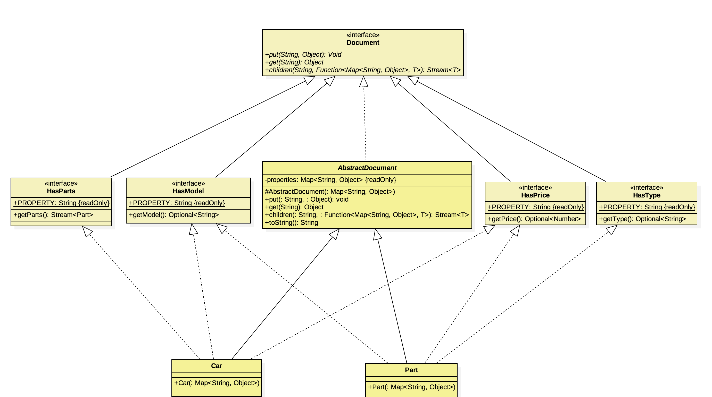

## Intention

Le patron de conception "Abstract Document" est un modèle de conception structurelle qui vise à fournir un moyen
cohérent de gérer les structures de données hiérarchiques et arborescentes en définissant une interface commune pour
différents types de documents.

## Explication

Le patron de conception "Abstract Document" permet de gérer des propriétés supplémentaires non statiques. Ce modèle
utilise le concept de traits pour assurer la sécurité des types et séparer les propriétés des différentes 
classes dans un ensemble d'interfaces

Exemple concret

>  Prenons l'exemple d'une voiture composée de plusieurs pièces. Cependant, nous ne savons pas si la voiture en question possède réellement toutes les pièces ou seulement certaines d'entre elles. Nos voitures sont dynamiques et extrêmement flexibles.

En clair

> Le modèle de document abstrait permet d'attacher des propriétés à des objets indépendament de ces derniers.

Wikipedia dit

> Un patron de conception structurelle orienté objet pour organiser des objets comme clé-valeur faiblement typés et exposer des données à l'aide de vues typées. L'objectif de ce modèle est d'atteindre un haut degré de flexibilité entre les composants
dans un langage fortement typé où de nouvelles propriétés peuvent être ajoutées à l'arbre d'objets à la volée, sans perdre le soutien de la sécurité de type.

**Exemple de programme**

Définissons en premier les classes de base `Document` et `AbstractDocument`. Ils font en sorte que l'objet contienne une carte(map) de propriétés et un nombre quelconque d'objets enfants.

```java
public interface Document {

  Void put(String key, Object value);

  Object get(String key);

  <T> Stream<T> children(String key, Function<Map<String, Object>, T> constructor);
}

public abstract class AbstractDocument implements Document {

  private final Map<String, Object> properties;

  protected AbstractDocument(Map<String, Object> properties) {
    Objects.requireNonNull(properties, "properties map is required");
    this.properties = properties;
  }

  @Override
  public Void put(String key, Object value) {
    properties.put(key, value);
    return null;
  }

  @Override
  public Object get(String key) {
    return properties.get(key);
  }

  @Override
  public <T> Stream<T> children(String key, Function<Map<String, Object>, T> constructor) {
    return Stream.ofNullable(get(key))
        .filter(Objects::nonNull)
        .map(el -> (List<Map<String, Object>>) el)
        .findAny()
        .stream()
        .flatMap(Collection::stream)
        .map(constructor);
  }
  ...
}
```
Ensuite, nous définissons une enumération  `Property` et un ensemble d'interfaces pour le type, le prix, le modèle et les pièces. Cela nous permet de créer une interface statique pour notre classe `Car`.

```java
public enum Property {

  PARTS, TYPE, PRICE, MODEL
}

public interface HasType extends Document {

  default Optional<String> getType() {
    return Optional.ofNullable((String) get(Property.TYPE.toString()));
  }
}

public interface HasPrice extends Document {

  default Optional<Number> getPrice() {
    return Optional.ofNullable((Number) get(Property.PRICE.toString()));
  }
}
public interface HasModel extends Document {

  default Optional<String> getModel() {
    return Optional.ofNullable((String) get(Property.MODEL.toString()));
  }
}

public interface HasParts extends Document {

  default Stream<Part> getParts() {
    return children(Property.PARTS.toString(), Part::new);
  }
}
```

Nous sommes maintenant prêts à présenter la classe `Car`.

```java
public class Car extends AbstractDocument implements HasModel, HasPrice, HasParts {

  public Car(Map<String, Object> properties) {
    super(properties);
  }
}
```

Enfin, voici comment nous construisons et utilisons la "voiture" dans un exemple complet.

```java
    LOGGER.info("Constructing parts and car");

    var wheelProperties = Map.of(
        Property.TYPE.toString(), "wheel",
        Property.MODEL.toString(), "15C",
        Property.PRICE.toString(), 100L);

    var doorProperties = Map.of(
        Property.TYPE.toString(), "door",
        Property.MODEL.toString(), "Lambo",
        Property.PRICE.toString(), 300L);

    var carProperties = Map.of(
        Property.MODEL.toString(), "300SL",
        Property.PRICE.toString(), 10000L,
        Property.PARTS.toString(), List.of(wheelProperties, doorProperties));

    var car = new Car(carProperties);

    LOGGER.info("Here is our car:");
    LOGGER.info("-> model: {}", car.getModel().orElseThrow());
    LOGGER.info("-> price: {}", car.getPrice().orElseThrow());
    LOGGER.info("-> parts: ");
    car.getParts().forEach(p -> LOGGER.info("\t{}/{}/{}",
        p.getType().orElse(null),
        p.getModel().orElse(null),
        p.getPrice().orElse(null))
    );

    // Constructing parts and car
    // Here is our car:
    // model: 300SL
    // price: 10000
    // parts: 
    // wheel/15C/100
    // door/Lambo/300
```

## Diagramme de classes



## Application

Ce modèle est particulièrement utile dans les scénarios où vous avez différents types de documents qui partagent des attributs ou des comportements communs, mais qui ont également des attributs ou des comportements uniques,  spécifiques à leurs types individuels. Voici quelques
Voici quelques scénarios dans lesquels le patron de conception Abstract Document peut s'appliquer :

* Systèmes de gestion de contenu (SGC) : dans un SGC (CMS en anglais), vous pouvez avoir différents types de contenu tels que des articles, des images, des vidéos, etc. Chaque type de contenu peut avoir des attributs communs tels que la date de création, l'auteur et les balises, mais aussi des attributs spécifiques tels que les dimensions de l'image pour les images ou la durée de la vidéo pour les vidéos.

* Systèmes de gestion de fichiers : Si vous concevez un système de gestion de fichiers dans lequel différents types de fichiers doivent être gérés; tels que des documents, des images, des fichiers audio et des répertoires, le patron "Abstract Document" peut vous aider à fournir un moyen cohérent d'accéder à des attributs tels que la taille du fichier, la date de création, etc., tout en autorisant des attributs spécifiques tels que la résolution de l'image ou la durée de l'audio.

* Systèmes de commerce électronique ou vente en ligne : Une plateforme de commerce électronique peut avoir différents types de produits tels que des produits physiques, des téléchargements numériques et des abonnements. Chaque type peut partager des attributs communs tels que le nom, le prix et la description, tout en ayant des attributs uniques tels que le poids d'expédition pour les produits physiques ou le lien de téléchargement pour les produits numériques.

* Systèmes de dossiers médicaux : En médécine, les dossiers des patients peuvent inclure différents types de données telles que des données démographiques, des antécédents médicaux, des résultats d'examens et des prescriptions. Le patron de conception "abstract document" peut aider à gérer des attributs partagés tels que l'ID du patient et sa date de naissance, tout en s'adaptant à des attributs spécialisés tels que les résultats d'examens ou les médicaments prescrits.

* Gestion de la configuration : Lorsqu'il s'agit de paramètres de configuration pour des applications logicielles, il peut y avoir différents types d'éléments de configuration, chacun avec son propre ensemble d'attributs. Le patron de conception "abstract document" peut être utilisé pour gérer ces éléments de configuration tout en garantissant une manière cohérente d'accéder à leurs attributs et de les manipuler.

* Plateformes éducatives : Les systèmes éducatifs peuvent disposer de différents types de matériel pédagogique, tels que des contenus textuels, des vidéos, des quiz et des devoirs. Les attributs communs tels que le titre, l'auteur et la date de publication peuvent être partagés, tandis que les attributs uniques tels que la durée des vidéos ou les dates d'échéance des devoirs peuvent être spécifiques à chaque type.

* Outils de gestion de projet : Dans les applications de gestion de projet, vous pouvez avoir différents types de tâches comme les tâches à faire, les étapes et les problèmes. Le modèle de document abstrait peut être utilisé pour gérer des attributs généraux tels que le nom de la tâche et le destinataire, tout en autorisant des attributs spécifiques tels que la date du jalon ou la priorité du problème.

L'idée principale du patron de conception Abstract Document est de fournir un moyen flexible et extensible de gérer différents types de documents ou d'entités avec des attributs partagés et distincts. En définissant une interface commune et en l'implémentant
dans les différents types de documents, vous pouvez obtenir une approche plus organisée et cohérente de la manipulation de structures de données complexes.

## Crédits

* [Wikipedia: Abstract Document Pattern](https://en.wikipedia.org/wiki/Abstract_Document_Pattern)
* [Martin Fowler: Dealing with properties](http://martinfowler.com/apsupp/properties.pdf)
* [Pattern-Oriented Software Architecture Volume 4: A Pattern Language for Distributed Computing (v. 4)](https://www.amazon.com/gp/product/0470059028/ref=as_li_qf_asin_il_tl?ie=UTF8&tag=javadesignpat-20&creative=9325&linkCode=as2&creativeASIN=0470059028&linkId=e3aacaea7017258acf184f9f3283b492)
