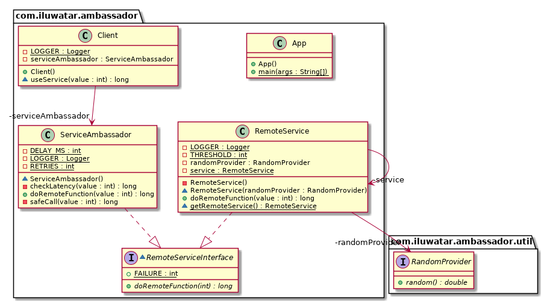

## हेतु

क्लाइंट पर एक सहायक सेवा उदाहरण प्रदान करें और साझा संसाधन से सामान्य कार्यक्षमता को दूर रखें।

## व्याख्या

वास्तविक दुनिया का उदाहरण

> एक दूरस्थ सेवा में कई ग्राहक उसके द्वारा प्रदान किए गए फ़ंक्शन तक पहुँच प्राप्त करते हैं। यह सेवा एक विरासती एप्लिकेशन है और है
> अद्यतन करना असंभव है. उपयोगकर्ताओं की ओर से बड़ी संख्या में अनुरोधों के कारण कनेक्टिविटी संबंधी समस्याएं उत्पन्न हो रही हैं। अनुरोध के लिए नए नियम
> आवृत्ति को विलंबता जांच और क्लाइंट-साइड लॉगिंग के साथ लागू किया जाना चाहिए।

साफ़ शब्दों में

> एंबेसेडर पैटर्न के साथ, हम विलंबता जांच के साथ-साथ ग्राहकों से कम-बार-बार मतदान लागू कर सकते हैं
> लॉगिंग.

माइक्रोसॉफ्ट दस्तावेज़ बताता है

> एक राजदूत सेवा को एक आउट-ऑफ-प्रोसेस प्रॉक्सी के रूप में सोचा जा सकता है जो क्लाइंट के साथ सह-स्थित होती है। यह पैटर्न
> मॉनिटरिंग, लॉगिंग, रूटिंग जैसे सामान्य क्लाइंट कनेक्टिविटी कार्यों को ऑफ़लोड करने के लिए उपयोगी हो सकता है।
> सुरक्षा (जैसे टीएलएस), और भाषा अज्ञेयवादी तरीके से लचीलापन पैटर्न। इसका उपयोग अक्सर पुराने अनुप्रयोगों के साथ किया जाता है,
> या अन्य एप्लिकेशन जिन्हें अपनी नेटवर्किंग क्षमताओं को बढ़ाने के लिए संशोधित करना मुश्किल है। यह भी हो सकता है
> उन सुविधाओं को लागू करने के लिए एक विशेष टीम को सक्षम करें।

**प्रोग्रामेटिक उदाहरण**

उपरोक्त परिचय को ध्यान में रखते हुए हम इस उदाहरण में कार्यक्षमता का अनुकरण करेंगे। हमने एक इंटरफ़ेस लागू किया है
दूरस्थ सेवा के साथ-साथ राजदूत सेवा द्वारा:

```java
interface RemoteServiceInterface {
    long doRemoteFunction(int value) throws Exception;
}
```

एक दूरस्थ सेवा को सिंगलटन के रूप में दर्शाया गया है।

```java
@Slf4j
public class RemoteService implements RemoteServiceInterface {
    private static RemoteService service = null;

    static synchronized RemoteService getRemoteService() {
        if (service == null) {
            service = new RemoteService();
        }
        return service;
    }

    private RemoteService() {}

    @Override
    public long doRemoteFunction(int value) {
        long waitTime = (long) Math.floor(Math.random() * 1000);

        try {
            sleep(waitTime);
        } catch (InterruptedException e) {
            LOGGER.error("Thread sleep interrupted", e);
        }

        return waitTime >= 200 ? value * 10 : -1;
    }
}
```

एक सेवा राजदूत लॉगिंग, विलंबता जांच जैसी अतिरिक्त सुविधाएं जोड़ रहा है

```java
@Slf4j
public class ServiceAmbassador implements RemoteServiceInterface {
  private static final int RETRIES = 3;
  private static final int DELAY_MS = 3000;

  ServiceAmbassador() {
  }

  @Override
  public long doRemoteFunction(int value) {
    return safeCall(value);
  }

  private long checkLatency(int value) {
    var startTime = System.currentTimeMillis();
    var result = RemoteService.getRemoteService().doRemoteFunction(value);
    var timeTaken = System.currentTimeMillis() - startTime;

    LOGGER.info("Time taken (ms): " + timeTaken);
    return result;
  }

  private long safeCall(int value) {
    var retries = 0;
    var result = (long) FAILURE;

    for (int i = 0; i < RETRIES; i++) {
      if (retries >= RETRIES) {
        return FAILURE;
      }

      if ((result = checkLatency(value)) == FAILURE) {
        LOGGER.info("Failed to reach remote: (" + (i + 1) + ")");
        retries++;
        try {
          sleep(DELAY_MS);
        } catch (InterruptedException e) {
          LOGGER.error("Thread sleep state interrupted", e);
        }
      } else {
        break;
      }
    }
    return result;
  }
}
```

एक ग्राहक के पास एक स्थानीय सेवा राजदूत होता है जिसका उपयोग दूरस्थ सेवा के साथ बातचीत करने के लिए किया जाता है:

```java
@Slf4j
public class Client {
  private final ServiceAmbassador serviceAmbassador = new ServiceAmbassador();

  long useService(int value) {
    var result = serviceAmbassador.doRemoteFunction(value);
    LOGGER.info("Service result: " + result);
    return result;
  }
}
```

यहां दो ग्राहक सेवा का उपयोग कर रहे हैं।

```java
public class App {
  public static void main(String[] args) {
    var host1 = new Client();
    var host2 = new Client();
    host1.useService(12);
    host2.useService(73);
  }
}
```

उदाहरण चलाने के लिए आउटपुट यहां दिया गया है:

```java
Time taken (ms): 111
Service result: 120
Time taken (ms): 931
Failed to reach remote: (1)
Time taken (ms): 665
Failed to reach remote: (2)
Time taken (ms): 538
Failed to reach remote: (3)
Service result: -1
```

## क्लास डायग्राम



## प्रयोज्यता

एंबेसडर एक विरासती दूरस्थ सेवा के साथ काम करते समय लागू होता है जिसे संशोधित नहीं किया जा सकता है या अत्यधिक होगा
संशोधित करना कठिन. रिमोट पर बदलाव की आवश्यकता से बचते हुए क्लाइंट पर कनेक्टिविटी सुविधाएँ लागू की जा सकती हैं
सेवा।

* राजदूत दूरस्थ सेवा के लिए एक स्थानीय इंटरफ़ेस प्रदान करता है।
* एंबेसडर क्लाइंट को लॉगिंग, सर्किट ब्रेकिंग, रिट्रीज़ और सुरक्षा प्रदान करता है।

## विशिष्ट उपयोग का मामला

* किसी अन्य वस्तु तक पहुंच को नियंत्रित करें
* लॉगिंग लागू करें
* सर्किट ब्रेकिंग लागू करें
* दूरस्थ सेवा कार्यों को ऑफलोड करें
* नेटवर्क कनेक्शन की सुविधा

## ज्ञात उपयोग

* [Kubernetes-native API gateway for microservices](https://github.com/datawire/ambassador)

## संबंधित पैटर्न

* [Proxy](https://java-design-patterns.com/patterns/proxy/)

## श्रेय

* [Ambassador pattern](https://docs.microsoft.com/en-us/azure/architecture/patterns/ambassador)
* [Designing Distributed Systems: Patterns and Paradigms for Scalable, Reliable Services](https://www.amazon.com/s?k=designing+distributed+systems&sprefix=designing+distri%2Caps%2C156&linkCode=ll2&tag=javadesignpat-20&linkId=a12581e625462f9038557b01794e5341&language=en_US&ref_=as_li_ss_tl)
