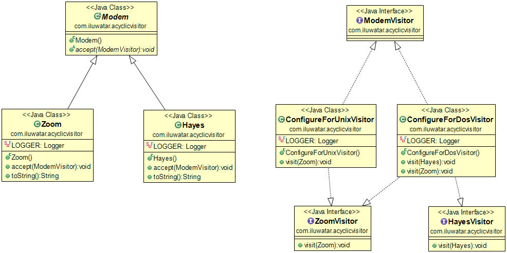

## Intento

Permette di aggiungere nuove funzioni alle gerarchie di classi esistenti senza influire su tali gerarchie e senza creare i cicli di dipendenza problematici che sono intrinseci al pattern Visitor dei GoF.

## Spiegazione

Esempio del mondo reale

> Abbiamo una gerarchia di classi di modem. I modem in questa gerarchia devono essere visitati da un algoritmo esterno basato su criteri di filtraggio (ad esempio, se si tratta di un modem compatibile con Unix o DOS).

In parole semplici

> L'Acyclic Visitor consente di aggiungere funzioni alle gerarchie di classi esistenti senza modificarle.

[WikiWikiWeb](https://wiki.c2.com/?AcyclicVisitor) dice

>Il pattern Acyclic Visitor consente di aggiungere nuove funzioni alle gerarchie di classi esistenti senza influire su tali gerarchie e senza creare i cicli di dipendenza che sono intrinseci al pattern Visitor dei Gang of Four. _(Testo tradotto dalla voce Acyclic Visitor da WikiWikiWeb in lingua inglese)._

**Esempio di codice**

Ecco la gerarchia delle classi `Modem`.

```java
public abstract class Modem {
  public abstract void accept(ModemVisitor modemVisitor);
}

public class Zoom extends Modem {
  ...
  @Override
  public void accept(ModemVisitor modemVisitor) {
    if (modemVisitor instanceof ZoomVisitor) {
      ((ZoomVisitor) modemVisitor).visit(this);
    } else {
      LOGGER.info("Only ZoomVisitor is allowed to visit Zoom modem");
    }
  }
}

public class Hayes extends Modem {
  ...
  @Override
  public void accept(ModemVisitor modemVisitor) {
    if (modemVisitor instanceof HayesVisitor) {
      ((HayesVisitor) modemVisitor).visit(this);
    } else {
      LOGGER.info("Only HayesVisitor is allowed to visit Hayes modem");
    }
  }
}
```


Successivamente introduciamo la gerarchia delle classi `ModemVisitor`.

```java
public interface ModemVisitor {
}

public interface HayesVisitor extends ModemVisitor {
  void visit(Hayes hayes);
}

public interface ZoomVisitor extends ModemVisitor {
  void visit(Zoom zoom);
}

public interface AllModemVisitor extends ZoomVisitor, HayesVisitor {
}

public class ConfigureForDosVisitor implements AllModemVisitor {
  ...
  @Override
  public void visit(Hayes hayes) {
    LOGGER.info(hayes + " used with Dos configurator.");
  }
  @Override
  public void visit(Zoom zoom) {
    LOGGER.info(zoom + " used with Dos configurator.");
  }
}

public class ConfigureForUnixVisitor implements ZoomVisitor {
  ...
  @Override
  public void visit(Zoom zoom) {
    LOGGER.info(zoom + " used with Unix configurator.");
  }
}
```

Infine, ecco i visitatori in azione.

```java
    var conUnix = new ConfigureForUnixVisitor();
    var conDos = new ConfigureForDosVisitor();
    var zoom = new Zoom();
    var hayes = new Hayes();
    hayes.accept(conDos);
    zoom.accept(conDos);
    hayes.accept(conUnix);
    zoom.accept(conUnix);   
```

Output del programma:

```
    // Hayes modem used with Dos configurator.
    // Zoom modem used with Dos configurator.
    // Only HayesVisitor is allowed to visit Hayes modem
    // Zoom modem used with Unix configurator.
```

## Diagramma delle classi



## Applicabilità

Questo pattern può essere utilizzato nei seguenti casi:

* Quando è necessario aggiungere una nuova funzione a una gerarchia esistente senza la necessità di modificarla o influenzarla. 
* Quando ci sono funzioni che operano su una gerarchia, ma che non appartengono alla gerarchia stessa, ad esempio, il problema di ConfigureForDOS / ConfigureForUnix / ConfigureForX. 
* Quando è necessario eseguire operazioni molto diverse su un oggetto a seconda del suo tipo.
* Quando la gerarchia delle classi visitate sarà frequentemente estesa con nuovi derivati dalla classe Element.
* Quando la ricompilazione, il relinking, il ritestare o la ridistribuzione dei derivati da Element è molto costoso.

## Tutorial

* [Acyclic Visitor Pattern Example](https://codecrafter.blogspot.com/2012/12/the-acyclic-visitor-pattern.html)

## Conseguenze

Aspetti positivi:

* Assenza di cicli di dipendenza tra le gerarchie di classi.
* Non è necessario ricompilare tutti i visitatori se se ne aggiunge uno nuovo.
* Non causa errori di compilazione nei visitatori esistenti se la gerarchia delle classi ha un nuovo membro.

Aspetti negativi:

* Viola il [Principio di sostituzione di Liskov](https://java-design-patterns.com/principles/#liskov-substitution-principle) mostrando di poter accettare tutti i visitatori ma essendo solo interessato a visitatori specifici.
* Deve essere creata una gerarchia parallela di visitatori per tutti i membri della gerarchia di classi visitabili.

## Pattern correlati

* [Visitor Pattern](https://java-design-patterns.com/patterns/visitor/)

## Collegamenti esterni

* [Acyclic Visitor by Robert C. Martin](http://condor.depaul.edu/dmumaugh/OOT/Design-Principles/acv.pdf)
* [Acyclic Visitor in WikiWikiWeb](https://wiki.c2.com/?AcyclicVisitor)
