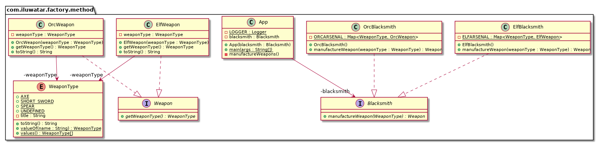

## 또한 ~으로 알려진

* Virtual Constructor

## 의도

팩토리 메소드 패턴을 사용하여 객체를 생성하기 위한 인터페이스를 정의하고, 어떤 클래스를 인스턴스화할지는 하위 클래스가 결정하도록 합니다. 이 생성 설계 패턴은 클래스가 인스턴스 생성을 하위 클래스로 위임하여 코드 유연성과 유지보수성을 향상시킬 수 있습니다.

## 설명

예시

> 한 물류 회사가 다양한 유형의 패키지를 배송해야 한다고 가정해 봅시다. 일반, 급송, 그리고 대형 배송 패키지가 있습니다. 이 회사는 중앙 시스템을 통해 배송 요청을 처리하지만, 각 패키지 유형이 어떻게 처리되는지에 대한 구체적인 사항은 알지 못합니다. 이를 관리하기 위해 이 회사는 팩토리 메소드 패턴을 사용합니다.
>
> 이 구조에서 중앙 클래스인 `DeliveryRequest`에는 `createPackage()`라는 메서드가 있습니다. 이 메서드는 `StandardDelivery`, `ExpressDelivery`, `OversizedDelivery`와 같은 하위 클래스에서 오버라이딩되며, 각 하위 클래스는 해당 패키지 유형을 생성하고 관리하는 방법을 알고 있습니다. 이렇게 함으로써 중앙 시스템은 각 패키지 유형이 어떻게 생성되고 처리되는지에 대한 세부 사항을 알 필요 없이 배송 요청을 처리할 수 있어, 유연하고 쉽게 유지보수가 가능합니다.

평범하게 말하자면,

> 이 패턴은 인스턴스 생성 로직을 자식 클래스에 위임하는 방법을 제공합니다.

Wikipedia 말에 의하면

> 클래스 기반 프로그래밍에서, 팩토리 메소드 패턴은 생성 패턴 중 하나로, 생성할 객체의 구체적인 클래스를 명시하지 않고 객체를 생성하는 문제를 해결합니다. 이를 위해 생성자는 직접 호출하지 않고, 팩토리 메소드를 호출하여 객체를 생성하는 방식을 사용합니다. 팩토리 메소드는 인터페이스에 명시되어 자식 클래스가 구현하거나, 기본 클래스에 구현되어 파생 클래스에서 필요에 따라 오버라이딩할 수 있습니다.

## 프로그램 코드 예제

팩토리 메소드 접근 방식은 다음 예제에서 볼 수 있듯이 유연하고 유지 관리 가능한 코드를 달성하기 위한 자바 디자인 패턴에서 중추적인 역할을 합니다.

대장장이가 무기를 제작합니다. 엘프는 엘프족 무기를, 오크는 오크족 무기를 필요로 합니다. 고객에 따라 적합한 유형의 대장장이가 소환됩니다.

우선, `Blacksmith` 인터페이스와 이를 구현한 몇 가지 클래스들이 있습니다.

```java
public interface Blacksmith {
  Weapon manufactureWeapon(WeaponType weaponType);
}

public class ElfBlacksmith implements Blacksmith {
  public Weapon manufactureWeapon(WeaponType weaponType) {
    return ELFARSENAL.get(weaponType);
  }
}

public class OrcBlacksmith implements Blacksmith {
  public Weapon manufactureWeapon(WeaponType weaponType) {
    return ORCARSENAL.get(weaponType);
  }
}
```

고객이 오면, 올바른 유형의 대장장이가 소환되어 요청된 무기를 제작합니다.

```java
public static void main(String[] args) {

    Blacksmith blacksmith = new OrcBlacksmith();
    Weapon weapon = blacksmith.manufactureWeapon(WeaponType.SPEAR);
    LOGGER.info(MANUFACTURED, blacksmith, weapon);
    weapon = blacksmith.manufactureWeapon(WeaponType.AXE);
    LOGGER.info(MANUFACTURED, blacksmith, weapon);

    blacksmith = new ElfBlacksmith();
    weapon = blacksmith.manufactureWeapon(WeaponType.SPEAR);
    LOGGER.info(MANUFACTURED, blacksmith, weapon);
    weapon = blacksmith.manufactureWeapon(WeaponType.AXE);
    LOGGER.info(MANUFACTURED, blacksmith, weapon);
}
```

프로그램 실행 결과
```
06:40:07.269 [main] INFO com.iluwatar.factory.method.App -- The orc blacksmith manufactured an orcish spear
06:40:07.271 [main] INFO com.iluwatar.factory.method.App -- The orc blacksmith manufactured an orcish axe
06:40:07.272 [main] INFO com.iluwatar.factory.method.App -- The elf blacksmith manufactured an elven spear
06:40:07.272 [main] INFO com.iluwatar.factory.method.App -- The elf blacksmith manufactured an elven axe
```

## 클래스 다이어그램



## 적용 가능성

자바에서 팩토리 메소드 패턴을 사용하는 경우:

* 클래스가 생성해야 할 객체의 클래스를 예측할 수 없을 때
* 클래스가 생성할 객체를 자식 클래스가 지정하도록 하고 싶을 때
* 여러 보조 자식 클래스 중 하나에 책임을 위임하고, 어느 자식 클래스가 해당 작업을 담당하는지에 대한 정보를 국지화하고 싶을 때

## 실제 사례

* [java.util.Calendar](http://docs.oracle.com/javase/8/docs/api/java/util/Calendar.html#getInstance--)
* [java.util.ResourceBundle](http://docs.oracle.com/javase/8/docs/api/java/util/ResourceBundle.html#getBundle-java.lang.String-)
* [java.text.NumberFormat](http://docs.oracle.com/javase/8/docs/api/java/text/NumberFormat.html#getInstance--)
* [java.nio.charset.Charset](http://docs.oracle.com/javase/8/docs/api/java/nio/charset/Charset.html#forName-java.lang.String-)
* [java.net.URLStreamHandlerFactory](http://docs.oracle.com/javase/8/docs/api/java/net/URLStreamHandlerFactory.html#createURLStreamHandler-java.lang.String-)
* [java.util.EnumSet](https://docs.oracle.com/javase/8/docs/api/java/util/EnumSet.html#of-E-)
* [javax.xml.bind.JAXBContext](https://docs.oracle.com/javase/8/docs/api/javax/xml/bind/JAXBContext.html#createMarshaller--)
* Frameworks that run application components, configured dynamically at runtime.

## 장단점

장점:

* 팩토리 메소드 패턴은 하위 클래스에 대한 후크(hooks)를 제공하여 코드의 유연성과 유지보수성을 높입니다.
* 병렬적인 클래스 계층 구조를 연결합니다.
* 애플리케이션 특화 클래스를 코드에 직접 포함할 필요가 없어집니다. 코드가 제품 인터페이스와만 상호작용하므로, 사용자 정의 구체 클래스와 쉽게 연동할 수 있습니다.

단점:

* 확장된 팩토리 메소드를 구현하기 위해 새로운 하위 클래스를 추가해야 하므로 코드가 복잡해질 수 있습니다.

## 관련 패턴

* [Abstract Factory](https://java-design-patterns.com/patterns/abstract-factory/): 팩토리 메소드는 종종 추상 팩토리 패턴 내에서 호출됩니다.
* [Prototype](https://java-design-patterns.com/patterns/prototype/): 프로토타입 클래스를 복제한 새 인스턴스를 반환하는 팩토리 메소드.

## 크레딧

* [Design Patterns: Elements of Reusable Object-Oriented Software](https://amzn.to/3w0Rk5y)
* [Head First Design Patterns: Building Extensible and Maintainable Object-Oriented Software](https://amzn.to/3UpTLrG)
* [Patterns of Enterprise Application Architecture](https://amzn.to/4b2ZxoM)
