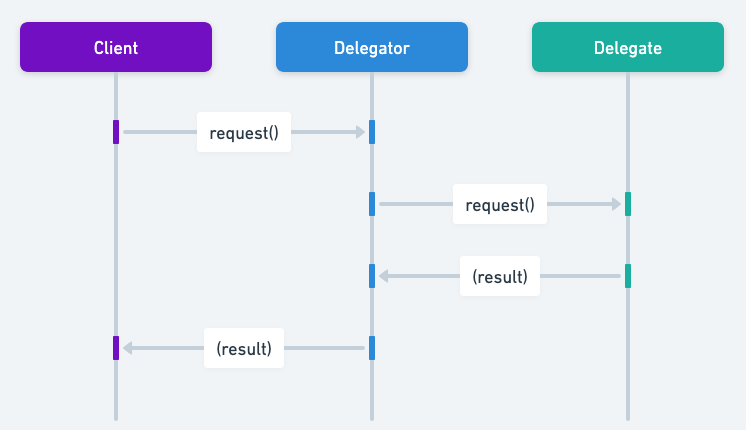

## Também conhecido como

* Helper
* Surrogate

## Propósito

Permitir que um objeto delegue a responsabilidade por uma tarefa a outro objeto auxiliar.

## Explicação

Exemplo do mundo real

> Em um restaurante, o chef principal delega tarefas aos sous-chefs: um cuida das grelhas, outro das saladas e um terceiro é responsável pelas sobremesas. Cada sous-chef é especializado em sua área, permitindo que o chef principal se concentre na gestão geral da cozinha. Isso reflete o padrão Delegation, no qual um objeto principal delega tarefas específicas a objetos auxiliares, cada um especialista em seu domínio.

Em outras palavras

> Delegation é um padrão de design em que um objeto repassa uma tarefa a um objeto auxiliar.

De acordo com a Wikipédia

> Em programação orientada a objetos, delegação se refere a avaliar um membro (propriedade ou método) de um objeto (o receptor) no contexto de outro objeto original (o remetente). A delegação pode ser feita explicitamente, passando o objeto remetente para o objeto receptor, o que pode ser feito em qualquer linguagem orientada a objetos; ou implicitamente, pelas regras de busca de membros da linguagem, o que exige suporte da linguagem para esse recurso.

Diagrama de sequência



## Exemplo Programático

Vamos considerar um exemplo de impressão.

Temos uma interface `Printer` e três implementações: `CanonPrinter`, `EpsonPrinter` e `HpPrinter`.

```java
public interface Printer {
    void print(final String message);
}

@Slf4j
public class CanonPrinter implements Printer {
    @Override
    public void print(String message) {
        LOGGER.info("Canon Printer : {}", message);
    }
}

@Slf4j
public class EpsonPrinter implements Printer {
    @Override
    public void print(String message) {
        LOGGER.info("Epson Printer : {}", message);
    }
}

@Slf4j
public class HpPrinter implements Printer {
    @Override
    public void print(String message) {
        LOGGER.info("HP Printer : {}", message);
    }
}
```

O `PrinterController` pode ser usado como um `Printer`, delegando qualquer trabalho tratado por essa interface a um objeto que a implemente.

```java
public class PrinterController implements Printer {

    private final Printer printer;

    public PrinterController(Printer printer) {
        this.printer = printer;
    }

    @Override
    public void print(String message) {
        printer.print(message);
    }
}
```

No código cliente, os controladores de impressora podem imprimir mensagens de formas diferentes, dependendo do objeto para o qual delegam esse trabalho.

```java
public class App {

    private static final String MESSAGE_TO_PRINT = "hello world";

    public static void main(String[] args) {
        var hpPrinterController = new PrinterController(new HpPrinter());
        var canonPrinterController = new PrinterController(new CanonPrinter());
        var epsonPrinterController = new PrinterController(new EpsonPrinter());

        hpPrinterController.print(MESSAGE_TO_PRINT);
        canonPrinterController.print(MESSAGE_TO_PRINT);
        epsonPrinterController.print(MESSAGE_TO_PRINT);
    }
}
```

Saída do programa:

```
HP Printer:hello world
Canon Printer:hello world
Epson Printer:hello world
```

## Quando usar o padrão Delegation

* Quando você deseja passar a responsabilidade de uma classe para outra sem usar herança.
* Para obter reutilização baseada em composição em vez de herança.
* Quando você precisa usar diversas classes auxiliares intercambiáveis em tempo de execução.

## Aplicações do mundo real do padrão Delegation

* O pacote java.awt.event do Java, no qual listeners são frequentemente usados para tratar eventos.
* Classes wrapper do Java Collections Framework (java.util.Collections), que delegam a outros objetos de coleção.
* No Spring Framework, a delegação é usada extensivamente no container IoC, no qual beans delegam tarefas a outros beans.

## Benefícios e desafios do padrão Delegation

Benefícios:

* Reduz a criação de subclasses: os objetos podem delegar operações a objetos diferentes e alterá-los em tempo de execução, reduzindo a necessidade de criar subclasses.
* Incentiva a reutilização: a delegação promove a reutilização do código do objeto auxiliar.
* Aumenta a flexibilidade: ao delegar tarefas a objetos auxiliares, é possível alterar o comportamento das suas classes em tempo de execução.

Desafios:

* Sobrecarga em tempo de execução: a delegação pode introduzir camadas adicionais de indireção, o que pode resultar em pequenos custos de desempenho.
* Complexidade: o design pode se tornar mais complicado, pois envolve classes e interfaces adicionais para gerenciar a delegação.

## Padrões relacionados

* [Composite](https://java-design-patterns.com/patterns/composite/): a delegação pode ser usada dentro de um padrão composite para delegar comportamentos específicos de componentes a componentes filhos.
* [Strategy](https://java-design-patterns.com/patterns/strategy/): a delegação é frequentemente usada no padrão strategy, no qual um objeto de contexto delega tarefas a um objeto de estratégia.
* https://java-design-patterns.com/patterns/proxy/: o padrão proxy é uma forma de delegação em que um objeto proxy controla o acesso a outro objeto, ao qual delega o trabalho.

## Referências e Créditos

* [Effective Java](https://amzn.to/4aGE7gX)
* [Head First Design Patterns](https://amzn.to/3J9tuaB)
* [Refactoring: Improving the Design of Existing Code](https://amzn.to/3VOcRsw)
* [Delegate Pattern: Wikipedia ](https://en.wikipedia.org/wiki/Delegation_pattern)
