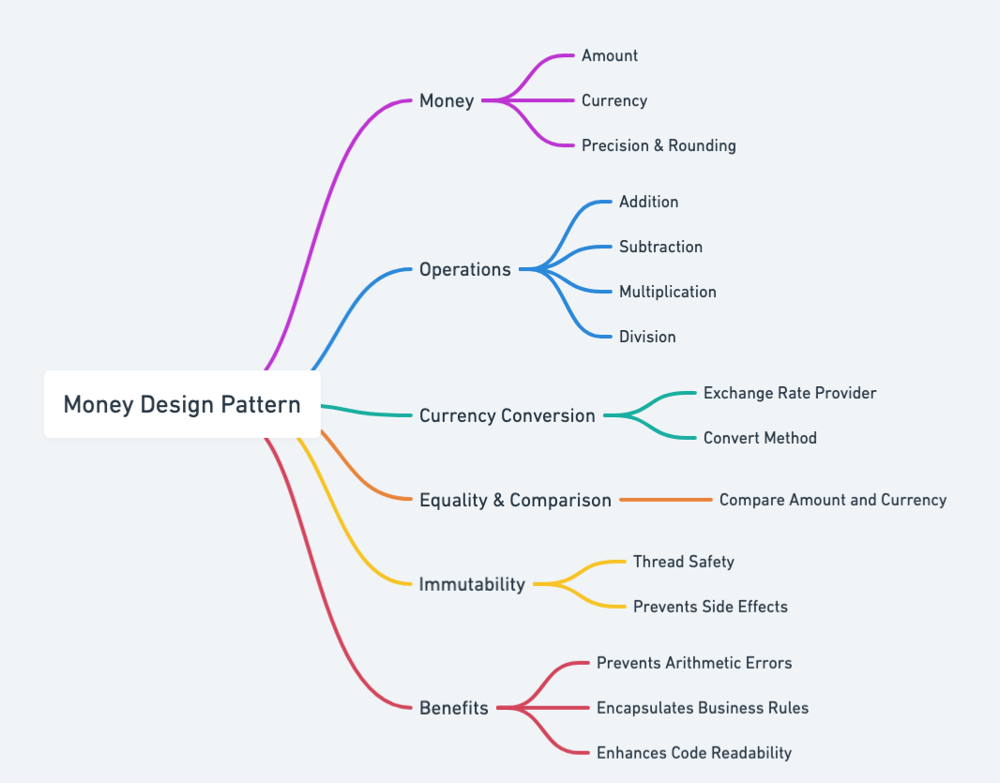
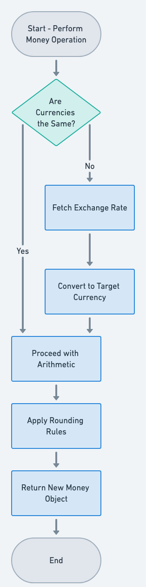

## Também conhecido como

* Monetary Value Object

## Propósito

Encapsular valores monetários e sua moeda associada em um objeto específico do domínio.

## Explicação

Exemplo do mundo real

> Imagine um sistema de vale-presente on-line, no qual cada vale-presente mantém um saldo específico em uma determinada moeda. Em vez de usar apenas um valor de ponto flutuante para o saldo, o sistema usa um objeto Money para rastrear o valor e a moeda com precisão. Sempre que alguém usa o vale-presente, o saldo é atualizado com cálculos precisos que evitam erros de arredondamento de ponto flutuante, garantindo que a lógica de domínio permaneça consistente e correta.

Em outras palavras

> O padrão Money encapsula tanto um valor quanto sua moeda, garantindo que as operações financeiras sejam precisas, consistentes e fáceis de manter.

De acordo com a Wikipédia

> O padrão de design Money encapsula um valor monetário e sua moeda, permitindo operações aritméticas e conversões seguras, ao mesmo tempo em que preserva a precisão e a consistência nos cálculos financeiros.

Mapa mental



Fluxograma



## Exemplo Programático

Neste exemplo, criamos uma classe `Money` para demonstrar como valores monetários podem ser encapsulados junto com sua moeda. Essa abordagem ajuda a evitar imprecisões de ponto flutuante, garante que as operações aritméticas sejam tratadas de forma consistente e fornece uma maneira clara e centrada no domínio de trabalhar com dinheiro.

```java
@AllArgsConstructor
@Getter
public class Money {
    private double amount;
    private String currency;

    public Money(double amnt, String curr) {
        this.amount = amnt;
        this.currency = curr;
    }

    private double roundToTwoDecimals(double value) {
        return Math.round(value * 100.0) / 100.0;
    }

    public void addMoney(Money moneyToBeAdded) throws CannotAddTwoCurrienciesException {
        if (!moneyToBeAdded.getCurrency().equals(this.currency)) {
            throw new CannotAddTwoCurrienciesException("You are trying to add two different currencies");
        }
        this.amount = roundToTwoDecimals(this.amount + moneyToBeAdded.getAmount());
    }

    public void subtractMoney(Money moneyToBeSubtracted) throws CannotSubtractException {
        if (!moneyToBeSubtracted.getCurrency().equals(this.currency)) {
            throw new CannotSubtractException("You are trying to subtract two different currencies");
        } else if (moneyToBeSubtracted.getAmount() > this.amount) {
            throw new CannotSubtractException("The amount you are trying to subtract is larger than the amount you have");
        }
        this.amount = roundToTwoDecimals(this.amount - moneyToBeSubtracted.getAmount());
    }

    public void multiply(int factor) {
        if (factor < 0) {
            throw new IllegalArgumentException("Factor must be non-negative");
        }
        this.amount = roundToTwoDecimals(this.amount * factor);
    }

    public void exchangeCurrency(String currencyToChangeTo, double exchangeRate) {
        if (exchangeRate < 0) {
            throw new IllegalArgumentException("Exchange rate must be non-negative");
        }
        this.amount = roundToTwoDecimals(this.amount * exchangeRate);
        this.currency = currencyToChangeTo;
    }
}
```

Ao encapsular toda a lógica relacionada a dinheiro em uma única classe, reduzimos o risco de misturar moedas diferentes, melhoramos a clareza do código-base e facilitamos futuras modificações, como adicionar novas moedas ou refinar as regras de arredondamento. Esse padrão fortalece o modelo de domínio ao tratar o dinheiro como um conceito distinto, e não apenas como mais um valor numérico.

## Quando usar o padrão Money

* Quando cálculos financeiros ou manipulações de dinheiro fazem parte da lógica de negócio
* Quando é necessário um tratamento preciso de valores monetários para evitar imprecisões de ponto flutuante
* Quando princípios de domain-driven design e tipagem forte são desejados

## Aplicações do mundo real do padrão Money

* A biblioteca JSR 354 (Java Money and Currency) em Java
* Modelos de domínio personalizados em sistemas de e-commerce e contabilidade

## Benefícios e desafios do padrão Money

Benefícios

* Fornece uma representação única e type-safe para valores monetários e moeda
* Incentiva o encapsulamento de operações relacionadas, como adição, subtração e formatação
* Evita erros de ponto flutuante ao usar inteiros ou bibliotecas decimais especializadas

Desafios

* Requer classes e infraestrutura adicionais para lidar com conversões e formatação de moeda
* Pode introduzir sobrecarga de desempenho ao realizar um grande número de operações monetárias

## Padrões relacionados

* [Value Object](https://java-design-patterns.com/patterns/value-object/): Money é tipicamente um exemplo clássico de value object em domain-driven design.

## Referências e Créditos

* [Domain-Driven Design: Tackling Complexity in the Heart of Software](https://amzn.to/3wlDrze)
* [Implementing Domain-Driven Design](https://amzn.to/4dmBjrB)
* [Patterns of Enterprise Application Architecture](https://amzn.to/3WfKBPR)
