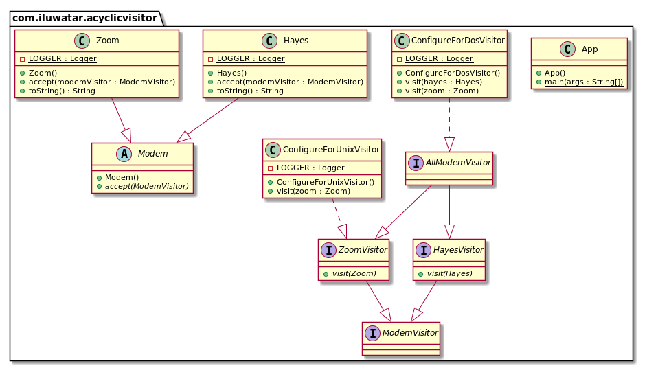

## 目的

允許將新功能新增到現有的類層次結構中，而不會影響這些層次結構，也不會有四人幫訪客模式中那樣迴圈依賴的問題。

## 解釋

真實世界例子

> 我們有一個調變解調器類的層次結構。 需要使用基於過濾條件的外部演算法（是Unix或DOS相容的調變解調器）來訪問此層次結構中的調變解調器。

通俗地說

> 非迴圈訪問者允許將功能新增到現有的類層次結構中，而無需修改層次結構

[WikiWikiWeb](https://wiki.c2.com/?AcyclicVisitor) 上說

> 非迴圈訪客模式允許將新功能新增到現有的類層次結構中，而不會影響這些層次結構，也不會建立四人幫訪客模式中固有的迴圈依賴問題。

**程式示例**

這是調變解調器的層次結構。

```java
public abstract class Modem {
  public abstract void accept(ModemVisitor modemVisitor);
}

public class Zoom extends Modem {
  ...
  @Override
  public void accept(ModemVisitor modemVisitor) {
    if (modemVisitor instanceof ZoomVisitor) {
      ((ZoomVisitor) modemVisitor).visit(this);
    } else {
      LOGGER.info("Only ZoomVisitor is allowed to visit Zoom modem");
    }
  }
}

public class Hayes extends Modem {
  ...
  @Override
  public void accept(ModemVisitor modemVisitor) {
    if (modemVisitor instanceof HayesVisitor) {
      ((HayesVisitor) modemVisitor).visit(this);
    } else {
      LOGGER.info("Only HayesVisitor is allowed to visit Hayes modem");
    }
  }
}
```

下面我們介紹`調變解調器訪問者`類結構。

```java
public interface ModemVisitor {
}

public interface HayesVisitor extends ModemVisitor {
  void visit(Hayes hayes);
}

public interface ZoomVisitor extends ModemVisitor {
  void visit(Zoom zoom);
}

public interface AllModemVisitor extends ZoomVisitor, HayesVisitor {
}

public class ConfigureForDosVisitor implements AllModemVisitor {
  ...
  @Override
  public void visit(Hayes hayes) {
    LOGGER.info(hayes + " used with Dos configurator.");
  }
  @Override
  public void visit(Zoom zoom) {
    LOGGER.info(zoom + " used with Dos configurator.");
  }
}

public class ConfigureForUnixVisitor implements ZoomVisitor {
  ...
  @Override
  public void visit(Zoom zoom) {
    LOGGER.info(zoom + " used with Unix configurator.");
  }
}
```

最後，這裡是訪問者的實踐。

```java
    var conUnix = new ConfigureForUnixVisitor();
    var conDos = new ConfigureForDosVisitor();
    var zoom = new Zoom();
    var hayes = new Hayes();
    hayes.accept(conDos);
    zoom.accept(conDos);
    hayes.accept(conUnix);
    zoom.accept(conUnix);   
```

程式輸出:

```
    // Hayes modem used with Dos configurator.
    // Zoom modem used with Dos configurator.
    // Only HayesVisitor is allowed to visit Hayes modem
    // Zoom modem used with Unix configurator.
```

## 類圖



## 適用性

以下情況可以使用此模式：

* 需要在現有層次結構中新增新功能而無需更改或影響該層次結構時。
* 當某些功能在層次結構上執行，但不屬於層次結構本身時。 例如 ConfigureForDOS / ConfigureForUnix / ConfigureForX問題。
* 當您需要根據物件的型別對物件執行非常不同的操作時。
* 當訪問的類層次結構將經常使用元素類的新派生進行擴充套件時。
* 當重新編譯，重新連結，重新測試或重新分發派生元素非常昂貴時。

## 結果

好處:

* 類層次結構之間沒有依賴關係迴圈。
* 如果新增了新訪客，則無需重新編譯所有訪客。
* 如果類層次結構具有新成員，則不會導致現有訪問者中的編譯失敗。

壞處:

* 透過證明它可以接受所有訪客，但實際上僅對特定訪客感興趣，從而違反了[Liskov的替代原則](https://java-design-patterns.com/principles/#liskov-substitution-principle)
* 必須為可訪問的類層次結構中的所有成員建立訪問者的並行層次結構。

## 相關的模式

* [Visitor Pattern](https://java-design-patterns.com/patterns/visitor/)

## 鳴謝

* [Acyclic Visitor by Robert C. Martin](http://condor.depaul.edu/dmumaugh/OOT/Design-Principles/acv.pdf)
* [Acyclic Visitor in WikiWikiWeb](https://wiki.c2.com/?AcyclicVisitor)
