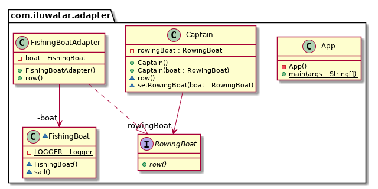

## 又被稱為
包裝器

## 目的
將一個介面轉換成另一個客戶所期望的介面。介面卡讓那些本來因為介面不相容的類可以合作無間。

## 解釋

現實世界例子

> 考慮有這麼一種情況，在你的儲存卡中有一些照片，你想將其傳到你的電腦中。為了傳送資料，你需要某種能夠相容你電腦介面的介面卡以便你的儲存卡能連上你的電腦。在這種情況下，讀卡器就是一個介面卡。
> 另一個例子就是註明的電源介面卡；三腳插頭不能插在兩腳插座上，需要一個電源介面卡來使其能夠插在兩腳插座上。
> 還有一個例子就是翻譯官，他翻譯一個人對另一個人說的話。

用直白的話來說

> 介面卡模式讓你可以把不相容的物件包在介面卡中，以讓其相容其他類。

維基百科中說

> 在軟體工程中，介面卡模式是一種可以讓現有類的介面把其作為其他介面來使用的設計模式。它經常用來使現有的類和其他類能夠工作並且不用修改其他類的原始碼。

**程式設計樣例(物件介面卡)**

假如有一個船長他只會划船，但不會航行。

首先我們有介面`RowingBoat`和`FishingBoat`

```java
public interface RowingBoat {
  void row();
}

@Slf4j
public class FishingBoat {
  public void sail() {
    LOGGER.info("The fishing boat is sailing");
  }
}
```
船長希望有一個`RowingBoat`介面的實現，這樣就可以移動

```java
public class Captain {

  private final RowingBoat rowingBoat;
  // default constructor and setter for rowingBoat
  public Captain(RowingBoat rowingBoat) {
    this.rowingBoat = rowingBoat;
  }

  public void row() {
    rowingBoat.row();
  }
}
```

現在海盜來了，我們的船長需要逃跑但是隻有一個漁船可用。我們需要建立一個可以讓船長使用其划船技能來操作漁船的介面卡。

```java
@Slf4j
public class FishingBoatAdapter implements RowingBoat {

  private final FishingBoat boat;

  public FishingBoatAdapter() {
    boat = new FishingBoat();
  }

  @Override
  public void row() {
    boat.sail();
  }
}

```

現在 `船長` 可以使用`FishingBoat`介面來逃離海盜了。

```java
var captain = new Captain(new FishingBoatAdapter());
captain.row();
```

## 類圖



## 應用
使用介面卡模式當

* 你想使用一個已有類，但是它的介面不能和你需要的所匹配
* 你需要建立一個可重用類，該類與不相關或不可預見的類進行協作，即不一定具有相容介面的類
* 你需要使用一些現有的子類，但是子類化他們每一個的子類來進行介面的適配是不現實的。一個物件介面卡可以適配他們父類的介面。
* 大多數使用第三方類庫的應用使用介面卡作為一個在應用和第三方類庫間的中間層來使應用和類庫解耦。如果必須使用另一個庫，則只需使用一個新庫的介面卡而無需改變應用程式的程式碼。

## 後果:
類和物件介面卡有不同的權衡取捨。一個類介面卡

*	適配被適配者到目標介面，需要保證只有一個具體的被適配者類。作為結果，當我們想適配一個類和它所有的子類時，類介面卡將不會起作用。
*	可以讓介面卡重寫一些被適配者的行為，因為介面卡是被適配者的子類。
*	只引入了一個物件，並且不需要其他指標間接訪問被適配者。

物件介面卡	

*	一個介面卡可以和許多被適配者工作，也就是被適配者自己和所有它的子類。介面卡同時可以為所有被適配者新增功能。
*	覆蓋被適配者的行為變得更難。需要子類化被適配者然後讓介面卡引用這個子類不是被適配者。


## 現實世界的案例

* [java.util.Arrays#asList()](http://docs.oracle.com/javase/8/docs/api/java/util/Arrays.html#asList%28T...%29)
* [java.util.Collections#list()](https://docs.oracle.com/javase/8/docs/api/java/util/Collections.html#list-java.util.Enumeration-)
* [java.util.Collections#enumeration()](https://docs.oracle.com/javase/8/docs/api/java/util/Collections.html#enumeration-java.util.Collection-)
* [javax.xml.bind.annotation.adapters.XMLAdapter](http://docs.oracle.com/javase/8/docs/api/javax/xml/bind/annotation/adapters/XmlAdapter.html#marshal-BoundType-)


## 鳴謝

* [Design Patterns: Elements of Reusable Object-Oriented Software](https://www.amazon.com/gp/product/0201633612/ref=as_li_tl?ie=UTF8&camp=1789&creative=9325&creativeASIN=0201633612&linkCode=as2&tag=javadesignpat-20&linkId=675d49790ce11db99d90bde47f1aeb59)
* [J2EE Design Patterns](https://www.amazon.com/gp/product/0596004273/ref=as_li_tl?ie=UTF8&camp=1789&creative=9325&creativeASIN=0596004273&linkCode=as2&tag=javadesignpat-20&linkId=48d37c67fb3d845b802fa9b619ad8f31)
* [Head First Design Patterns: A Brain-Friendly Guide](https://www.amazon.com/gp/product/0596007124/ref=as_li_tl?ie=UTF8&camp=1789&creative=9325&creativeASIN=0596007124&linkCode=as2&tag=javadesignpat-20&linkId=6b8b6eea86021af6c8e3cd3fc382cb5b)
* [Refactoring to Patterns](https://www.amazon.com/gp/product/0321213351/ref=as_li_tl?ie=UTF8&camp=1789&creative=9325&creativeASIN=0321213351&linkCode=as2&tag=javadesignpat-20&linkId=2a76fcb387234bc71b1c61150b3cc3a7)

```

```