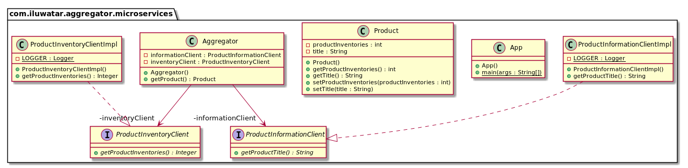

## 意圖

使用者對聚合器服務進行一次呼叫，然後聚合器將呼叫每個相關的微服務。

## 解釋

真實世界例子

> 我們的網路市場需要有關產品及其當前庫存的資訊。 它呼叫聚合服務，聚合服務依次呼叫產品資訊微服務和產品庫存微服務，返回組合資訊。

通俗地說

> 聚合器微服務從各種微服務中收集資料，並返回一個聚合資料以進行處理。

Stack Overflow上說

> 聚合器微服務呼叫多個服務以實現應用程式所需的功能。

**程式示例**

讓我們從資料模型開始。 這是我們的`產品`。

```java
public class Product {
  private String title;
  private int productInventories;
  // getters and setters ->
  ...
}
```

接下來，我們將介紹我們的聚合器微服務。 它包含用於呼叫相應微服務的客戶端`ProductInformationClient`和` ProductInventoryClient`。

```java
@RestController
public class Aggregator {

  @Resource
  private ProductInformationClient informationClient;

  @Resource
  private ProductInventoryClient inventoryClient;

  @RequestMapping(path = "/product", method = RequestMethod.GET)
  public Product getProduct() {

    var product = new Product();
    var productTitle = informationClient.getProductTitle();
    var productInventory = inventoryClient.getProductInventories();

    //Fallback to error message
    product.setTitle(requireNonNullElse(productTitle, "Error: Fetching Product Title Failed"));

    //Fallback to default error inventory
    product.setProductInventories(requireNonNullElse(productInventory, -1));

    return product;
  }
}
```

這是產品資訊微服務的精華實現。 庫存微服務類似，它只返回庫存計數。

```java
@RestController
public class InformationController {
  @RequestMapping(value = "/information", method = RequestMethod.GET)
  public String getProductTitle() {
    return "The Product Title.";
  }
}
```

Now calling our `Aggregator` REST API returns the product information.

現在呼叫我們的聚合器 REST API會返回產品資訊。

```bash
curl http://localhost:50004/product
{"title":"The Product Title.","productInventories":5}
```

## 類圖



## 適用性

當需要各種微服務的統一API時，無論客戶端裝置如何，都可以使用Aggregator微服務模式。

## 鳴謝

* [Microservice Design Patterns](http://web.archive.org/web/20190705163602/http://blog.arungupta.me/microservice-design-patterns/)
* [Microservices Patterns: With examples in Java](https://www.amazon.com/gp/product/1617294543/ref=as_li_qf_asin_il_tl?ie=UTF8&tag=javadesignpat-20&creative=9325&linkCode=as2&creativeASIN=1617294543&linkId=8b4e570267bc5fb8b8189917b461dc60)
* [Architectural Patterns: Uncover essential patterns in the most indispensable realm of enterprise architecture](https://www.amazon.com/gp/product/B077T7V8RC/ref=as_li_qf_asin_il_tl?ie=UTF8&tag=javadesignpat-20&creative=9325&linkCode=as2&creativeASIN=B077T7V8RC&linkId=c34d204bfe1b277914b420189f09c1a4)
