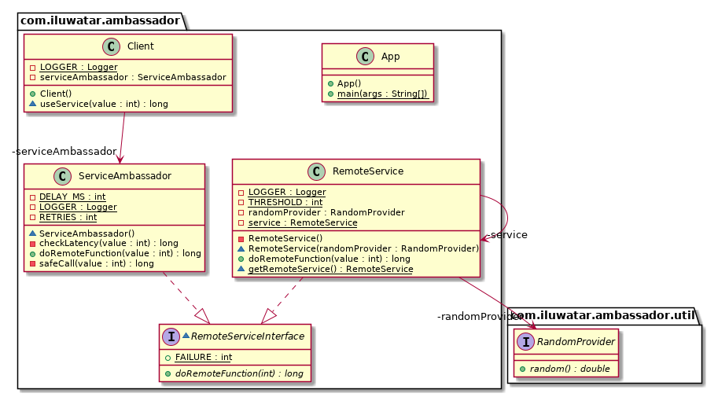

## 目的

在客戶端上提供幫助程式服務例項，並從共享資源上轉移常用功能。

## 解釋

真實世界例子

> 遠端服務有許多客戶端訪問它提供的功能。 該服務是舊版應用程式，無法更新。 使用者的大量請求導致連線問題。新的請求頻率規則需要同時實現延遲檢測和客戶端日誌功能。

通俗的說

> 使用“大使”模式，我們可以實現來自客戶端的頻率較低的輪詢以及延遲檢查和日誌記錄。

微軟文件做了如下闡述

> 可以將大使服務視為與客戶端位於同一位置的程序外代理。 此模式對於以語言不可知的方式減輕常見的客戶端連線任務（例如監視，日誌記錄，路由，安全性（如TLS）和彈性模式）的工作很有用。 它通常與舊版應用程式或其他難以修改的應用程式一起使用，以擴充套件其網路功能。 它還可以使專業團隊實現這些功能。

**程式示例**

有了上面的介紹我們將在這個例子中模仿功能。我們有一個用遠端服務實現的介面，同時也是大使服務。

```java
interface RemoteServiceInterface {
    long doRemoteFunction(int value) throws Exception;
}
```

表示為單例的遠端服務。

```java
public class RemoteService implements RemoteServiceInterface {

    private static final Logger LOGGER = LoggerFactory.getLogger(RemoteService.class);
    private static RemoteService service = null;

    static synchronized RemoteService getRemoteService() {
        if (service == null) {
            service = new RemoteService();
        }
        return service;
    }

    private RemoteService() {}

    @Override
    public long doRemoteFunction(int value) {
        long waitTime = (long) Math.floor(Math.random() * 1000);

        try {
            sleep(waitTime);
        } catch (InterruptedException e) {
            LOGGER.error("Thread sleep interrupted", e);
        }

        return waitTime >= 200 ? value * 10 : -1;
    }
}
```

服務大使新增了像日誌和延遲檢測的額外功能

```java
public class ServiceAmbassador implements RemoteServiceInterface {

  private static final Logger LOGGER = LoggerFactory.getLogger(ServiceAmbassador.class);
  private static final int RETRIES = 3;
  private static final int DELAY_MS = 3000;

  ServiceAmbassador() {
  }

  @Override
  public long doRemoteFunction(int value) {
    return safeCall(value);
  }

  private long checkLatency(int value) {
    var startTime = System.currentTimeMillis();
    var result = RemoteService.getRemoteService().doRemoteFunction(value);
    var timeTaken = System.currentTimeMillis() - startTime;

    LOGGER.info("Time taken (ms): " + timeTaken);
    return result;
  }

  private long safeCall(int value) {
    var retries = 0;
    var result = (long) FAILURE;

    for (int i = 0; i < RETRIES; i++) {
      if (retries >= RETRIES) {
        return FAILURE;
      }

      if ((result = checkLatency(value)) == FAILURE) {
        LOGGER.info("Failed to reach remote: (" + (i + 1) + ")");
        retries++;
        try {
          sleep(DELAY_MS);
        } catch (InterruptedException e) {
          LOGGER.error("Thread sleep state interrupted", e);
        }
      } else {
        break;
      }
    }
    return result;
  }
}
```

客戶端具有用於與遠端服務進行互動的本地服務大使：

```java
public class Client {

  private static final Logger LOGGER = LoggerFactory.getLogger(Client.class);
  private final ServiceAmbassador serviceAmbassador = new ServiceAmbassador();

  long useService(int value) {
    var result = serviceAmbassador.doRemoteFunction(value);
    LOGGER.info("Service result: " + result);
    return result;
  }
}
```

這是兩個使用該服務的客戶端。

```java
public class App {
  public static void main(String[] args) {
    var host1 = new Client();
    var host2 = new Client();
    host1.useService(12);
    host2.useService(73);
  }
}
```

Here's the output for running the example:

```java
Time taken (ms): 111
Service result: 120
Time taken (ms): 931
Failed to reach remote: (1)
Time taken (ms): 665
Failed to reach remote: (2)
Time taken (ms): 538
Failed to reach remote: (3)
Service result: -1
```

## 類圖



## 適用性

大使適用於無法修改或極難修改的舊式遠端服務。 可以在客戶端上實現連線性的功能，而無需更改遠端服務。

* 大使提供了用於遠端服務的本地介面。
* 大使在客戶端上提供日誌記錄，斷路，重試和安全性。

## 典型用例

* 控制對另一個物件的訪問
* 實現日誌
* 解除安裝遠端服務任務
* 簡化網路連線

## 已知使用

* [Kubernetes-native API gateway for microservices](https://github.com/datawire/ambassador)

## 相關模式

* [Proxy](https://java-design-patterns.com/patterns/proxy/)

## 鳴謝

* [Ambassador pattern](https://docs.microsoft.com/en-us/azure/architecture/patterns/ambassador)
* [Designing Distributed Systems: Patterns and Paradigms for Scalable, Reliable Services](https://books.google.co.uk/books?id=6BJNDwAAQBAJ&pg=PT35&lpg=PT35&dq=ambassador+pattern+in+real+world&source=bl&ots=d2e7GhYdHi&sig=Lfl_MDnCgn6lUcjzOg4GXrN13bQ&hl=en&sa=X&ved=0ahUKEwjk9L_18rrbAhVpKcAKHX_KA7EQ6AEIWTAI#v=onepage&q=ambassador%20pattern%20in%20real%20world&f=false)
