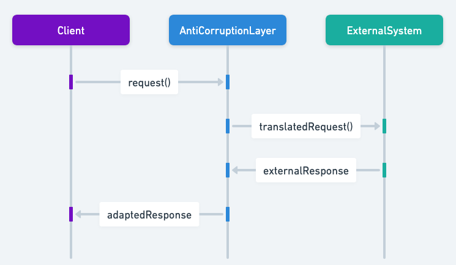

## 又稱為

* ACL
* 介面層
* 翻譯層

## 防腐層模式的目的

防腐層（ACL）是 Java 開發中很重要的設計模式，特別適合系統整合與維持資料完整性。在語意不同的子系統之間建立外觀或介面卡層，轉換不同的資料格式與系統模型，確保整合不會污染商業邏輯或資料完整性。

## 防腐層模式的詳細說明與真實世界範例

真實世界範例

> 這個範例展示防腐層如何讓舊系統與現代平台順利整合，並在系統遷移期間維持商業邏輯的完整性。
>
> 想像一家大型零售公司要把庫存管理系統從使用多年的舊軟體遷移到現代平台。舊系統包含複雜的商業規則與新系統不相容的資料格式。公司不直接連接兩個系統，而是在中間建立防腐層（ACL）。
>
> ACL 會在兩個系統之間轉換與調整資料。當新系統要求庫存資料時，ACL 將要求轉成舊系統能理解的格式，取得資料後再轉成適合新系統的格式。如此新系統不會受到舊系統內部細節影響，也能避免資料與商業邏輯被污染。

簡單來說

> 防腐層透過提供中介翻譯層，保護系統免受外部系統的複雜性與變動影響。

[Microsoft 文件](https://learn.microsoft.com/en-us/azure/architecture/patterns/anti-corruption-layer)指出：

> 在語意不同的子系統之間實作外觀或介面卡層。此層會翻譯其中一個子系統對另一個子系統提出的要求，確保應用程式的設計不受外部子系統相依性限制。此模式最早由 Eric Evans 在《領域驅動設計》中描述。

序列圖



## Java 防腐層模式的程式範例

Java 中的防腐層會提供一個中介層來轉換資料格式，確保不同系統的整合不會造成資料污染。

以下有兩個商店訂單系統：`Legacy` 與 `Modern`。兩者使用不同的領域模型，且必須同時運作。訂單可能來自任一系統，因此接收 `legacyOrder` 的系統需要確認訂單有效，且不存在於另一個系統中。防腐層負責隱藏另一個系統的領域模型與操作。

`Legacy` 系統的領域模型：

```java
public class LegacyOrder {
    private String id;
    private String customer;
    private String item;
    private String qty;
    private String price;
}
```

`Modern` 系統的領域模型：

```java
public class ModernOrder {
    private String id;
    private Customer customer;

    private Shipment shipment;

    private String extra;
}

public class Customer {
    private String address;
}

public class Shipment {
    private String item;
    private String qty;
    private String price;
}
```

防腐層：

```java
public class AntiCorruptionLayer {

    @Autowired
    private ModernShop modernShop;

    @Autowired
    private LegacyShop legacyShop;

    public Optional<LegacyOrder> findOrderInModernSystem(String id) {
        return modernShop.findOrder(id).map(o -> /* map to legacyOrder*/);
    }

    public Optional<ModernOrder> findOrderInLegacySystem(String id) {
        return legacyShop.findOrder(id).map(o -> /* map to modernOrder*/);
    }

}
```

無論 `Legacy` 或 `Modern` 系統需要與對方溝通，都應使用 ACL，以避免污染目前的領域模型。以下範例展示 `Legacy` 系統如何透過 `Modern` 系統驗證訂單後下單。

```java
public class LegacyShop {
    @Autowired
    private AntiCorruptionLayer acl;

    public void placeOrder(LegacyOrder legacyOrder) throws ShopException {

        String id = legacyOrder.getId();

        Optional<ModernOrder> orderInModernSystem = acl.findOrderInModernSystem(id);

        if (orderInModernSystem.isPresent()) {
            // order is already in the modern system
        } else {
            // place order in the current system
        }
    }
}
```

## 何時在 Java 中使用防腐層模式

* 遷移計畫分成多個階段，但新舊系統之間仍需持續整合。
* 兩個以上的子系統語意不同，卻仍需要互相溝通。
* 整合舊系統或外部系統時，直接整合可能污染新系統的領域模型。
* 大型系統中的不同子系統使用不同的資料格式或結構。
* 需要讓子系統或外部服務保持鬆散耦合，以便維護與擴充。

## Java 防腐層模式教學

* [防腐層（Microsoft）](https://learn.microsoft.com/en-us/azure/architecture/patterns/anti-corruption-layer)
* [防腐層模式（Amazon）](https://docs.aws.amazon.com/prescriptive-guidance/latest/cloud-design-patterns/acl.html)

## Java 防腐層模式的實際應用

* 微服務架構中的服務需要互相溝通，但不應緊密相依彼此的資料結構。
* 企業系統整合，尤其是現代系統與舊系統的整合。
* 領域驅動設計（DDD）的限界上下文中，與外部系統互動時維持領域模型完整性。

## 防腐層模式的優點與取捨

優點：

* 提供清楚的邊界，保護領域模型的完整性。
* 促進系統鬆散耦合，提高面對外部變更的韌性。
* 將整合程式碼與商業邏輯隔離，使程式更乾淨且容易維護。

取捨：

* 翻譯過程會增加複雜度與可能的效能負擔。
* 需要額外設計與實作，避免此層變成瓶頸。
* 管理不當時可能造成模型重複。

## 相關 Java 設計模式

* [介面卡](https://java-design-patterns.com/patterns/adapter/)：可使用介面卡模式轉換不同的資料格式或結構。
* [外觀](https://java-design-patterns.com/patterns/facade/)：防腐層可以視為用來隔離子系統的專用外觀模式。
* [閘道](https://java-design-patterns.com/patterns/gateway/)：可作為外部系統的閘道，提供統一介面。

## 參考資料與致謝

* [Domain-Driven Design: Tackling Complexity in the Heart of Software](https://amzn.to/3vptcJz)
* [Implementing Domain-Driven Design](https://amzn.to/3ISOSRA)
* [Patterns of Enterprise Application Architecture](https://amzn.to/3WfKBPR)