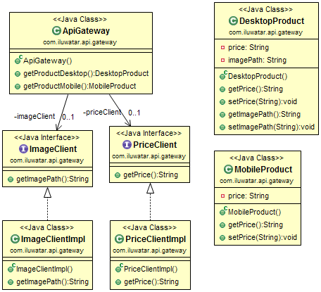

## 目的

API閘道器將所有對微服務的呼叫聚合到一起。使用者對API閘道器進行一次呼叫，然後API閘道器呼叫每個相關的微服務。

## 解釋

使用微服務模式，客戶端可能需要來自多個不同微服務的資料。 如果客戶端直接呼叫每個微服務，則可能會導致更長的載入時間，因為客戶端將不得不為每個呼叫的微服務發出網路請求。此外，讓客戶端呼叫每個微服務會直接將客戶端與該微服務相關聯-如果微服務的內部實現發生了變化（例如，如果將來某個時候合併了兩個微服務），或者微服務的位置（主機和埠） 更改，則必須更新使用這些微服務的每個客戶端。

API閘道器模式的目的是緩解其中的一些問題。 在API閘道器模式中，在客戶端和微服務之間放置了一個附加實體（API閘道器）。API閘道器的工作是將對微服務的呼叫進行聚合。 客戶端不是一次單獨呼叫每個微服務，而是一次呼叫API閘道器。 然後，API閘道器呼叫客戶端所需的每個微服務。

真實世界例子

> 我們正在為電子商務站點實現微服務和API閘道器模式。 在此係統中，API閘道器呼叫Image和Price微服務。

通俗地說

> 對於使用微服務架構實現的系統，API是聚合微服務呼叫的入口點。 

維基百科說

> API閘道器是充當API前置，接收API請求，執行限制和安全策略，將請求傳遞到後端服務，然後將響應傳遞迴請求者的伺服器。閘道器通常包括一個轉換引擎，以實時地編排和修改請求和響應。 閘道器可以提供收集分析資料和提供快取等功能。閘道器還可以提供支援身份驗證，授權，安全性，審計和法規遵從性的功能。

**程式示例**

此實現展示了電子商務站點的API閘道器模式。` ApiGateway`分別使用` ImageClientImpl`和` PriceClientImpl`來呼叫Image和Price微服務。 在桌面裝置上檢視該網站的客戶可以看到價格資訊和產品圖片，因此` ApiGateway`會呼叫這兩種微服務並在`DesktopProduct`模型中彙總資料。 但是，移動使用者只能看到價格資訊。 他們看不到產品圖片。 對於移動使用者，`ApiGateway`僅檢索價格資訊，並將其用於填充`MobileProduct`模型。

這個是影象微服務的實現。

```java
public interface ImageClient {
  String getImagePath();
}

public class ImageClientImpl implements ImageClient {
  @Override
  public String getImagePath() {
    var httpClient = HttpClient.newHttpClient();
    var httpGet = HttpRequest.newBuilder()
        .GET()
        .uri(URI.create("http://localhost:50005/image-path"))
        .build();

    try {
      var httpResponse = httpClient.send(httpGet, BodyHandlers.ofString());
      return httpResponse.body();
    } catch (IOException | InterruptedException e) {
      e.printStackTrace();
    }

    return null;
  }
}
```

這裡是價格服務的實現。

```java
public interface PriceClient {
  String getPrice();
}

public class PriceClientImpl implements PriceClient {

  @Override
  public String getPrice() {
    var httpClient = HttpClient.newHttpClient();
    var httpGet = HttpRequest.newBuilder()
        .GET()
        .uri(URI.create("http://localhost:50006/price"))
        .build();

    try {
      var httpResponse = httpClient.send(httpGet, BodyHandlers.ofString());
      return httpResponse.body();
    } catch (IOException | InterruptedException e) {
      e.printStackTrace();
    }

    return null;
  }
}
```

在這裡，我們可以看到API閘道器如何將請求對映到微服務。

```java
public class ApiGateway {

  @Resource
  private ImageClient imageClient;

  @Resource
  private PriceClient priceClient;

  @RequestMapping(path = "/desktop", method = RequestMethod.GET)
  public DesktopProduct getProductDesktop() {
    var desktopProduct = new DesktopProduct();
    desktopProduct.setImagePath(imageClient.getImagePath());
    desktopProduct.setPrice(priceClient.getPrice());
    return desktopProduct;
  }

  @RequestMapping(path = "/mobile", method = RequestMethod.GET)
  public MobileProduct getProductMobile() {
    var mobileProduct = new MobileProduct();
    mobileProduct.setPrice(priceClient.getPrice());
    return mobileProduct;
  }
}
```

## 類圖


## 適用性

在以下情況下使用API閘道器模式

* 你正在使用微服務架構，並且需要聚合單點來進行微服務呼叫。

## 鳴謝

* [microservices.io - API Gateway](http://microservices.io/patterns/apigateway.html)
* [NGINX - Building Microservices: Using an API Gateway](https://www.nginx.com/blog/building-microservices-using-an-api-gateway/)
* [Microservices Patterns: With examples in Java](https://www.amazon.com/gp/product/1617294543/ref=as_li_qf_asin_il_tl?ie=UTF8&tag=javadesignpat-20&creative=9325&linkCode=as2&creativeASIN=1617294543&linkId=ac7b6a57f866ac006a309d9086e8cfbd)
* [Building Microservices: Designing Fine-Grained Systems](https://www.amazon.com/gp/product/1491950358/ref=as_li_qf_asin_il_tl?ie=UTF8&tag=javadesignpat-20&creative=9325&linkCode=as2&creativeASIN=1491950358&linkId=4c95ca9831e05e3f0dadb08841d77bf1)
