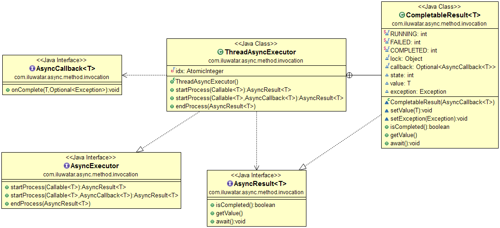

## 意圖

非同步方法呼叫是一個呼叫執行緒在等待任務結果時不會阻塞的模式。模式為多個獨立的任務提供並行的處理方式並且透過回撥或等到它們全部完成來接收任務結果。

## 解釋

真實世界例子

> 發射火箭是一項令人激動的事務。任務指揮官發出了發射命令，經過一段不確定的時間後，火箭要麼成功發射，要麼慘遭失敗。

通俗地說

> 非同步方法呼叫開始任務處理，並在任務完成之前立即返回。 任務處理的結果稍後返回給呼叫方。

維基百科說

> 在多執行緒計算機程式設計中，非同步方法呼叫（AMI），也稱為非同步方法呼叫或非同步模式，是一種設計模式，其中在等待被呼叫的程式碼完成時不會阻塞呼叫站點。 而是在執行結果到達時通知呼叫執行緒。輪詢呼叫結果是不希望的選項。

**程式示例**

在此示例中，我們正在發射太空火箭並部署月球漫遊車。該應用演示了非同步方法呼叫模式。 模式的關鍵部分是`AsyncResult`（用於非同步評估值的中間容器），`AsyncCallback`（可以在任務完成時被執行）和`AsyncExecutor`（用於管理非同步任務的執行）。

```java
public interface AsyncResult<T> {
  boolean isCompleted();
  T getValue() throws ExecutionException;
  void await() throws InterruptedException;
}
```

```java
public interface AsyncCallback<T> {
  void onComplete(T value, Optional<Exception> ex);
}
```

```java
public interface AsyncExecutor {
  <T> AsyncResult<T> startProcess(Callable<T> task);
  <T> AsyncResult<T> startProcess(Callable<T> task, AsyncCallback<T> callback);
  <T> T endProcess(AsyncResult<T> asyncResult) throws ExecutionException, InterruptedException;
}
```

`ThreadAsyncExecutor`是`AsyncExecutor`的實現。 接下來將突出顯示其一些關鍵部分。

```java
public class ThreadAsyncExecutor implements AsyncExecutor {

  @Override
  public <T> AsyncResult<T> startProcess(Callable<T> task) {
    return startProcess(task, null);
  }

  @Override
  public <T> AsyncResult<T> startProcess(Callable<T> task, AsyncCallback<T> callback) {
    var result = new CompletableResult<>(callback);
    new Thread(
            () -> {
              try {
                result.setValue(task.call());
              } catch (Exception ex) {
                result.setException(ex);
              }
            },
            "executor-" + idx.incrementAndGet())
        .start();
    return result;
  }

  @Override
  public <T> T endProcess(AsyncResult<T> asyncResult)
      throws ExecutionException, InterruptedException {
    if (!asyncResult.isCompleted()) {
      asyncResult.await();
    }
    return asyncResult.getValue();
  }
}
```

然後，我們準備發射一些火箭，看看一切是如何協同工作的。

```java
public static void main(String[] args) throws Exception {
  // 構造一個將執行非同步任務的新執行程式
  var executor = new ThreadAsyncExecutor();

  // 以不同的處理時間開始一些非同步任務，最後兩個使用回撥處理程式
  final var asyncResult1 = executor.startProcess(lazyval(10, 500));
  final var asyncResult2 = executor.startProcess(lazyval("test", 300));
  final var asyncResult3 = executor.startProcess(lazyval(50L, 700));
  final var asyncResult4 = executor.startProcess(lazyval(20, 400), callback("Deploying lunar rover"));
  final var asyncResult5 =
      executor.startProcess(lazyval("callback", 600), callback("Deploying lunar rover"));

  // 在當前執行緒中模擬非同步任務正在它們自己的執行緒中執行
  Thread.sleep(350); // 哦，兄弟，我們在這很辛苦
  log("Mission command is sipping coffee");

  // 等待任務完成
  final var result1 = executor.endProcess(asyncResult1);
  final var result2 = executor.endProcess(asyncResult2);
  final var result3 = executor.endProcess(asyncResult3);
  asyncResult4.await();
  asyncResult5.await();

  // log the results of the tasks, callbacks log immediately when complete
  // 記錄任務結果的日誌， 回撥的日誌會在回撥完成時立刻記錄
  log("Space rocket <" + result1 + "> launch complete");
  log("Space rocket <" + result2 + "> launch complete");
  log("Space rocket <" + result3 + "> launch complete");
}
```

這是程式控制臺的輸出。

```java
21:47:08.227 [executor-2] INFO com.iluwatar.async.method.invocation.App - Space rocket <test> launched successfully
21:47:08.269 [main] INFO com.iluwatar.async.method.invocation.App - Mission command is sipping coffee
21:47:08.318 [executor-4] INFO com.iluwatar.async.method.invocation.App - Space rocket <20> launched successfully
21:47:08.335 [executor-4] INFO com.iluwatar.async.method.invocation.App - Deploying lunar rover <20>
21:47:08.414 [executor-1] INFO com.iluwatar.async.method.invocation.App - Space rocket <10> launched successfully
21:47:08.519 [executor-5] INFO com.iluwatar.async.method.invocation.App - Space rocket <callback> launched successfully
21:47:08.519 [executor-5] INFO com.iluwatar.async.method.invocation.App - Deploying lunar rover <callback>
21:47:08.616 [executor-3] INFO com.iluwatar.async.method.invocation.App - Space rocket <50> launched successfully
21:47:08.617 [main] INFO com.iluwatar.async.method.invocation.App - Space rocket <10> launch complete
21:47:08.617 [main] INFO com.iluwatar.async.method.invocation.App - Space rocket <test> launch complete
21:47:08.618 [main] INFO com.iluwatar.async.method.invocation.App - Space rocket <50> launch complete
```

# 類圖



## 適用性

在以下情況下使用非同步方法呼叫模式

* 您有多個可以並行執行的獨立任務
* 您需要提高一組順序任務的效能
* 您的處理能力或長時間執行的任務數量有限，並且呼叫方不應等待任務執行完畢

## 真實世界例子

* [FutureTask](http://docs.oracle.com/javase/8/docs/api/java/util/concurrent/FutureTask.html)
* [CompletableFuture](https://docs.oracle.com/javase/8/docs/api/java/util/concurrent/CompletableFuture.html)
* [ExecutorService](http://docs.oracle.com/javase/8/docs/api/java/util/concurrent/ExecutorService.html)
* [Task-based Asynchronous Pattern](https://msdn.microsoft.com/en-us/library/hh873175.aspx)
