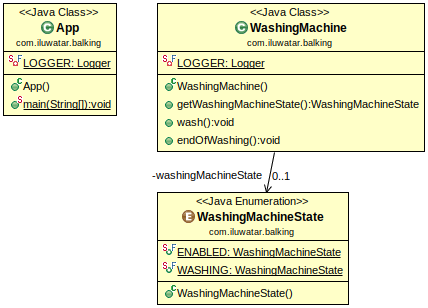

## 意圖

止步模式用於防止物件在不完整或不合適的狀態下執行某些程式碼。

## 解釋

真實世界例子

> 洗衣機中有一個開始按鈕，用於啟動衣物洗滌。當洗衣機處於非活動狀態時，按鈕將按預期工作，但是如果已經在洗滌，則按鈕將不起任何作用。

通俗地說

> 使用止步模式，僅當物件處於特定狀態時才執行特定程式碼。

維基百科說

> 禁止模式是一種軟體設計模式，僅當物件處於特定狀態時才對物件執行操作。例如，一個物件讀取zip壓縮檔案並在壓縮檔案沒開啟的時候呼叫get方法，物件將在請求的時候”止步“。

**程式示例**

在此示例中，` WashingMachine`是一個具有兩個狀態的物件，可以處於兩種狀態：ENABLED和WASHING。 如果機器已啟用，則使用執行緒安全方法將狀態更改為WASHING。 另一方面，如果已經進行了清洗並且任何其他執行緒執行`wash（）`，則它將不執行該操作，而是不執行任何操作而返回。

這裡是`WashingMachine` 類相關的部分。

```java
@Slf4j
public class WashingMachine {

  private final DelayProvider delayProvider;
  private WashingMachineState washingMachineState;

  public WashingMachine(DelayProvider delayProvider) {
    this.delayProvider = delayProvider;
    this.washingMachineState = WashingMachineState.ENABLED;
  }

  public WashingMachineState getWashingMachineState() {
    return washingMachineState;
  }

  public void wash() {
    synchronized (this) {
      var machineState = getWashingMachineState();
      LOGGER.info("{}: Actual machine state: {}", Thread.currentThread().getName(), machineState);
      if (this.washingMachineState == WashingMachineState.WASHING) {
        LOGGER.error("Cannot wash if the machine has been already washing!");
        return;
      }
      this.washingMachineState = WashingMachineState.WASHING;
    }
    LOGGER.info("{}: Doing the washing", Thread.currentThread().getName());
    this.delayProvider.executeAfterDelay(50, TimeUnit.MILLISECONDS, this::endOfWashing);
  }

  public synchronized void endOfWashing() {
    washingMachineState = WashingMachineState.ENABLED;
    LOGGER.info("{}: Washing completed.", Thread.currentThread().getId());
  }
}
```

這裡是一個`WashingMachine`所使用的`DelayProvider`簡單介面。

```java
public interface DelayProvider {
  void executeAfterDelay(long interval, TimeUnit timeUnit, Runnable task);
}
```

現在，我們使用`WashingMachine`介紹該應用程式。

```java
  public static void main(String... args) {
    final var washingMachine = new WashingMachine();
    var executorService = Executors.newFixedThreadPool(3);
    for (int i = 0; i < 3; i++) {
      executorService.execute(washingMachine::wash);
    }
    executorService.shutdown();
    try {
      executorService.awaitTermination(10, TimeUnit.SECONDS);
    } catch (InterruptedException ie) {
      LOGGER.error("ERROR: Waiting on executor service shutdown!");
      Thread.currentThread().interrupt();
    }
  }
```

下面是程式的輸出。

```
14:02:52.268 [pool-1-thread-2] INFO com.iluwatar.balking.WashingMachine - pool-1-thread-2: Actual machine state: ENABLED
14:02:52.272 [pool-1-thread-2] INFO com.iluwatar.balking.WashingMachine - pool-1-thread-2: Doing the washing
14:02:52.272 [pool-1-thread-3] INFO com.iluwatar.balking.WashingMachine - pool-1-thread-3: Actual machine state: WASHING
14:02:52.273 [pool-1-thread-3] ERROR com.iluwatar.balking.WashingMachine - Cannot wash if the machine has been already washing!
14:02:52.273 [pool-1-thread-1] INFO com.iluwatar.balking.WashingMachine - pool-1-thread-1: Actual machine state: WASHING
14:02:52.273 [pool-1-thread-1] ERROR com.iluwatar.balking.WashingMachine - Cannot wash if the machine has been already washing!
14:02:52.324 [pool-1-thread-2] INFO com.iluwatar.balking.WashingMachine - 14: Washing completed.
```

## 類圖



## 適用性


使用止步模式當

* 您只想在物件處於特定狀態時才對其呼叫操作
* 物件通常僅處於容易暫時停止但狀態未知的狀態

## 相關模式

* [保護性暫掛模式](https://java-design-patterns.com/patterns/guarded-suspension/)
* [雙重檢查鎖模式](https://java-design-patterns.com/patterns/double-checked-locking/)

## 鳴謝

* [Patterns in Java: A Catalog of Reusable Design Patterns Illustrated with UML, 2nd Edition, Volume 1](https://www.amazon.com/gp/product/0471227293/ref=as_li_qf_asin_il_tl?ie=UTF8&tag=javadesignpat-20&creative=9325&linkCode=as2&creativeASIN=0471227293&linkId=0e39a59ffaab93fb476036fecb637b99)
