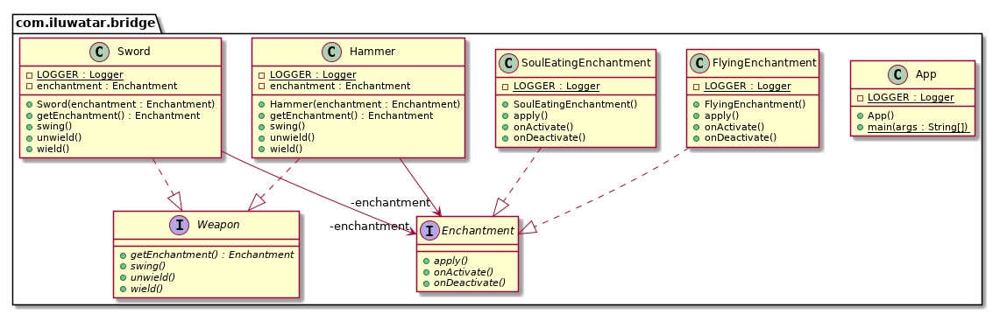

## 又被稱為

手柄/身體模式

## 目的

將抽象與其實現分離，以便二者可以獨立變化。

## 解釋

真實世界例子

> 考慮一下你擁有一種具有不同附魔的武器，並且應該允許將具有不同附魔的不同武器混合使用。 你會怎麼做？ 為每個附魔建立每種武器的多個副本，還是隻是建立單獨的附魔並根據需要為武器設定它？ 橋接模式使您可以進行第二次操作。

通俗的說

> 橋接模式是一個更推薦組合而不是繼承的模式。將實現細節從一個層次結構推送到具有單獨層次結構的另一個物件。

維基百科說

> 橋接模式是軟體工程中使用的一種設計模式，旨在“將抽象與其實現分離，從而使兩者可以獨立變化”

**程式示例**

翻譯一下上面的武器示例。下面我們有武器的類層級：

```java
public interface Weapon {
  void wield();
  void swing();
  void unwield();
  Enchantment getEnchantment();
}

public class Sword implements Weapon {

  private final Enchantment enchantment;

  public Sword(Enchantment enchantment) {
    this.enchantment = enchantment;
  }

  @Override
  public void wield() {
    LOGGER.info("The sword is wielded.");
    enchantment.onActivate();
  }

  @Override
  public void swing() {
    LOGGER.info("The sword is swinged.");
    enchantment.apply();
  }

  @Override
  public void unwield() {
    LOGGER.info("The sword is unwielded.");
    enchantment.onDeactivate();
  }

  @Override
  public Enchantment getEnchantment() {
    return enchantment;
  }
}

public class Hammer implements Weapon {

  private final Enchantment enchantment;

  public Hammer(Enchantment enchantment) {
    this.enchantment = enchantment;
  }

  @Override
  public void wield() {
    LOGGER.info("The hammer is wielded.");
    enchantment.onActivate();
  }

  @Override
  public void swing() {
    LOGGER.info("The hammer is swinged.");
    enchantment.apply();
  }

  @Override
  public void unwield() {
    LOGGER.info("The hammer is unwielded.");
    enchantment.onDeactivate();
  }

  @Override
  public Enchantment getEnchantment() {
    return enchantment;
  }
}
```

這裡是單獨的附魔類結構：

```java
public interface Enchantment {
  void onActivate();
  void apply();
  void onDeactivate();
}

public class FlyingEnchantment implements Enchantment {

  @Override
  public void onActivate() {
    LOGGER.info("The item begins to glow faintly.");
  }

  @Override
  public void apply() {
    LOGGER.info("The item flies and strikes the enemies finally returning to owner's hand.");
  }

  @Override
  public void onDeactivate() {
    LOGGER.info("The item's glow fades.");
  }
}

public class SoulEatingEnchantment implements Enchantment {

  @Override
  public void onActivate() {
    LOGGER.info("The item spreads bloodlust.");
  }

  @Override
  public void apply() {
    LOGGER.info("The item eats the soul of enemies.");
  }

  @Override
  public void onDeactivate() {
    LOGGER.info("Bloodlust slowly disappears.");
  }
}
```

這裡是兩種層次結構的實踐：

```java
var enchantedSword = new Sword(new SoulEatingEnchantment());
enchantedSword.wield();
enchantedSword.swing();
enchantedSword.unwield();
// The sword is wielded.
// The item spreads bloodlust.
// The sword is swinged.
// The item eats the soul of enemies.
// The sword is unwielded.
// Bloodlust slowly disappears.

var hammer = new Hammer(new FlyingEnchantment());
hammer.wield();
hammer.swing();
hammer.unwield();
// The hammer is wielded.
// The item begins to glow faintly.
// The hammer is swinged.
// The item flies and strikes the enemies finally returning to owner's hand.
// The hammer is unwielded.
// The item's glow fades.
```


## 類圖



## 適用性

使用橋接模式當

* 你想永久性的避免抽象和他的實現之間的繫結。有可能是這種情況，當實現需要被選擇或者在執行時切換。
* 抽象和他們的實現應該能透過寫子類來擴充套件。這種情況下，橋接模式讓你可以組合不同的抽象和實現並獨立的擴充套件他們。
* 對抽象的實現的改動應當不會對客戶產生影響；也就是說，他們的程式碼不必重新編譯。
* 你有種類繁多的類。這樣的類層次結構表明需要將一個物件分為兩部分。Rumbaugh 使用術語“巢狀歸納”來指代這種類層次結構。
* 你想在多個物件間分享一種實現（可能使用引用計數），這個事實應該對客戶隱藏。一個簡單的示例是Coplien的String類，其中多個物件可以共享同一字串表示形式

## 教程

* [Bridge Pattern Tutorial](https://www.journaldev.com/1491/bridge-design-pattern-java)

## 鳴謝

* [Design Patterns: Elements of Reusable Object-Oriented Software](https://www.amazon.com/gp/product/0201633612/ref=as_li_tl?ie=UTF8&camp=1789&creative=9325&creativeASIN=0201633612&linkCode=as2&tag=javadesignpat-20&linkId=675d49790ce11db99d90bde47f1aeb59)
* [Head First Design Patterns: A Brain-Friendly Guide](https://www.amazon.com/gp/product/0596007124/ref=as_li_tl?ie=UTF8&camp=1789&creative=9325&creativeASIN=0596007124&linkCode=as2&tag=javadesignpat-20&linkId=6b8b6eea86021af6c8e3cd3fc382cb5b)
