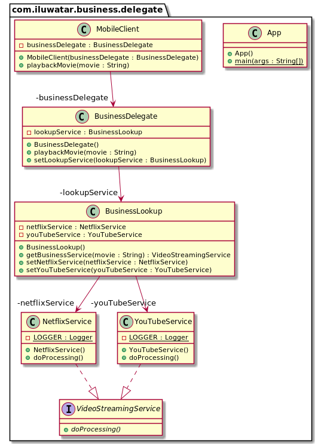

## 意圖

業務委託模式在表示層和業務層之間新增了一個抽象層。 透過使用該模式，我們獲得了各層之間的鬆散耦合，並封裝了有關如何定位，連線到組成應用程式的業務物件以及與之互動的邏輯。

## 解釋

真實世界例子

> 手機應用程式承諾將現有的任何電影流式傳輸到您的手機。它捕獲使用者的搜尋字串，並將其傳遞給業務委託層。業務委託層選擇最合適的影片流服務，然後從那裡播放影片。

通俗的說

> 業務委託模式在表示層和業務層之間新增了一個抽象層。 

維基百科說

> 業務委託是一種Java EE設計模式。 該模式旨在減少業務服務與連線的表示層之間的耦合，並隱藏服務的實現細節（包括EJB體系結構的查詢和可訪問性）。 業務代表充當介面卡，以從表示層呼叫業務物件。

**程式示例**

首先，我們有影片流服務的抽象類和一些它的實現。

```java
public interface VideoStreamingService {
  void doProcessing();
}

@Slf4j
public class NetflixService implements VideoStreamingService {
  @Override
  public void doProcessing() {
    LOGGER.info("NetflixService is now processing");
  }
}

@Slf4j
public class YouTubeService implements VideoStreamingService {
  @Override
  public void doProcessing() {
    LOGGER.info("YouTubeService is now processing");
  }
}
```

然後我們有一個查詢服務來決定我們使用哪個影片流服務。

```java
@Setter
public class BusinessLookup {

  private NetflixService netflixService;
  private YouTubeService youTubeService;

  public VideoStreamingService getBusinessService(String movie) {
    if (movie.toLowerCase(Locale.ROOT).contains("die hard")) {
      return netflixService;
    } else {
      return youTubeService;
    }
  }
}
```

業務委託類使用業務查詢服務將電影播放請求路由到合適的影片流服務。

```java
@Setter
public class BusinessDelegate {

  private BusinessLookup lookupService;

  public void playbackMovie(String movie) {
    VideoStreamingService videoStreamingService = lookupService.getBusinessService(movie);
    videoStreamingService.doProcessing();
  }
}
```

移動客戶端利用業務委託來呼叫業務層。

```java
public class MobileClient {

  private final BusinessDelegate businessDelegate;

  public MobileClient(BusinessDelegate businessDelegate) {
    this.businessDelegate = businessDelegate;
  }

  public void playbackMovie(String movie) {
    businessDelegate.playbackMovie(movie);
  }
}
```

最後我們展示完整示例。

```java
  public static void main(String[] args) {

    // prepare the objects
    var businessDelegate = new BusinessDelegate();
    var businessLookup = new BusinessLookup();
    businessLookup.setNetflixService(new NetflixService());
    businessLookup.setYouTubeService(new YouTubeService());
    businessDelegate.setLookupService(businessLookup);

    // create the client and use the business delegate
    var client = new MobileClient(businessDelegate);
    client.playbackMovie("Die Hard 2");
    client.playbackMovie("Maradona: The Greatest Ever");
  }
```

這是控制檯的輸出。

```
21:15:33.790 [main] INFO com.iluwatar.business.delegate.NetflixService - NetflixService is now processing
21:15:33.794 [main] INFO com.iluwatar.business.delegate.YouTubeService - YouTubeService is now processing
```

## 類圖



## 相關模式

* [服務定位器模式](https://java-design-patterns.com/patterns/service-locator/)

## 適用性

使用業務委託模式當

* 你希望表示層和業務層之間的鬆散耦合
* 你想編排對多個業務服務的呼叫
* 你希望封裝查詢服務和服務呼叫

## 教程

* [Business Delegate Pattern at TutorialsPoint](https://www.tutorialspoint.com/design_pattern/business_delegate_pattern.htm)

## 鳴謝

* [J2EE Design Patterns](https://www.amazon.com/gp/product/0596004273/ref=as_li_tl?ie=UTF8&camp=1789&creative=9325&creativeASIN=0596004273&linkCode=as2&tag=javadesignpat-20&linkId=48d37c67fb3d845b802fa9b619ad8f31)
* [Core J2EE Patterns: Best Practices and Design Strategies](https://www.amazon.com/gp/product/0130648841/ref=as_li_qf_asin_il_tl?ie=UTF8&tag=javadesignpat-20&creative=9325&linkCode=as2&creativeASIN=0130648841&linkId=a0100de2b28c71ede8db1757fb2b5947)
