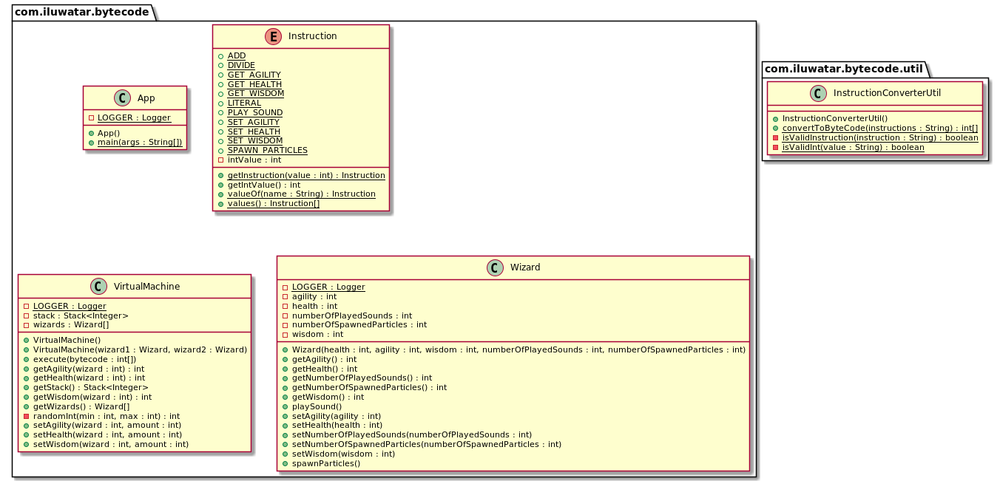

## 意圖

允許編碼行為作為虛擬機器的指令。

## 解釋

真實世界例子

> 一個團隊正在開發一款新的巫師對戰遊戲。巫師的行為需要經過精心的調整和上百次的遊玩測試。每次當遊戲設計師想改變巫師行為時都讓程式設計師去修改程式碼這是不妥的，所以巫師行為以資料驅動的虛擬機器方式實現。

通俗地說

> 位元組碼模式支援由資料而不是程式碼驅動的行為。

[Gameprogrammingpatterns.com](https://gameprogrammingpatterns.com/bytecode.html) 中做了如下闡述：

> 指令集定義了可以執行的低階操作。一系列指令被編碼為位元組序列。虛擬機器一次一條地執行這些指令，中間的值用棧處理。透過組合指令，可以定義複雜的高階行為。

**程式示例**

其中最重要的遊戲物件是`巫師`類。

```java
@AllArgsConstructor
@Setter
@Getter
@Slf4j
public class Wizard {

  private int health;
  private int agility;
  private int wisdom;
  private int numberOfPlayedSounds;
  private int numberOfSpawnedParticles;

  public void playSound() {
    LOGGER.info("Playing sound");
    numberOfPlayedSounds++;
  }

  public void spawnParticles() {
    LOGGER.info("Spawning particles");
    numberOfSpawnedParticles++;
  }
}
```

下面我們展示虛擬機器可用的指令。每個指令對於如何操作棧中的資料都有自己的語義。例如，增加指令，其取得棧頂的兩個元素並把結果壓入棧中。

```java
@AllArgsConstructor
@Getter
public enum Instruction {

  LITERAL(1),         // e.g. "LITERAL 0", push 0 to stack
  SET_HEALTH(2),      // e.g. "SET_HEALTH", pop health and wizard number, call set health
  SET_WISDOM(3),      // e.g. "SET_WISDOM", pop wisdom and wizard number, call set wisdom
  SET_AGILITY(4),     // e.g. "SET_AGILITY", pop agility and wizard number, call set agility
  PLAY_SOUND(5),      // e.g. "PLAY_SOUND", pop value as wizard number, call play sound
  SPAWN_PARTICLES(6), // e.g. "SPAWN_PARTICLES", pop value as wizard number, call spawn particles
  GET_HEALTH(7),      // e.g. "GET_HEALTH", pop value as wizard number, push wizard's health
  GET_AGILITY(8),     // e.g. "GET_AGILITY", pop value as wizard number, push wizard's agility
  GET_WISDOM(9),      // e.g. "GET_WISDOM", pop value as wizard number, push wizard's wisdom
  ADD(10),            // e.g. "ADD", pop 2 values, push their sum
  DIVIDE(11);         // e.g. "DIVIDE", pop 2 values, push their division
  // ...
}
```

我們示例的核心是`虛擬機器`類。 它將指令作為輸入並執行它們以提供遊戲物件行為。

```java
@Getter
@Slf4j
public class VirtualMachine {

  private final Stack<Integer> stack = new Stack<>();

  private final Wizard[] wizards = new Wizard[2];

  public VirtualMachine() {
    wizards[0] = new Wizard(randomInt(3, 32), randomInt(3, 32), randomInt(3, 32),
        0, 0);
    wizards[1] = new Wizard(randomInt(3, 32), randomInt(3, 32), randomInt(3, 32),
        0, 0);
  }

  public VirtualMachine(Wizard wizard1, Wizard wizard2) {
    wizards[0] = wizard1;
    wizards[1] = wizard2;
  }

  public void execute(int[] bytecode) {
    for (var i = 0; i < bytecode.length; i++) {
      Instruction instruction = Instruction.getInstruction(bytecode[i]);
      switch (instruction) {
        case LITERAL:
          // Read the next byte from the bytecode.
          int value = bytecode[++i];
          // Push the next value to stack
          stack.push(value);
          break;
        case SET_AGILITY:
          var amount = stack.pop();
          var wizard = stack.pop();
          setAgility(wizard, amount);
          break;
        case SET_WISDOM:
          amount = stack.pop();
          wizard = stack.pop();
          setWisdom(wizard, amount);
          break;
        case SET_HEALTH:
          amount = stack.pop();
          wizard = stack.pop();
          setHealth(wizard, amount);
          break;
        case GET_HEALTH:
          wizard = stack.pop();
          stack.push(getHealth(wizard));
          break;
        case GET_AGILITY:
          wizard = stack.pop();
          stack.push(getAgility(wizard));
          break;
        case GET_WISDOM:
          wizard = stack.pop();
          stack.push(getWisdom(wizard));
          break;
        case ADD:
          var a = stack.pop();
          var b = stack.pop();
          stack.push(a + b);
          break;
        case DIVIDE:
          a = stack.pop();
          b = stack.pop();
          stack.push(b / a);
          break;
        case PLAY_SOUND:
          wizard = stack.pop();
          getWizards()[wizard].playSound();
          break;
        case SPAWN_PARTICLES:
          wizard = stack.pop();
          getWizards()[wizard].spawnParticles();
          break;
        default:
          throw new IllegalArgumentException("Invalid instruction value");
      }
      LOGGER.info("Executed " + instruction.name() + ", Stack contains " + getStack());
    }
  }

  public void setHealth(int wizard, int amount) {
    wizards[wizard].setHealth(amount);
  }
  // other setters ->
  // ...
}
```

現在我們可以展示使用虛擬機器的完整示例。

```java
  public static void main(String[] args) {

    var vm = new VirtualMachine(
        new Wizard(45, 7, 11, 0, 0),
        new Wizard(36, 18, 8, 0, 0));

    vm.execute(InstructionConverterUtil.convertToByteCode("LITERAL 0"));
    vm.execute(InstructionConverterUtil.convertToByteCode("LITERAL 0"));
    vm.execute(InstructionConverterUtil.convertToByteCode("GET_HEALTH"));
    vm.execute(InstructionConverterUtil.convertToByteCode("LITERAL 0"));
    vm.execute(InstructionConverterUtil.convertToByteCode("GET_AGILITY"));
    vm.execute(InstructionConverterUtil.convertToByteCode("LITERAL 0"));
    vm.execute(InstructionConverterUtil.convertToByteCode("GET_WISDOM"));
    vm.execute(InstructionConverterUtil.convertToByteCode("ADD"));
    vm.execute(InstructionConverterUtil.convertToByteCode("LITERAL 2"));
    vm.execute(InstructionConverterUtil.convertToByteCode("DIVIDE"));
    vm.execute(InstructionConverterUtil.convertToByteCode("ADD"));
    vm.execute(InstructionConverterUtil.convertToByteCode("SET_HEALTH"));
  }
```

下面是控制檯輸出。

```
16:20:10.193 [main] INFO com.iluwatar.bytecode.VirtualMachine - Executed LITERAL, Stack contains [0]
16:20:10.196 [main] INFO com.iluwatar.bytecode.VirtualMachine - Executed LITERAL, Stack contains [0, 0]
16:20:10.197 [main] INFO com.iluwatar.bytecode.VirtualMachine - Executed GET_HEALTH, Stack contains [0, 45]
16:20:10.197 [main] INFO com.iluwatar.bytecode.VirtualMachine - Executed LITERAL, Stack contains [0, 45, 0]
16:20:10.197 [main] INFO com.iluwatar.bytecode.VirtualMachine - Executed GET_AGILITY, Stack contains [0, 45, 7]
16:20:10.197 [main] INFO com.iluwatar.bytecode.VirtualMachine - Executed LITERAL, Stack contains [0, 45, 7, 0]
16:20:10.197 [main] INFO com.iluwatar.bytecode.VirtualMachine - Executed GET_WISDOM, Stack contains [0, 45, 7, 11]
16:20:10.197 [main] INFO com.iluwatar.bytecode.VirtualMachine - Executed ADD, Stack contains [0, 45, 18]
16:20:10.197 [main] INFO com.iluwatar.bytecode.VirtualMachine - Executed LITERAL, Stack contains [0, 45, 18, 2]
16:20:10.198 [main] INFO com.iluwatar.bytecode.VirtualMachine - Executed DIVIDE, Stack contains [0, 45, 9]
16:20:10.198 [main] INFO com.iluwatar.bytecode.VirtualMachine - Executed ADD, Stack contains [0, 54]
16:20:10.198 [main] INFO com.iluwatar.bytecode.VirtualMachine - Executed SET_HEALTH, Stack contains []
```

## 類圖



## 適用性


當您需要定義很多行為並且遊戲的實現語言不合適時，請使用位元組碼模式，因為：

* 它的等級太低，使得程式設計變得乏味或容易出錯。
* 由於編譯時間慢或其他工具問題，迭代它需要很長時間。
* 它有太多的信任。 如果您想確保定義的行為不會破壞遊戲，您需要將其與程式碼庫的其餘部分進行沙箱化。

## 相關模式

* [Interpreter](https://java-design-patterns.com/patterns/interpreter/)

## 鳴謝

* [Game programming patterns](http://gameprogrammingpatterns.com/bytecode.html)
