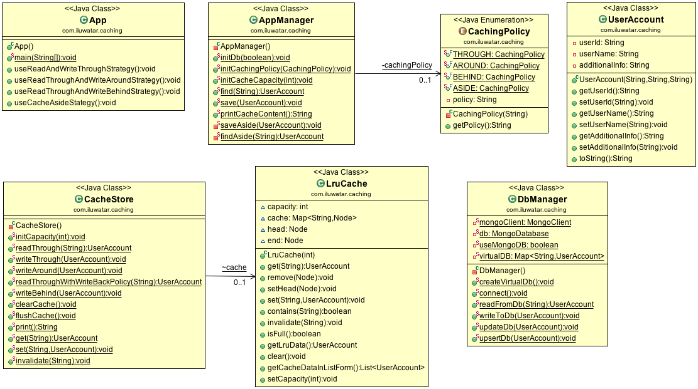

## 目的
為了避免昂貴的資源重新獲取，方法是在資源使用後不立即釋放資源。資源保留其身份，保留在某些快速訪問的儲存中，並被重新使用，以避免再次獲取它們。

## 類圖

## 適用性
在以下情況下使用快取模式

* 重複獲取，初始化和釋放同一資源會導致不必要的效能開銷。

## 鳴謝

* [Write-through, write-around, write-back: Cache explained](http://www.computerweekly.com/feature/Write-through-write-around-write-back-Cache-explained)
* [Read-Through, Write-Through, Write-Behind, and Refresh-Ahead Caching](https://docs.oracle.com/cd/E15357_01/coh.360/e15723/cache_rtwtwbra.htm#COHDG5177)
* [Cache-Aside pattern](https://docs.microsoft.com/en-us/azure/architecture/patterns/cache-aside)
