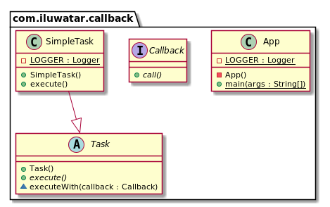

## 目的
回撥是一部分被當為引數來傳遞給其他程式碼的可執行程式碼，接收方的程式碼可以在一些方便的時候來呼叫它。

## 解釋

真實世界例子

> 我們需要被通知當執行的任務結束時。我們為呼叫者傳遞一個回撥方法然後等它呼叫通知我們。

通俗的講


> 回撥是一個用來傳遞給呼叫者的方法，它將在定義的時刻被呼叫。 

維基百科說

> 在計算機程式設計中，回撥又被稱為“稍後呼叫”函式，可以是任何可執行的程式碼用來作為引數傳遞給其他程式碼；其它程式碼被期望在給定時間內呼叫回撥方法。

**程式設計示例**

回撥是一個只有一個方法的簡單介面。

```java
public interface Callback {

  void call();
}
```

下面我們定義一個任務它將在任務執行完成後執行回撥。

```java
public abstract class Task {

  final void executeWith(Callback callback) {
    execute();
    Optional.ofNullable(callback).ifPresent(Callback::call);
  }

  public abstract void execute();
}

public final class SimpleTask extends Task {

  private static final Logger LOGGER = getLogger(SimpleTask.class);

  @Override
  public void execute() {
    LOGGER.info("Perform some important activity and after call the callback method.");
  }
}
```

最後這裡是我們如何執行一個任務然後接收一個回撥當它完成時。

```java
    var task = new SimpleTask();
    task.executeWith(() -> LOGGER.info("I'm done now."));
```
## 類圖


## 適用性
使用回撥模式當
* 當一些同步或非同步架構動作必須在一些定義好的活動執行後執行時。

## Java例子

* [CyclicBarrier](http://docs.oracle.com/javase/7/docs/api/java/util/concurrent/CyclicBarrier.html#CyclicBarrier%28int,%20java.lang.Runnable%29) 建構函式可以接受回撥，該回撥將在每次障礙被觸發時觸發。
