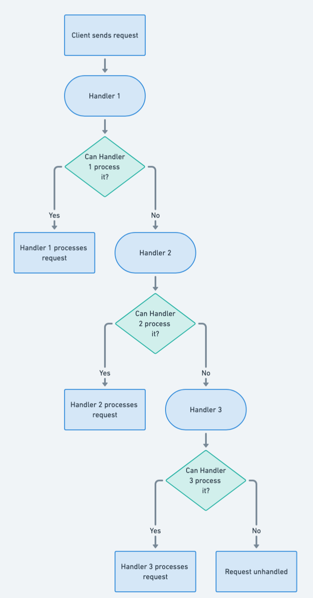

## 又稱為

* 命令鏈
* 物件鏈
* 責任鏈

## 責任鏈設計模式的目的

責任鏈模式是一種行為型設計模式，透過讓多個物件都有機會處理請求，將請求發送者與接收者解耦。接收者會串成鏈，請求沿著鏈傳遞，直到某個物件處理它為止。

## 責任鏈模式的詳細說明與真實世界範例

真實世界範例

> 技術支援客服中心是責任鏈模式的例子。每個支援層級都是鏈中的處理者。客戶提出問題時，前線人員先接聽；簡單問題由前線處理，複雜問題則轉交第二線技術人員。這個過程會逐級升級，直到由能解決問題的專家處理。每個層級都是一個處理者，請求會沿鏈傳遞，因此請求不需要知道具體接收者。

簡單來說

> 建立一串物件，請求從一端進入，依序傳遞到其他物件，直到找到適合的處理者。

維基百科指出

> 責任鏈模式由命令物件來源與一系列處理物件組成。每個處理物件包含能處理的命令類型邏輯，其餘命令則傳給鏈中的下一個處理物件。

流程圖



## Java 責任鏈模式的程式範例

本範例中，Orc King 發出命令，由代表責任鏈的命令鏈處理。指揮官、軍官與士兵依序組成責任鏈。

首先建立 `Request` 類別：

```java
@Getter
public class Request {
    private final RequestType requestType;
    private final String requestDescription;
    private boolean handled;

    public Request(final RequestType requestType, final String requestDescription) {
        this.requestType = Objects.requireNonNull(requestType);
        this.requestDescription = Objects.requireNonNull(requestDescription);
    }

    public void markHandled() { this.handled = true; }

    @Override
    public String toString() { return getRequestDescription(); }
}

public enum RequestType {
    DEFEND_CASTLE, TORTURE_PRISONER, COLLECT_TAX
}
```

接著建立 `RequestHandler` 階層：

```java
public interface RequestHandler {
    boolean canHandleRequest(Request req);
    int getPriority();
    void handle(Request req);
    String name();
}

@Slf4j
public class OrcCommander implements RequestHandler {
    @Override
    public boolean canHandleRequest(Request req) {
        return req.getRequestType() == RequestType.DEFEND_CASTLE;
    }

    @Override public int getPriority() { return 2; }

    @Override
    public void handle(Request req) {
        req.markHandled();
        LOGGER.info("{} handling request \"{}\"", name(), req);
    }

    @Override public String name() { return "Orc commander"; }
}
// OrcOfficer 與 OrcSoldier 的定義方式與 OrcCommander 類似。
```

`OrcKing` 發出命令並建立責任鏈：

```java
public class OrcKing {
    private List<RequestHandler> handlers;

    public OrcKing() { buildChain(); }

    private void buildChain() {
        handlers = Arrays.asList(new OrcCommander(), new OrcOfficer(), new OrcSoldier());
    }

    public void makeRequest(Request req) {
        handlers.stream()
            .sorted(Comparator.comparing(RequestHandler::getPriority))
            .filter(handler -> handler.canHandleRequest(req))
            .findFirst()
            .ifPresent(handler -> handler.handle(req));
    }
}
```

責任鏈開始運作：

```java
public static void main(String[] args) {
    var king = new OrcKing();
    king.makeRequest(new Request(RequestType.DEFEND_CASTLE, "defend castle"));
    king.makeRequest(new Request(RequestType.TORTURE_PRISONER, "torture prisoner"));
    king.makeRequest(new Request(RequestType.COLLECT_TAX, "collect tax"));
}
```

主控台輸出：

```
Orc commander handling request "defend castle"
Orc officer handling request "torture prisoner"
Orc soldier handling request "collect tax"
```

## 何時在 Java 中使用責任鏈模式

* 可能有多個物件能處理請求，而處理者事先未知，需要自動找出處理者。
* 想向多個物件之一發出請求，但不想明確指定接收者。
* 能處理請求的物件集合需要動態指定。

## 責任鏈模式的實際應用

* GUI 框架中的事件冒泡，事件可能在 UI 元件階層的多個層級處理。
* 請求會經過一系列處理物件的中介軟體框架。
* 訊息可經過一連串記錄器、由各記錄器以不同方式處理的記錄框架。
* [java.util.logging.Logger#log()](http://docs.oracle.com/javase/8/docs/api/java/util/logging/Logger.html#log%28java.util.logging.Level,%20java.lang.String%29)
* [Apache Commons Chain](https://commons.apache.org/proper/commons-chain/index.html)
* [javax.servlet.Filter#doFilter()](http://docs.oracle.com/javaee/7/api/javax/servlet/Filter.html#doFilter-javax.servlet.ServletRequest-javax.servlet.ServletResponse-javax.servlet.FilterChain-)

## 責任鏈模式的優點與取捨

優點：

* 降低耦合，發送者不需知道實際處理請求的處理者。
* 指派物件責任更有彈性，可以透過調整鏈的成員與順序變更處理責任。
* 沒有具體處理者時可以設定預設處理者。

取捨：

* 鏈很長或很複雜時，流程可能難以除錯與理解。
* 如果鏈沒有全域處理者，請求可能無法處理。
* 找到適合處理者前可能經過多個處理者，造成效能問題。

## 相關 Java 設計模式

* [命令](https://java-design-patterns.com/patterns/command/)：可將請求封裝成物件，再沿鏈傳遞。
* [組合](https://java-design-patterns.com/patterns/composite/)：責任鏈常與組合模式一起使用。
* [裝飾者](https://java-design-patterns.com/patterns/decorator/)：裝飾者可像責任鏈中的責任一樣串接。

## 參考資料與致謝

* [Design Patterns: Elements of Reusable Object-Oriented Software](https://amzn.to/3w0pvKI)
* [Head First Design Patterns: Building Extensible and Maintainable Object-Oriented Software](https://amzn.to/49NGldq)
* [Pattern-Oriented Software Architecture, Volume 1: A System of Patterns](https://amzn.to/3PAJUg5)
* [Refactoring to Patterns](https://amzn.to/3VOO4F5)
* [Pattern languages of program design 3](https://amzn.to/4a4NxTH)