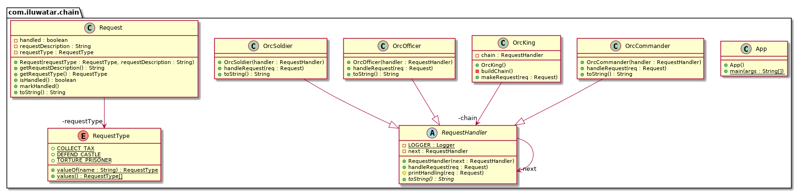

## 目的
透過給多個物件一個處理請求的機會，避免請求的傳送者和它的接收者耦合。串聯接收物件並在鏈條中傳遞請求直到一個物件處理它。

## 解釋

真實世界例子

> 獸王大聲命令他的軍隊。最近響應的是指揮官，然後是軍官，然後是士兵。指揮官，軍官，士兵這裡就形成了一個責任鏈。

通俗的說

> 它幫助構建一串物件。請求從一個物件中進入並結束然後進入到一個個物件中直到找到合適的處理器。

維基百科說

> 在物件導向設計中，責任鏈模式是一種由源命令物件和一系列處理物件組成的設計模式。每個處理物件包含了其定義的可處理的命令物件型別的邏輯。剩下的會傳遞給鏈條中的下一個處理物件。

**程式示例**

用上面的獸人來翻譯我們的示例。首先我們有請求類

```java
public class Request {

  private final RequestType requestType;
  private final String requestDescription;
  private boolean handled;

  public Request(final RequestType requestType, final String requestDescription) {
    this.requestType = Objects.requireNonNull(requestType);
    this.requestDescription = Objects.requireNonNull(requestDescription);
  }

  public String getRequestDescription() { return requestDescription; }

  public RequestType getRequestType() { return requestType; }

  public void markHandled() { this.handled = true; }

  public boolean isHandled() { return this.handled; }

  @Override
  public String toString() { return getRequestDescription(); }
}

public enum RequestType {
  DEFEND_CASTLE, TORTURE_PRISONER, COLLECT_TAX
}
```

然後是請求處理器的層次結構

```java
@Slf4j
public abstract class RequestHandler {
  private final RequestHandler next;

  public RequestHandler(RequestHandler next) {
    this.next = next;
  }

  public void handleRequest(Request req) {
    if (next != null) {
      next.handleRequest(req);
    }
  }

  protected void printHandling(Request req) {
    LOGGER.info("{} handling request \"{}\"", this, req);
  }

  @Override
  public abstract String toString();
}

public class OrcCommander extends RequestHandler {
  public OrcCommander(RequestHandler handler) {
    super(handler);
  }

  @Override
  public void handleRequest(Request req) {
    if (req.getRequestType().equals(RequestType.DEFEND_CASTLE)) {
      printHandling(req);
      req.markHandled();
    } else {
      super.handleRequest(req);
    }
  }

  @Override
  public String toString() {
    return "Orc commander";
  }
}

// OrcOfficer和OrcSoldier的定義與OrcCommander類似

```

然後我們有獸王下達命令並形成鏈條

```java
public class OrcKing {
  RequestHandler chain;

  public OrcKing() {
    buildChain();
  }

  private void buildChain() {
    chain = new OrcCommander(new OrcOfficer(new OrcSoldier(null)));
  }

  public void makeRequest(Request req) {
    chain.handleRequest(req);
  }
}
```

然後這樣使用它

```java
var king = new OrcKing();
king.makeRequest(new Request(RequestType.DEFEND_CASTLE, "defend castle")); // Orc commander handling request "defend castle"
king.makeRequest(new Request(RequestType.TORTURE_PRISONER, "torture prisoner")); // Orc officer handling request "torture prisoner"
king.makeRequest(new Request(RequestType.COLLECT_TAX, "collect tax")); // Orc soldier handling request "collect tax"
```

## 類圖


## 適用性
使用責任鏈模式當

* 多於一個物件可能要處理請求，並且處理器並不知道一個優先順序。處理器應自動確定。
* 你想對多個物件之一發出請求而無需明確指定接收者
* 處理請求的物件集合應該被動態指定時

## Java世界例子

* [java.util.logging.Logger#log()](http://docs.oracle.com/javase/8/docs/api/java/util/logging/Logger.html#log%28java.util.logging.Level,%20java.lang.String%29)
* [Apache Commons Chain](https://commons.apache.org/proper/commons-chain/index.html)
* [javax.servlet.Filter#doFilter()](http://docs.oracle.com/javaee/7/api/javax/servlet/Filter.html#doFilter-javax.servlet.ServletRequest-javax.servlet.ServletResponse-javax.servlet.FilterChain-)

## 鳴謝

* [Design Patterns: Elements of Reusable Object-Oriented Software](https://www.amazon.com/gp/product/0201633612/ref=as_li_tl?ie=UTF8&camp=1789&creative=9325&creativeASIN=0201633612&linkCode=as2&tag=javadesignpat-20&linkId=675d49790ce11db99d90bde47f1aeb59)
* [Head First Design Patterns: A Brain-Friendly Guide](https://www.amazon.com/gp/product/0596007124/ref=as_li_tl?ie=UTF8&camp=1789&creative=9325&creativeASIN=0596007124&linkCode=as2&tag=javadesignpat-20&linkId=6b8b6eea86021af6c8e3cd3fc382cb5b)
